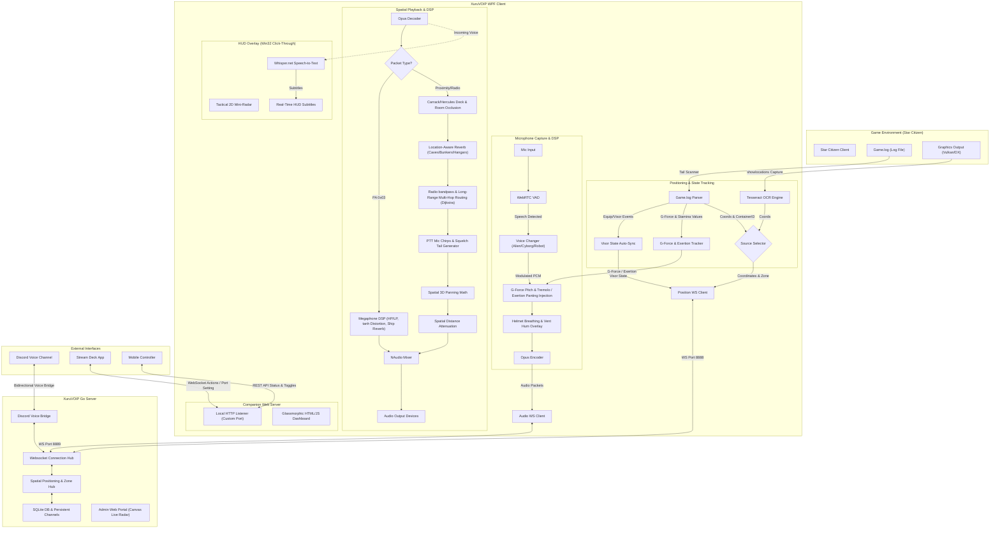

# XuruVoip

<p align="center">
  <a href="https://github.com/XuruDragon/XuruVOIP/actions/workflows/tests.yml">
    
  </a>
  <a href="https://github.com/XuruDragon/XuruVOIP/releases">
    
  </a>
</p>

<p align="center">
  <b>Translations:</b><br/>
  <a href="README.md">English</a> •
  <a href="readmes/README.fr.md">Français</a> •
  <a href="readmes/README.de.md">Deutsch</a> •
  <a href="readmes/README.es.md">Español</a> •
  <a href="readmes/README.pt-BR.md">Português (Brasil)</a> •
  <a href="readmes/README.pt-PT.md">Português (Portugal)</a> •
  <a href="readmes/README.ja.md">日本語</a> •
  <a href="readmes/README.zh.md">简体中文</a>
</p>

<p align="center">
  
</p>

XuruVoip is a high-performance, secure, and dynamically spatialized **3D voice communication (VoIP) suite** designed specifically for custom gaming integrations with **Star Citizen**. It consists of a Go-based backend server and a modern C# WPF client with a built-in Companion App (web interface) and Elgato Stream Deck integration.

### 🎯 Project Goal
The goal of XuruVoip is to provide Star Citizen gaming events, roleplay organizations, and tactical squads with an **unprecedented level of audio immersion and operational convenience**. By reading real-time coordinate, visor, and vehicle states from the game client, XuruVoip dynamically shapes player voices in 3D space, simulates planetary/vacuum atmospheres, and routes tactical communications automatically without requiring manual client configurations.

---

### 🗺️ Navigation Directory

| Section | Description |
| :--- | :--- |
| [📖 Detailed Features Guide](doc/functionnalities.md) | Technical and user explanation of all 20+ implemented functionalities. |
| [📖 Non-Technical User Guides](#-non-technical-user-guides) | Easy-to-understand step-by-step guides for Client, Server, and Stream Deck. |
| [📸 Screenshots & UI](#-screenshots--ui) | Visual showcase of client screens, admin portal, and settings. |
| [🗂️ Project Structure](#️-project-structure) | Repository layout and folder breakdown. |
| [⚙️ System Architecture](#️-system-architecture) | The complete actual workflow diagram of the WPF client, Go server, and external devices. |
| [💡 Core Features Overview](#-core-features-overview) | Detailed breakdown of the 19+ implemented spatial and networking features. |
| [🖥️ Go Server (Go)](#️-xuruvoip-server-go) | Server build, run, deployment, and configuration instructions. |
| [🎛️ Discord Voice Bridge](#️-discord-voice-bridge-setup-guide) | Connecting Go server radio channels to a Discord Voice Channel. |
| [📱 Companion App & Stream Deck](#-companion-app--stream-deck-integration) | Remote device control and Stream Deck physical keys setup. |
| [🛠️ WPF Client (C#)](#-building--running-the-client) | Client requirements, compilation, and MSI/Portable installation guides. |

---

## 📖 Non-Technical User Guides

If you do not have a background in computer science, we have written simple, step-by-step guides to help you get everything configured and running easily:

* 📖 **[Detailed Features Guide](doc/functionnalities.md)**: Deep-dive explanation of each feature implemented, how they work, how to use them, and why they are useful.
* 🎮 **[Client User Guide](doc/client_guide.md)**: Friendly guide on choosing microphones/speakers, setting up Push-to-Talk, using space suit helmets, and turning on exertion voice effects.
* 🖥️ **[Server Configuration Guide](doc/server_guide.md)**: Explains how to host a server, adjust passwords/settings in the `.env` settings file, and set up the Discord Voice Bridge.
* 🎛️ **[Stream Deck Plugin Guide](doc/streamdeck_guide.md)**: Walkthrough on installing physical buttons for muting, visor toggling, and displaying active radio channels.

---

## 📸 Screenshots & UI

<details>
<summary>📸 Click to view screenshots</summary>

### 1. Main Client Window


### 2. Audio Settings Tab (3D Spatial Audio Control)


### 3. General Settings Tab (Language & Game.log Selection)


### 4. Connection Settings Tab


### 5. Hotkeys Settings Tab


### 6. Overlay Settings Tab (Vulkan & DirectX HUD)


### 7. OCR Settings Tab (Tesseract OCR)


### 8. Admin Web Portal Login Page


### 9. Admin Web Portal Dashboard


### 10. Admin Web Portal Players


### 11. Admin Web Portal Admin List


### 12. Admin Web Portal Ban List


</details>

---

## 🗂️ Project Structure

- **/server**: High-performance Go backend hosting the position, audio, and administration services.
- **/client**: Modern C# WPF client utilizing NAudio, WebRtcVad, and Tesseract OCR or Game.log tail for automated location tracking and log parsing. The companion app is also included in this project.
- **/streamdeck**: Stream Deck plugin for XuruVoIP client.

---

## ⚙️ System Architecture

Below is the complete actual architecture of the XuruVoip system, illustrating the capture, positioning, playback, and HUD rendering loops inside the WPF client, the Go server websocket hubs, and the external integrations:



---

## 💡 Core Features Overview

### 1. 🔊 Real-Time 3D Spatial Audio
* **Dynamic Stereo Panning:** PROJECTS remote speaker coordinates onto the listener's Forward and Right direction vectors to calculate exact left/right panning using a constant-power formula.
* **Front-Back Ambiguity Resolution:** Attenuates audio volume by 25% if a speaker is standing behind the listener, resolving standard 2D audio panning limitations.
* **Distance Roll-Off:** Fades out proximity voices linearly based on distance, ensuring natural loudness levels (fades completely to zero at 50 meters, or 5 meters for whispers).

### 2. 🗺️ Location-Aware Acoustics & Ship/Bunker Occlusion
* **Deck and Wall Occlusion:** Detects internal boundaries inside spaces. If players are on different decks (e.g. Carrack, Hercules) or rooms (e.g. Bunkers), low-pass filtering (cutoff frequencies from 300Hz to 900Hz) and volume dampening are dynamically applied.
* **Environmental Reverb:** Reads the hierarchical zone of the player and automatically applies custom wet-mix, delay, and feedback reverb parameters for **Caves**, **Bunkers**, and **Hangars**.

### 3. 💨 Helmet & EVA Atmospheric Simulation
* **EVA Muting:** Automatically mutes proximity voice communications in space or vacuum zones (EVA), forcing players to use radio channels to communicate.
* **Visor Respirator Overlay:** Simulates air pressure when the visor is down. Synthesizes a low-frequency breathing whoosh and a dual-frequency (50Hz + 100Hz) suit vent fan hum onto the captured mic feed.
* **Auto Visor Synchronization:** Reads attachment logs in `Game.log` to automatically detect when a helmet is equipped/removed and updates the visor state in real-time.

### 4. 🎙️ Sci-Fi Voice Changer & Suit Modulators
* **Real-Time DSP Filters:** Time-domain pitch shifting, flanging, ring modulation, soft-tanh saturation, and 8-bit bitcrushing.
* **Atmospheric Presets:** Instantly load preset voice profiles including **Alien**, **Cyborg**, **Robotic**, or **Custom Pitch Shift** (0.5x to 2.0x).
* **Custom Modulator Sliders:** Fine-tune pitch, ring mod frequency/mix, flanger depth/rate/feedback, and bitcrush settings via settings sliders.

### 5. 📻 Immersive Radio Degradation & Chimes
* **Bandpass Filtering:** Models radio filters with low/high cutoffs when using radio channels or when suit visors are down.
* **Radio Signal Degradation:** Narrow cutoff bands and blends in bandpass-filtered static noise as distance between players approaches the radio transmitter limit.
* **Acoustic Radio Chimes:** Plays mechanical key-down and key-up chimes when transmitting on radio channels. Supports four distinct mathematical profiles selectable in settings or the Companion App: Military (sine sweeps), Industrial (mechanical clanks), Alien (ring-modulated sweeps), and Vintage (analog relay clicks).
* **Planetary Distance-Based Radio Delay:** Simulates signal propagation delay using the speed of light ($\approx 3.3\text{ ms}$ per kilometer, up to 3000ms max) for realistic communication lag.
* **Custom PTT Chimes:** Downmixes and resamples custom WAV/MP3 files (`radio_key_down` and `radio_key_up`) from the `Resources/` folder to serve as user-provided chimes.

### 6. 💬 Automatic Ship Intercom System
* **Vehicle Intercom Channels:** Boarding a vehicle automatically subscribes players to a dynamic `Intercom_<ContainerID>` radio channel.
* **Pilot Priority Ducking:** When a player in a cockpit or driver seat transmits on the intercom, all other players' proximity audio is ducked by 85% to ensure flight command clarity.
* **Dynamic Intercom Degradation:** Intercom channels automatically degrade based on vehicle status:
  * **Shield Hits:** Temporarily injects static bursts and volume crackles (lasts 2.5 seconds).
  * **Critical Power:** Low-voltage AC hum, soft-clipping distortion, and pitch-resampling drop.
  * **Quantum Travel:** Comb-filter flanger/phaser sweep and high-frequency whine.
  * *All sub-effects can be toggled individually in the General Settings and are disabled by default.*
* **Cleanup Cooldown:** Counts down 5 minutes after the last player leaves the ship before deleting the intercom channel, maximizing server performance.

### 7. 📡 Vulkan-Compatible HUD Overlay & 2D Tactical Radar
* **Win32 Click-Through Overlay:** A borderless HUD overlay showing VoIP connections, frequencies, and speaking states. Vulkan and DirectX compatible (running in borderless windowed mode).
* **Interactive HUD Customizer:** Allows real-time theme (Aegis, Anvil, Drake, RSI, Origin), positioning (corners/center), and component visibility (mini-radar, speakers list, connection header) customization via settings or the Companion App.
* **Intercom Status Indicator:** Displays warnings like `⚡ INTERCOM: DEGRADED` (with sub-status details such as `[Power Loss]`, `[Quantum]`, or `[Static Pop]`) in the overlay when intercom degradation is active.
* **Tactical Mini-Radar:** Features a heading-aligned 2D HUD radar that displays relative speaking players, drawing pulsating sound rings around them.
* **3D Elevation Indicators:** Appends vertical direction arrows and deck height deltas (e.g. `Bob (▲ 12m)`) next to radar blips when vertical separation exceeds 2 meters.
* **Speech-to-Text Subtitles:** Transcribes incoming radio/proximity audio to localized HUD subtitles using an offline, lightweight Whisper model (`ggml-tiny.bin`).
* **Hands-Free PTT Voice Commands:** Holding the dedicated Voice Command key temporarily suppresses outgoing proximity/radio voice feeds and buffers mic audio. On release, the voice is transcribed locally via the Whisper model to trigger ship actions:
  * **Supported Commands:** Visor/Helmet Toggle, Microphone Mute/Unmute (proximity/radio/profile/all), active Radio Channel selection, and Voice Changer presets.
  * **Multi-Language Keyword Matching:** Supported across 8 languages (English, French, German, Spanish, Portuguese, Japanese, and Chinese).
  * **Confidence Threshold Filter:** A configurable slider filters out low-confidence matches or extraneous speech.
  * *Disabled by default; enabling it downloads the offline Whisper transcription model (~140MB) if not already present.*
  * **Voice Commands Reference List:**
    Below is the list of all supported hands-free PTT voice commands, split by XuruVOIP application controls and Star Citizen game key bindings:
    
    #### XuruVOIP Application Controls (Exclusive to XuruVOIP)
    These commands control your helmet/visor state, channel mutes, radio frequency selection, or voice modulations directly inside XuruVOIP:
    * **Toggle Visor/Helmet Filter:** `visor`, `helmet`, `toggle visor`, `toggle helmet`, `visor toggle`
    * **Mute Proximity Channel:** `mute proximity`, `silence proximity`, `disable proximity mic`, `proximity mute`
    * **Unmute Proximity Channel:** `unmute proximity`, `enable proximity mic`, `proximity unmute`
    * **Mute Radio Channel:** `mute radio`, `silence radio`, `disable radio mic`, `radio mute`
    * **Unmute Radio Channel:** `unmute radio`, `enable radio mic`, `radio unmute`
    * **Mute Profile Channel:** `mute profile`, `silence profile`, `disable profile mic`, `profile mute`
    * **Unmute Profile Channel:** `unmute profile`, `enable profile mic`, `profile unmute`
    * **Mute Microphone (Global):** `mute all`, `silence all`, `mute microphone`, `mute mic`
    * **Unmute Microphone (Global):** `unmute all`, `enable microphone`, `unmute mic`
    * **Switch Radio Channel:** `set channel`, `change channel`, `switch channel`, `channel to`, `channel` followed by the channel name (e.g. *"change channel Alpha"*)
    * **Set Voice Changer Profile:** `voice changer`, `voice profile`, `voice modifier`, `set voice` followed by a profile: `alien`, `cyborg`, `robotic`, `pitchshift`, `none` (or `off`/`normal`)
    
    #### Simulated Ship Controls (Star Citizen Related)
    These commands trigger simulated physical keystrokes on your PC to trigger Star Citizen controls:
    * **Toggle Ship Power:** `power`, `toggle power`, `power on`, `power off`, `systems on`, `systems off`
    * **Toggle Ship Engines:** `engines`, `toggle engines`, `engines on`, `engines off`
    * **Toggle Weapons:** `weapons`, `toggle weapons`, `weapons on`, `weapons off`
    * **Toggle Shields:** `shields toggle`, `toggle shields`
    * **Equalize Shields:** `reset shields`, `shields reset`, `equalize shields`, `shields equalize`
    * **Toggle VTOL Mode:** `vtol`, `toggle vtol`
    * **Spool Quantum Drive:** `quantum`, `spool quantum`, `quantum spool`, `quantum drive`, `quantum travel`
    * **Toggle Cruise Control:** `cruise`, `cruise control`, `toggle cruise`, `cruise speed`, `cruise lock`
    * **Request Landing / Open Hangar:** `request landing`, `landing request`, `open hangar`, `request hangar`, `call atc`
    * **Toggle Ship Doors/Ramps:** `doors`, `exterior`, `open doors`, `close doors`, `open exterior`, `close exterior`, `toggle doors`, `toggle exterior`
    * **Divert Shields Forward:** `shields`, `shields front`, `shields forward`, `divert shields`, `shields ahead`
    * **Toggle Landing Gear:** `landing gear`, `deploy landing gear`, `retract landing gear`, `toggle landing gear`, `gear`

### 8. 📱 Companion App & REST API
* **Local HTTP Web Server:** Hosts a local dashboard on a configurable port (default: `8891`, disabled by default).
* **Glassmorphic Controller:** Connects from phones or secondary screens to toggle mutes, channel cycles, helmets, or voice changers.
* **REST API:** Exposes endpoints `GET /api/status` and `POST /api/action` for external integrations (including intercom state status and simulation overrides).

### 9. 🎛️ Stream Deck Plugin
* **Stream Deck Action Pack:** Exposes 8 actions to control microphone mutes, audio mutes, helmet visors, and radio frequency cycles.
* **Dynamic Key Icons:** Continuous WebSockets update button graphics (active cyan vs muted amber) to reflect current client state.
* **Live Frequency Title:** Displays active radio channel names directly on physical Stream Deck buttons.

### 10. 🔌 Discord Voice Bridge
* **Bidirectional Audio Relay:** Relays communications between a Go server radio channel and a Discord voice channel.
* **Nicknames Mapping:** Captures Discord speech and maps SSRC IDs to server nicknames.
* **Dynamic Frequency Tracking:** Automatically moves the Discord bridge voice connection to follow and mirror the active channel of configured leaders or Command/Leader profiles.

### 11. 🛡️ Security, Log Rotation, and Admin Canvas Radar
* **Daily Log Rotation:** Startup log archiver retaining only the 5 most recent logs.
* **Admin Dashboard:** Real-time web admin panel with lockout security, rate-limiting, and an interactive 2D HTML5 Canvas Live Radar map allowing administrators to zoom, pan, and trace historical player trails.

### 12. 🤢 G-Force & Physical Exertion Voice Distortion
* **Tremolo & Pitch Shifting:** Under high G-forces, outgoing microphone audio is dynamically modulated with a tremolo LFO (4-10Hz, up to 40% depth) and pitched down (factor: 1.0 down to 0.85) to simulate physical strain, blackout, or redout states.
* **Heavy Breathing Overlay:** Automatically overlays randomized panting/breathing noise, scaling respiration cycle speed based on player stamina levels parsed in real-time from `Game.log`.
* **Manual / API Controls:** Toggleable via client Settings and Companion App Web UI sliders for roleplay or mock testing.

### 13. 📡 Tactical Radio Relay & Multi-Hop Repeater Beacons
* **Multi-Hop Signal Routing:** Players can toggle "Beacon Mode" to act as a Radio Repeater Beacon. If two players are out of direct radio range (beyond 1500m), the receiver client executes Dijkstra's shortest-path algorithm over all active repeaters in the zone.
* **Worst-Hop Quality Degradation:** If a multi-hop path exists under the 8000m single-hop limit, the system routes the communication and applies the worst-hop's degradation factor (signal quality) instead of total straight-line distance, enabling long-range planetary/orbital radio networks.
* **Dynamic WebSocket State:** Active repeater states are synchronized in real-time via the server's WebSocket control channel.

### 14. 📢 Ship Public Address (PA) Broadcast System
* **Ship-Wide Audio Broadcast:** Pilots or captains of multi-crew ships can broadcast voice announcements to all crew members sharing the same `ContainerID` (ship) in the same Zone.
* **PA DSP & Klaxon Chime:** PA transmissions bypass local proximity and radio mutes (except master volume/mute), play mono center-panned, prepend a Sci-Fi dual-tone chime/klaxon alert, and apply a megaphone bandpass & reverberation filter simulating hollow ship interior acoustics.

### 15. 🔌 External Hardware Telemetry (Sim-Pit UDP Sync)
* **Real-Time UDP Sync:** When enabled, the client broadcasts its VoIP and helmet states in JSON format to `127.0.0.1:8895` (configurable) every 100ms.
* **Telemetry Payload:** Includes local transmission states (`IsTransmittingProximity`, `IsTransmittingRadio`), remote receiving states (`IsReceivingProximity`, `IsReceivingRadio`), visor state (`HelmetVisorDown`), active channel, and current zone.
* **Hardware Integration Ready:** Enables sim-pit cockpit builders to connect custom Arduino LEDs, Stream Decks, or physical warning indicators that react to active communications in real-time.

### 16. 🪐 Planetary Atmosphere Density Simulation
* **Volume Range Scaling:** Proximity voice ranges are scaled dynamically based on planetary atmosphere density (e.g. 3.5x faster decay on Cellin, 0.75x slower decay on Crusader).
* **Thin Gas Muffling:** Outdoors on airless or thin-atmosphere moons, proximity voices are muffled via digital low-pass filters (e.g. 800Hz cutoff on Cellin).
* **Interior Pressurization Bypasses:** The simulation is bypassed automatically inside ship cabins, facilities, or stations.

### 17. 🎙️ Post-Op Voice Recorder & AAR Portal
* **Zero-Overhead Ogg/Opus Container:** Saves raw VoIP Opus packets directly to disk inside browser-playable `.ogg` audio files, consuming 5x less disk space than MP3 with zero server CPU encoding load.
* **Admin-Targeted Recording:** Recording only starts on active proximity, radio channel, or profile targets enabled via the Admin dashboard.
* **Canvas Activity Timeline:** Visualizes voice transmission periods on a 2D HTML5 canvas timeline in the Admin Portal, enabling admins to click on blocks to play back clips or delete segments.

### 18. 📞 Ship-to-Ship Hailing & Calling System
* **Cockpit-to-Cockpit Calling:** Establishes direct private communication loops between ships within a 5,000m range limit.
* **Hands-Free Call Streaming:** Captures voice automatically via Voice Activity Detection (VAD) override during calls, bypassing standard proximity/radio Push-to-Talk keys.
* **Realistic Dialing Chimes:** Synthesizes realistic dial tone sweep, ringing loops, connection, and disconnection chimes via NAudio.

### 19. 🔤 Visor HUD Real-Time Translation Subtitles
* **Dynamic Phrase Translator:** Translates incoming foreign-language voice streams using localized military/flight dictionaries for 7 flight-supported languages.
* **HUD Subtitle Prefixing:** Displays translated text directly on the visor HUD, prefixed with `[FROM -> TO]` source and target indicators.
* **On-Demand Whisper Loader:** Checks if the Whisper model is present, displaying an overlay warning and downloading it asynchronously in the background if needed.

### 20. 🎧 Binaural HRTF Spatial Audio
* **Physical Ear Simulation:** Simulates human ear shape and head shadow effects using ITD (Interaural Time Difference) and ILD (Interaural Level Difference) low-pass attenuation.
* **Stereo Compatibility:** Delivers high-fidelity 3D audio cues over standard stereo headphones without requiring surround-sound hardware.

### 21. 📊 Visor HUD 3D Spectrogram
* **FFT Telemetry Overlay:** Computes real-time Radix-2 64-point Fast Fourier Transforms (FFT) on incoming speaker voice streams.
* **Dynamic HUD Visualization:** Groups audio frequencies into 8 spectral bands next to active speakers on the Vulkan/DX HUD, with smooth decay.

### 22. 🎙️ Voice-Activated Ship Controls
* **Speech-to-Keybind Translation:** Listens to voice commands (e.g. "open doors") and matches them against localized dictionaries in 8 languages.
* **Direct Hardware Keystrokes:** Simulates physical keypresses with Low-level Win32 `keybd_event` (keys held for 50ms for reliable game capture, supporting modifiers).

### 23. 🛰️ Server-Side AAR 3D Playback
* **Coordinates Logging:** Server logs player coordinates and zones to a `<session_id>_positions.jsonl` file every 500ms.
* **Synchronized WebGL 3D Replay:** Visualizes the player's 3D path and speaking pulse rings on an interactive Three.js WebGL 3D map with mouse panning, zooming, and rotating, fully synchronized with the recorded Ogg/Opus audio.


---

## 🎮 XuruVoip Client Settings Tab Breakdown

The WPF settings window is structured into six configuration categories:
1. **General**: Configure languages, tail `Game.log` files, toggle general file logging, enable/configure the local **Companion App HTTP Server** and Port, and toggle/configure **External Telemetry Broadcast (UDP)** and Port (disabled by default).
2. **Connection**: Edit the Target Server IP, Position & Audio ports, Username, User Password, and Server Password.
3. **Position**: Toggle the location source ("OCR Screen Scanner" vs "Game.log Reader (GRTPR)"), configure monitor indexes, crop regions, OCR intervals, and preview live coordinate text.
4. **Audio**: Choose input/output hardware, adjust dB gains, select transmission mode (PTT vs VAD), configure VAD thresholds, toggle **Enable 3D Spatial Audio**, configure radio degradation, synthesized local chimes, visor modulator, and select **Voice Changer** presets.
5. **Hotkeys**: Bind keys to Proximity PTT, Radio PTT, Profile PTT, Helmet visor, Radio channel cycle, and individual microphone and audio channel mute switches.
6. **Overlay**: Toggle HUD overlay, set corner placements, enable the **Tactical Mini-Radar** (with configurable maximum range), and toggle real-time **Speech-to-Text captions**.

---

## 🖥️ XuruVoip Server (Go)

The server coordinates player positions, handles secure authentication, and dynamically routes audio packets based on spatial distance and radio channels.

### Key Features

* **Server-Side Proximity Control**: Dynamically relays proximity audio only to players within range (50m default, or 5m whisper).
* **Spatial Configuration**: Toggleable server-side option (`XURUVOIP_SPATIAL_AUDIO` in `.env`) that determines whether coordinates or only distance should be sent to clients.
* **Multi-Channel Radio Routing**: Allows players to listen to multiple radio channels simultaneously while transmitting on their active channel.
* **Audio Profile System**: Assigns audio effects (e.g., radio filter, echo) to players.
* **SQLite Persistence**: Stores player channel preferences and profile mappings across server restarts.
* **Anti-Bypass Security**: Bans troublemakers by Username, IP, and hardware fingerprint (HWID/MachineGuid) to prevent ban-dodging.
* **Web Administration Portal**: Secure web interface (HTTPS/WebSockets) for real-time dashboards, log streaming, channel/profile configuration, and ban management.
* **Server Admin Radar Map**: 2D HTML5 Canvas real-time player radar integrated into the admin dashboard, supporting click-and-drag panning, mouse-wheel zoom, active zone filtering, historical player walking trails (breadcrumbs), and live pulsating concentric soundwave rings around talking players.
* **Startup Log Rotation**: Checks the server log (`xuruvoip.log`) at startup. If the log file contains entries from a previous day, it is rotated to `xuruvoip.YYYY-MM-DD.log`. The server retains only the 5 most recent rotated files and deletes older ones to prevent excessive disk usage.

### Server Configuration (`.env`)

At first startup, the server automatically generates a `.env` file containing these default values:

```env
# BIND IP address and server ports
# Leave IP empty to listen on all interfaces (0.0.0.0)
XURUVOIP_SERVER_IP=
XURUVOIP_PORT=8888
XURUVOIP_AUDIO_PORT=8889
XURUVOIP_DATA_DIR=.

# Maximum Server Capacity (can be higher, depends on server performances)
XURUVOIP_MAX_PLAYERS=500

# Spatial Audio (1 = enabled and transmits coordinates, 0 = disabled and transmits distance only)
XURUVOIP_SPATIAL_AUDIO=1

# Public Server Settings (1 = players will not need to enter the server password to connect, 0 = required)
XURUVOIP_PUBLIC_SERVER=0

# Server Password / Token for player connections (only if public server is disabled)
XURUVOIP_SERVER_PASSWORD=auto_generated_32_chars_token

# Admin Server Password / Token for the admin portal page (https://[XURUVOIP_SERVER_IP]:[XURUVOIP_PORT]/admin)
XURUVOIP_ADMIN_SERVER_PASSWORD=auto_generated_32_chars_token

# Verbose logging level (0 = none, 1 = default, 2 = global frames per type, 3 = detailed channels/profiles)
XURUVOIP_VERBOSE_LOGS=1

# Security Settings (Rate Limiting and IP Lockout)
XURUVOIP_LIMIT_RATE_POS=50.0
XURUVOIP_LIMIT_BURST_POS=100
XURUVOIP_LIMIT_RATE_AUDIO=60.0
XURUVOIP_LIMIT_BURST_AUDIO=120

XURUVOIP_LOCKOUT_ATTEMPTS=5
XURUVOIP_LOCKOUT_WINDOW=60
XURUVOIP_LOCKOUT_DURATION=600

# Dynamic Intercom and Immersion features (1 = enabled, 0 = disabled)
XURUVOIP_ENABLE_INTERCOM=1
XURUVOIP_ENABLE_EVA_MUTING=1
XURUVOIP_ENABLE_RADIO_REPEATERS=1
XURUVOIP_ENABLE_SHIP_PA=1

# Discord Voice Bridge Settings (1 = enabled, 0 = disabled)
XURUVOIP_ENABLE_DISCORD_BRIDGE=1
XURUVOIP_DISCORD_TOKEN=your_discord_bot_token
XURUVOIP_DISCORD_GUILD_ID=your_discord_guild_id
XURUVOIP_DISCORD_CHANNEL_ID=your_discord_channel_id
XURUVOIP_DISCORD_BRIDGE_CHANNEL=General
```

### 🎛️ Discord Voice Bridge Setup Guide

To bridge a local Go server radio channel to a Discord voice channel, follow these setup steps:

1. **Create a Discord Bot Application:**
   * Visit the [Discord Developer Portal](https://discord.com/developers/applications) and sign in.
   * Click **New Application**, give it a name (e.g., `XuruVOIP Bridge`), and click **Create**.
   * Navigate to the **Bot** tab on the left sidebar, click **Reset Token**, and copy the generated **Bot Token**. Paste this as `XURUVOIP_DISCORD_TOKEN` in your server's `.env` file.
   * Under **Privileged Gateway Intents** on the same Bot page, enable the **Message Content Intent** (required for reading specific commands).

2. **Invite the Bot to your Discord Server:**
   * Go to the **OAuth2** tab, then select **URL Generator**.
   * Under **Scopes**, check `bot` and `applications.commands`.
   * Under **Bot Permissions**, select the following privileges:
     * *General Permissions:* `View Channels`
     * *Text Permissions:* `Send Messages`
     * *Voice Permissions:* `Connect`, `Speak`, `Use Voice Activity`
   * Copy the generated URL at the bottom of the page, paste it into a web browser, select your target Discord server (Guild), and click **Authorize**.

3. **Get Server (Guild) & Voice Channel IDs:**
   * Open Discord, go to **User Settings** -> **Advanced**, and toggle **Developer Mode** on.
   * Right-click your Discord server icon in the server list and select **Copy Server ID** (this is your Guild ID). Paste it as `XURUVOIP_DISCORD_GUILD_ID` in `.env`.
   * Right-click the target Discord Voice Channel where you want the bot to join, and select **Copy Channel ID**. Paste it as `XURUVOIP_DISCORD_CHANNEL_ID` in `.env`.

4. **Map Go Server Radio Channel:**
   * Configure `XURUVOIP_DISCORD_BRIDGE_CHANNEL` to the exact name of the radio channel you want to bridge (e.g. `General`, `Bravo`, `Alpha`, etc.). Any audio transmitted on this Go server radio frequency will be bidirectionally broadcasted to the Discord Voice Channel!

### Building the Server from source

#### Linux
```bash
cd server


GOOS="linux" GOARCH="amd64" go build .
# a "server" linux binary will be created in the current directory
```

#### Windows
```powershell
cd server 

$env:GOOS="windows"
$env:GOARCH="amd64"
go build .
# a "server.exe" windows binary will be created in the current directory
```

### Running the Server

#### From Source:
```bash
cd server
go run .
```

#### From Binary:
##### Windows
```powershell
.\server.exe
```

##### Linux
```bash
./server
```

### 🖥️ Headless Server Setup & Deployment

For permanent, production-ready headless installations, the server should run as a background system daemon/service that automatically starts on boot and restarts in case of failure.

#### 1. Network & Firewall Configuration
Ensure that the incoming TCP ports defined in your `.env` file (defaults are `8888` for positions/admin portal and `8889` for spatial audio) are open on your host firewall:
* **Linux (UFW):**
  ```bash
  sudo ufw allow 8888/tcp
  sudo ufw allow 8889/tcp
  sudo ufw reload
  ```
* **Linux (firewalld):**
  ```bash
  sudo firewall-cmd --zone=public --add-port=8888/tcp --permanent
  sudo firewall-cmd --zone=public --add-port=8889/tcp --permanent
  sudo firewall-cmd --reload
  ```

---

#### 2. Linux Deployment (systemd)

Follow these steps to deploy the Go server as a systemd service:

##### Step A: Setup Directory & Permissions
Create a dedicated system user and a working directory for security isolation:
```bash
# Create a system user without login privileges
sudo useradd -r -s /bin/false xuruvoip

# Create installation directory and copy the binary
sudo mkdir -p /opt/xuruvoip
sudo cp xuruvoip-server-linux-x64 /opt/xuruvoip/xuruvoip-server
sudo chmod +x /opt/xuruvoip/xuruvoip-server

# Set ownership to the system user
sudo chown -R xuruvoip:xuruvoip /opt/xuruvoip
```

##### Step B: Generate & Configure `.env`
Run the server once under the system user to generate the default `.env` configuration file and database:
```bash
sudo -u xuruvoip /opt/xuruvoip/xuruvoip-server -port 8888 -audio-port 8889
```
*Press `Ctrl+C` after the console prints the generated passwords.* Then, edit the generated `.env` file to customize settings (e.g. passwords, binding IP, spatial audio toggle):
```bash
sudo nano /opt/xuruvoip/.env
```

##### Step C: Create the systemd Service File
Copy the service file from the repo `server/xuruvoip.service` to `/etc/systemd/system/xuruvoip-server.service` or create a new service configuration file `/etc/systemd/system/xuruvoip-server.service` with the following content:
```ini
[Unit]
Description=XuruVoip Star Citizen Spatial VOIP Server
After=network.target

[Service]
Type=simple
User=xuruvoip
Group=xuruvoip
WorkingDirectory=/opt/xuruvoip
ExecStart=/opt/xuruvoip/xuruvoip-server
Restart=always
RestartSec=5
LimitNOFILE=65536

[Install]
WantedBy=multi-user.target
```

##### Step D: Enable & Start the Service
```bash
# Reload systemd daemon to pick up the new unit file
sudo systemctl daemon-reload

# Enable the service to run on startup
sudo systemctl enable xuruvoip-server

# Start the service immediately
sudo systemctl start xuruvoip-server
```

##### Step E: Monitor & Logs
To check service status and stream logs:
```bash
# Check status
sudo systemctl status xuruvoip-server

# Stream log files in real-time
journalctl -u xuruvoip-server -f -n 100
```

---

#### 3. Windows Deployment (NSSM)

To run the server as a native Windows service in headless mode, it is recommended to use the **Non-Sucking Service Manager (NSSM)**:

##### Step A: Setup Directories
Extract/copy `xuruvoip-server-windows-x64.exe` to a dedicated server folder (e.g. `C:\XuruVoipServer`).

##### Step B: Initialize Configuration
Open a PowerShell terminal as administrator and run the binary once to generate files:
```powershell
cd C:\XuruVoipServer
.\xuruvoip-server-windows-x64.exe
```
*Press `Ctrl+C` once the startup finishes.* Customize the generated `.env` file as needed.

##### Step C: Install the Service via NSSM
Download NSSM and install the service by running:
```powershell
# Open NSSM GUI installer
.\nssm.exe install XuruVoipServer "C:\XuruVoipServer\xuruvoip-server-windows-x64.exe"
```
In the NSSM popup, configure:
* **Path:** `C:\XuruVoipServer\xuruvoip-server-windows-x64.exe`
* **Startup directory:** `C:\XuruVoipServer`
* Click **Install service**.

##### Step D: Start the Service
Start the service using PowerShell or Services Manager (`services.msc`):
```powershell
Start-Service -Name XuruVoipServer
```

---

### Building & Running the Client

#### Requirements
- Windows 10/11
- .NET 9.0 SDK (WPF support)

#### Compile and Run:
```powershell
cd client
dotnet run
```

### Installing the Release Package

Since the installer and executables are not digitally signed, Windows SmartScreen may block them initially. You can easily unblock them using the properties menu.

* **Option A: Windows Package Manager (winget) - (Recommended)**
  1. Open a terminal (PowerShell or Command Prompt).
  2. Run the following command to install the client:
     ```powershell
     winget install XuruDragon.XuruVOIPClient
     ```

* **Option B: MSI Installer**
  1. Download `XuruVoipClient-win-x64.msi` from the [releases page](https://github.com/XuruDragon/XuruVOIP/releases).
  2. To prevent Windows SmartScreen from blocking the installation:
     - Right-click the downloaded `XuruVoipClient-win-x64.msi` file and select **Properties**.
     - In the properties window under the *General* tab, check the **Unblock** checkbox at the bottom.
     - Click **Apply**, then close the Properties window.
  3. Double-click the file to run the installer and follow the prompt instructions.
     *(Note: You will see a standard Windows User Account Control "Unknown Publisher" prompt; simply click **Yes** or **Run** to proceed.)*

* **Option C: Portable ZIP Version**
  1. Download `XuruVoipClient-win-x64.zip` from the [releases page](https://github.com/XuruDragon/XuruVOIP/releases).
  2. Extract the files in the ZIP package to any folder of your choice (e.g., `C:\Games\XuruVoip`):
  3. Then right-click the extracted `XuruVoipClient.exe` file and select **Properties**.
     - In the properties window under the *General* tab, check the **Unblock** checkbox at the bottom.
     - Click **Apply**, then close the Properties window.
  4. Double-click `XuruVoipClient.exe` to run the client directly without installing it.

## 📱 Companion App & Stream Deck Integration

XuruVOIP includes a built-in Companion App web service and an official Stream Deck plugin allowing you to monitor and trigger voice actions directly from secondary devices or physical keys.

### 1. Enabling the Companion App & Tactical Map MFD
By default, the Companion App local HTTP server and the Tactical Map mode are disabled to save system resources. To enable them:
1. Open the XuruVOIP client and click the **Settings** icon.
2. In the **General** tab, check the box **Enable Companion HTTP Server** (default port: `8891`).
3. To enable the radar display, check the nested **Enable Tactical Co-Pilot Map (MFD)** checkbox.
4. Click **Save & Close** to apply.
5. Access the dashboard: Open `http://localhost:8891` in a browser on your PC, tablet, or phone. If the Map mode is enabled, a new **🗺️ Tactical Map** tab will be available, displaying a canvas-based HUD radar screen tracking your character's real-time position, heading, same-zone crew contacts, and speaker activity indicators.

---

### 2. Stream Deck Plugin Installation
The release package includes the pre-packaged `.streamDeckPlugin` file.
1. Download `com.xuru.voip.streamDeckPlugin` from the [releases page](https://github.com/XuruDragon/XuruVOIP/releases).
2. Double-click the file to install it directly to your Elgato Stream Deck software. 
   *(Alternatively, you can manually extract and copy the `com.xuru.voip.sdPlugin` folder to `%appdata%\Elgato\StreamDeck\Plugins\`)*
3. Once installed, a new action category called **XuruVOIP** will appear in the right-side list of your Stream Deck desktop app.

---

### 3. Adding and Configuring Actions
You can drag and drop any of the following 19 actions onto your Stream Deck keys:
* 🎤 **Proximity Mute**: Toggles outgoing proximity microphone muting.
* 📻 **Radio Mute**: Toggles outgoing radio microphone muting.
* 👤 **Profile Mute**: Toggles outgoing profile microphone muting.
* 🔊 **Audio Proximity Mute**: Toggles incoming proximity playback muting.
* 🔊 **Audio Radio Mute**: Toggles incoming radio playback muting.
* 🔊 **Audio Profile Mute**: Toggles incoming profile playback muting.
* 🪖 **Toggle Helmet**: Toggles your space suit helmet visor down or up.
* 🔄 **Cycle Radio**: Cycles through available radio channels.
* 📢 **PA Broadcast**: Push-to-Talk key to broadcast on the Ship Public Address (PA) system.
* 📡 **Beacon Mode**: Toggles Radio Repeater / Beacon mode.
* 🎙️ **Voice Command Macro**: Triggers a custom voice command macro simulated headlessly (configured via settings).
* 💬 **Intercom Status**: Displays the ship intercom status (`NORMAL`, `SHIELD HIT`, `CRIT PWR`, `QUANTUM`) and cycles states when pressed.
* 🗺️ **Location Telemetry**: Displays your current system zone and coordinate telemetry $(X, Y, Z)$ on the key face.
* 📞 **Initiate Hail**: Initiates a ship-to-ship call to the nearest player.
* 📞 **Accept/Answer Hail**: Accepts an incoming ship-to-ship call.
* 📞 **Decline/End Hail**: Rejects an incoming call or terminates an active call.
* 🔤 **Toggle Translation**: Toggles real-time HUD translation subtitles.
* 🎧 **Toggle HRTF**: Toggles real-time HRTF spatial audio rendering.
* 📊 **Toggle Spectrogram**: Toggles real-time visor HUD 3D spectrogram.

#### Configuration (Property Inspector):
For each action you drag onto a key, click on it and configure the settings in the **Property Inspector** panel at the bottom:
* **Companion Port**: Set to match the port configured in your WPF client settings (default: `8891`).
* **Voice Command** (Voice Command Macro only): Enter the text command to execute (e.g., `"close visor"`, `"open hangar"`).
* **Dynamic Feedback**: Actions update their icons and states in real-time. Toggles show cyan/red, Intercom Status cycles through 4 states, and Location Telemetry displays coordinates.
* **Live Frequency Display**: The **Cycle Radio** key dynamically displays the currently active frequency name directly on the physical button in real-time!

---

## 👥 Credits

Developed by **[@XuruDragon](https://github.com/XuruDragon)** in collaboration with **Antigravity IDE**.
