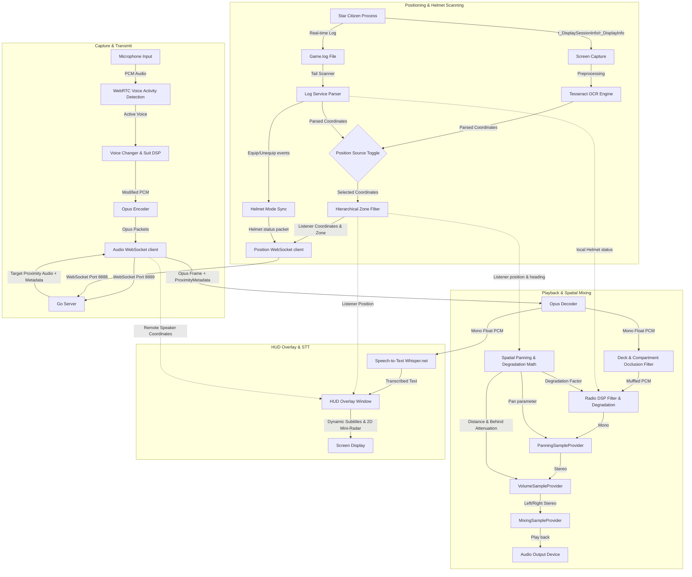

# XuruVoip

<p align="center">
  <a href="https://github.com/XuruDragon/XuruVOIP/actions/workflows/tests.yml">
    
  </a>
  <a href="https://github.com/XuruDragon/XuruVOIP/releases">
    
  </a>
</p>

<p align="center">
  <b>Translations:</b><br/>
  <a href="README.md">English</a> •
  <a href="doc/README.fr.md">Français</a> •
  <a href="doc/README.de.md">Deutsch</a> •
  <a href="doc/README.es.md">Español</a> •
  <a href="doc/README.pt-BR.md">Português (Brasil)</a> •
  <a href="doc/README.pt-PT.md">Português (Portugal)</a> •
  <a href="doc/README.ja.md">日本語</a> •
  <a href="doc/README.zh.md">简体中文</a>
</p>

<p align="center">
  
</p>

XuruVoip is a high-performance, secure, and dynamically spatialized **3D voice communication (VoIP) suite** designed specifically for custom gaming integrations with **Star Citizen**. It consists of a Go-based backend server and a modern C# WPF client.

---

## 📸 Screenshots & UI

<details>
<summary>📸 Click to view screenshots</summary>

### 1. Main Client Window


### 2. Audio Settings Tab (3D Spatial Audio Control)


### 3. General Settings Tab (Language & Game.log Selection)


### 4. Connection Settings Tab


### 5. Hotkeys Settings Tab


### 6. Overlay Settings Tab (Vulkan & DirectX HUD)


### 7. OCR Settings Tab (Tesseract OCR)


### 8. Admin Web Portal Login Page


### 9. Admin Web Portal Dashboard


### 10. Admin Web Portal Players


### 11. Admin Web Portal Admin List


### 12. Admin Web Portal Ban List


</details>

---

## 🗂️ Project Structure

- **/server**: High-performance Go backend hosting the position, audio, and administration services.
- **/client**: Modern C# WPF client utilizing NAudio, WebRtcVad, and Tesseract OCR or Game.log tail for automated location tracking and log parsing.

---

## ⚙️ How the Application Works (Client Architecture)

The C# WPF client runs alongside Star Citizen and performs real-time audio capturing, processing, coordinate recognition, and playback. Below is the workflow of the client system:



### 1. Audio Capture, VAD, and Compression
* **Audio Capture:** The client captures microphone audio using the **NAudio** API at a high-fidelity rate of 48,000 Hz, 16-bit mono.
* **Voice Activity Detection (VAD):** Captured audio buffers are evaluated using the native **WebRtcVad** wrapper. If the speech confidence level falls below the configured VAD threshold, transmission halts, avoiding broadcasting ambient keyboard clicks or fan noise.
* **Compression:** Active speech buffers are encoded into highly compressed **Opus** frames (using the **Concentus** C# wrapper) and transmitted immediately as binary WebSocket frames to the Go Audio Server.

### 2. Location Tracking and Heading Estimation
* **Position Source Toggle:** Players can choose between two positioning methodologies in the client settings:
  * **OCR Screen Scanner:** Periodically takes a screenshot of the configured screen region (where `/showlocations` or `r_DisplaySessionInfo` renders coordinate text), preprocesses the image, and feeds it to the **Tesseract OCR** engine.
  * **Game.log Reader (GRTPR):** Tail-scans the Star Citizen `Game.log` file directly for coordinates logged by the game. To enable this, players must add `r_DisplaySessionInfo = 3` (or `1`) to their `user.cfg` file. Selecting GRTPR completely shuts down and disposes the Tesseract OCR engine, saving substantial CPU and RAM resources on the host machine.
* **Hierarchical Zone Filtering:** The parsed position text contains multiple hierarchical lines of player coordinates (e.g. planetary coordinates, ship compartments, elevators). The client parses these lines and dynamically filters out sub-zones (like `elevator`, `transit`, `seat`) and system-wide zones (like `solarsystem`, `Stanton`). This ensures players inside a ship compartment can hear players in the adjacent corridor without audio cutting off due to minor sub-zone differences.
* **Heading Estimation:** Since Star Citizen does not output player orientation, the client tracks coordinate displacement ($Position_{current} - Position_{previous}$). If the player moves more than 0.5 meters, the client calculates the movement direction vector as the estimated look heading. When the player is stationary, the last calculated heading is preserved.

### 3. Real-time Helmet Detection (Log Tail-Scanning)
* **Tail Scanner:** The client spins up a background task that tail-reads the Star Citizen `Game.log` file in real-time.
* **Attachment Tracking:** The scanner monitors log notifications (like `<AttachmentReceived>`) for items matching utility helmets and visors (e.g. `FP_Visor`, `helmethook_attach`).
* **Auto-Synchronization:** When a helmet is equipped or removed in-game, the client instantly synchronizes the player's Helmet Mode (ON/OFF) without requiring manual key bindings.

### 4. Stereo 3D Spatial Mixing & DSP
* **Receive Loop:** The client receives binary Opus audio packets from the server. Proximity audio packets contain extra metadata: distance to the speaker, maximum range, and the speaker's coordinates.
* **Spatial Calculations:** The client calculates the angle between the estimated listener heading and the speaker's location. The coordinates are projected onto the listener's **Forward** and **Right** vectors:
  * **Stereo Panning:** The projection on the Right vector controls the left/right speaker balance (from `-1.0` full left to `+1.0` full right) using NAudio's constant-power `PanningSampleProvider`.
  * **Front-Back Ambiguity Resolution:** If the Forward projection is negative (the speaker is behind the listener), a psychoacoustic volume attenuation (up to 25% drop) is applied.
  * **Distance Attenuation:** Audio volume fades out linearly based on the speaker's distance, reaching zero at the proximity range (50m default, or 5m whisper).
* **Audio Playback**: The Opus frames are decoded, panned, volume-attenuated, and mixed into a stereo stream.
* **Radio DSP & Degradation**: Audio is processed through a **Radio DSP filter** (if either speaker or listener has their helmet on, or on radio channels).
  * **Dynamic Radio Degradation:** If enabled, the DSP filter dynamically narrows the high/low bandpass cutoff frequencies and mixes in bandpass-filtered white noise as the distance between players approaches the maximum communication range, simulating low-fi radio signal degradation.
  * **Authentic PTT & Radio Chimes:** When keying or unkeying the transmitter, NAudio synthesizes radio effects. Starting a transmission plays a 50ms pitch-sweeping **Mic Key Chirp** (900Hz to 700Hz). Ending a transmission triggers a 180ms bandpass-filtered static noise **Squelch Tail** when the playback service receives a final 0-byte Opus frame. An option for local PTT chime feedback allows players to hear their own transmitter chimes.

### 5. Dynamic Mic States & Muting Controls
* **Dynamic Microphone Display:** The main window's microphone status label dynamically updates in real-time to show the exact state of your transmitter:
  * `Proximity PTT (Off)` / `Proximity PTT (On)` (Push-To-Talk proximity channel)
  * `Proximity VAD (OFF)` / `Proximity VAD (ON)` (Voice-activation mode, switches to ON when speech is detected)
  * `Radio Channel PTT (ON)` (Transmitting on active Radio channel)
  * `Profile PTT (ON)` (Transmitting on Profile channel)
  * `(Muted)` (e.g. `Proximity PTT (Muted)`) when the microphone for the current channel is muted.
* **Channel Muting Status Table:** Below the active channel and helmet status, the main window includes a structured table summarizing the active/muted status of both the microphone (outgoing) and audio (incoming) for all three communication channels (Proximity, Radio, and Profile). Statuses are color-coded (Green for ACTIVE, Red for MUTED) and dynamically updated.
* **Separated Microphone & Audio Mute Hotkeys:**
  * **Microphone Mute (Outgoing):** Toggles microphone transmission muting for each channel. Defaults: Proximity (`M`), Radio (`,`), Profile (`.`). When muted, PTT presses and VAD speech will not transmit audio to the server, and the main window LED remains orange.
  * **Audio Mute (Incoming):** Toggles playback muting for other players' voice on each channel. Defaults are unassigned (`None`) and can be fully customized in the settings window.

### 6. Vulkan-Compatible Borderless HUD Overlay
* **HUD Overlay Window**: The client provides an optional, lightweight WPF overlay window that renders topmost. It displays client VoIP status, current communication frequency, and an active speaker list with visual radio signal indicators.
* **Win32 Click-Through Integration**: By using Win32 API window styles (`WS_EX_TRANSPARENT` and `WS_EX_NOACTIVATE`), the overlay does not steal focus and allows mouse clicks to pass directly through to the game.
* **API Agnostic Rendering**: Since standard transparent WPF windows rely on Windows Desktop Window Manager (DWM) composition, the overlay does not hook the graphics pipeline. This guarantees full rendering compatibility with both **Vulkan** and **DirectX**, provided the game is run in **"Borderless Windowed"** mode.
* **📡 Tactical HUD Mini-Radar**: Renders player locations on a circular mini-radar drawn on the overlay.
  * **Heading-Up Alignment**: The radar automatically rotates based on the player's movement direction vector (look heading).
  * **Relative Projection**: Projects coordinates of nearby speaking players in proximity. Active speakers display pulsating sound rings.
  * **Configurability**: Can be toggled on/off in Settings, with maximum range adjustable from 10m to 200m.
* **💬 Real-Time HUD Subtitles (Speech-to-Text)**: Automatically transcribes voice communications in real-time and displays them as subtitles on the overlay.
  * **Offline Transcription**: Uses an offline, lightweight Whisper model (`ggml-tiny.bin`) run locally (via Whisper.net).
  * **Dynamic Language Adaptation**: Matches the speech recognition parameters dynamically to the user's selected interface language.
  * **On-Demand Background Setup**: Only downloads the 75MB model from Huggingface on first activation. Background download progress is displayed directly on the HUD.

### 7. Environmental Acoustics (Occlusion & Reverb)
* **Occlusion Filter:** If the speaker and listener are in different zones or compartments, the client automatically applies a low-pass filter to simulate physical obstruction/occlusion. The cutoff frequency transitions smoothly to prevent audio clicks.
* **Location-Aware Reverb:** If the listener is located in a specific environment (Caves, Bunkers, or Hangars), a feedback delay-line comb filter applies environment-specific wet mix, delay, and feedback parameters:
  * *Caves / Tunnels:* 45% wet, 100ms delay, 0.6 feedback.
  * *Bunkers / Stations:* 25% wet, 50ms delay, 0.4 feedback.
  * *Hangars:* 35% wet, 150ms delay, 0.5 feedback.
* **🗺️ Compartment-Specific and Deck Occlusion**: Supports specific ship layouts and facilities, separating audio based on internal physical boundaries:
  * *Carrack Decks:* Z-coordinate divisions (Command vs Habitation vs Technical deck) apply low-pass filtering (cutoff 350Hz, volume 35%).
  * *Carrack Compartments:* Y-coordinate divisions (Cockpit vs Habitation vs Engine room) filter audio (cutoff 900Hz, volume 65%).
  * *Bunker Levels:* Z-coordinate divisions (Elevator lobby vs Intermediate level vs Main level) filter audio (cutoff 300Hz, volume 30%).
  * *Bunker Rooms:* X-coordinate divisions filter audio (cutoff 800Hz, volume 60%).
  * *Hercules Decks:* Z-coordinate divisions (Habitation vs Cargo hold) filter audio (cutoff 400Hz, volume 45%).
  * *Cutlass Compartments:* Y-coordinate divisions (Cockpit vs Cargo hold) filter audio (cutoff 1000Hz, volume 70%).
  * *Elevation Heuristic:* Any height difference greater than 4.5m between players in the same zone automatically triggers floor/ceiling occlusion (cutoff 500Hz, volume 45%).

### 8. Zero-Dependency Discord Rich Presence (RPC)
* **Robust Named Pipe Connection:** The client integrates with Discord without requiring heavy external dependencies. To ensure robust connectivity across different Discord configurations or multiple instances, it scans and attempts connection on all named pipe indexes from `discord-ipc-0` through `discord-ipc-9`.
* **Dynamic Activity Updates:** Instantly updates your Discord presence with:
  * **Details:** Current in-game location zone (e.g. `"At MicroTech Cave"`).
  * **State:** Connected channel and state (e.g. `"On Radio: Bravo Channel (Helmet On)"` or `"In Proximity"`).
  * **Time Elapsed:** Displays elapsed time since the server connection was established.

### 9. Startup Log Rotation
* **Daily Log Rotation:** At startup, the client checks the active log file's date. If it was modified on a previous day, it is archived as `xuru_voip.YYYY-MM-DD.log`.
* **Pruning and Retention:** To limit disk space consumption, the client scans the log directory and retains only the 5 most recent rotated log files, deleting older ones.

### 10. 🎙️ Real-time Voice Changer & Suit Modulators
* **Voice Modulator DSP**: Applies real-time digital signal processing effects to outgoing microphone audio prior to Opus compression:
  * **Pitch Shifter**: Real-time time-domain pitch shifter using two overlapping cross-fading delay lines.
  * **Ring Modulator**: Multiplies the audio signal by a carrier wave to produce metallic, robotic sci-fi tones.
  * **Flanger**: Comb filter with an LFO-modulated delay line to produce sweeping, space-like swoosh effects.
* **Voice Changer Presets**:
  * *Alien*: Deep pitch shift (0.65x) combined with ring modulation (85Hz) and flanger.
  * *Cyborg*: Metallic shift (0.82x), ring modulation (65Hz), soft tanh saturation, and 8-bit bitcrushing.
  * *Robotic*: High pitch shift (1.25x), ring modulation (140Hz), and flanger.
  * *Custom Pitch Shift*: Manually adjustable pitch factor (0.5x to 2.0x).
* **Helmet/Suit Comms Modulator**: When enabled, overlays an authentic respirator breathing hiss and key chime tones on transmission start/end (hiss and chimes are fully toggleable).

---

## 🎮 XuruVoip Client Settings Tab Breakdown

The settings window is divided into six specialized tabs:
1. **General**: Select client language, configure the custom Star Citizen `Game.log` file path, and toggle general log file writing.
2. **Connection**: Configure the Server IP address, Position & Audio ports, Username, User Password, and Server Token/Password.
3. **Position**: Toggle the coordinates source ("OCR Screen Scanner" vs "Game.log Reader (GRTPR)"), select monitor, scan interval (ms), crop region bounding box, and preview real-time OCR results (OCR settings are hidden when GRTPR is active).
4. **Audio**: Choose input/output devices, adjust gains, select transmission mode (PTT / VAD), configure VAD threshold, toggle **Enable 3D Spatial Audio**, configure distance-based radio degradation and synthesized PTT mic chimes, toggle helmet/suit modulator, and choose/configure **Voice Changer** presets (Alien, Cyborg, Robotic, PitchShift).
5. **Hotkeys**: Record keys for Proximity PTT, Radio PTT, Profile PTT, Helmet toggle, Radio channel cycle, muting outgoing microphone channels, and muting incoming audio channels.
6. **Overlay**: Toggle the borderless HUD overlay window, configure the screen corner placement, enable the **Tactical Mini-Radar** (with configurable maximum range), and toggle real-time **Speech-to-Text captions** (including the HuggingFace model download notice).

---

## 🖥️ XuruVoip Server (Go)

The server coordinates player positions, handles secure authentication, and dynamically routes audio packets based on spatial distance and radio channels.

### Key Features

* **Server-Side Proximity Control**: Dynamically relays proximity audio only to players within range (50m default, or 5m whisper).
* **Spatial Configuration**: Toggleable server-side option (`XURUVOIP_SPATIAL_AUDIO` in `.env`) that determines whether coordinates or only distance should be sent to clients.
* **Multi-Channel Radio Routing**: Allows players to listen to multiple radio channels simultaneously while transmitting on their active channel.
* **Audio Profile System**: Assigns audio effects (e.g., radio filter, echo) to players.
* **SQLite Persistence**: Stores player channel preferences and profile mappings across server restarts.
* **Anti-Bypass Security**: Bans troublemakers by Username, IP, and hardware fingerprint (HWID/MachineGuid) to prevent ban-dodging.
* **Web Administration Portal**: Secure web interface (HTTPS/WebSockets) for real-time dashboards, log streaming, channel/profile configuration, and ban management.
* **Server Admin Radar Map**: 2D HTML5 Canvas real-time player radar integrated into the admin dashboard, supporting click-and-drag panning, mouse-wheel zoom, active zone filtering, historical player walking trails (breadcrumbs), and live pulsating concentric soundwave rings around talking players.
* **Startup Log Rotation**: Checks the server log (`xuruvoip.log`) at startup. If the log file contains entries from a previous day, it is rotated to `xuruvoip.YYYY-MM-DD.log`. The server retains only the 5 most recent rotated files and deletes older ones to prevent excessive disk usage.

### Server Configuration (`.env`)

At first startup, the server automatically generates a `.env` file containing these default values:

```env
# BIND IP address and server ports
# Leave IP empty to listen on all interfaces (0.0.0.0)
XURUVOIP_SERVER_IP=
XURUVOIP_PORT=8888
XURUVOIP_AUDIO_PORT=8889
XURUVOIP_DATA_DIR=.

# Maximum Server Capacity (can be higher, depends on server performances)
XURUVOIP_MAX_PLAYERS=500

# Spatial Audio (1 = enabled and transmits coordinates, 0 = disabled and transmits distance only)
XURUVOIP_SPATIAL_AUDIO=1

# Public Server Settings (1 = players will not need to enter the server password to connect, 0 = required)
XURUVOIP_PUBLIC_SERVER=0

# Server Password / Token for player connections (only if public server is disabled)
XURUVOIP_SERVER_PASSWORD=auto_generated_32_chars_token

# Admin Server Password / Token for the admin portal page (https://[XURUVOIP_SERVER_IP]:[XURUVOIP_PORT]/admin)
XURUVOIP_ADMIN_SERVER_PASSWORD=auto_generated_32_chars_token

# Verbose logging level (0 = none, 1 = default, 2 = global frames per type, 3 = detailed channels/profiles)
XURUVOIP_VERBOSE_LOGS=1

# Security Settings (Rate Limiting and IP Lockout)
XURUVOIP_LIMIT_RATE_POS=50.0
XURUVOIP_LIMIT_BURST_POS=100
XURUVOIP_LIMIT_RATE_AUDIO=60.0
XURUVOIP_LIMIT_BURST_AUDIO=120

XURUVOIP_LOCKOUT_ATTEMPTS=5
XURUVOIP_LOCKOUT_WINDOW=60
XURUVOIP_LOCKOUT_DURATION=600
```

### Building the Server from source

#### Linux
```bash
cd server


GOOS="linux" GOARCH="amd64" go build .
# a "server" linux binary will be created in the current directory
```

#### Windows
```powershell
cd server 

$env:GOOS="windows"
$env:GOARCH="amd64"
go build .
# a "server.exe" windows binary will be created in the current directory
```

### Running the Server

#### From Source:
```bash
cd server
go run .
```

#### From Binary:
##### Windows
```powershell
.\server.exe
```

##### Linux
```bash
./server
```

### 🖥️ Headless Server Setup & Deployment

For permanent, production-ready headless installations, the server should run as a background system daemon/service that automatically starts on boot and restarts in case of failure.

#### 1. Network & Firewall Configuration
Ensure that the incoming TCP ports defined in your `.env` file (defaults are `8888` for positions/admin portal and `8889` for spatial audio) are open on your host firewall:
* **Linux (UFW):**
  ```bash
  sudo ufw allow 8888/tcp
  sudo ufw allow 8889/tcp
  sudo ufw reload
  ```
* **Linux (firewalld):**
  ```bash
  sudo firewall-cmd --zone=public --add-port=8888/tcp --permanent
  sudo firewall-cmd --zone=public --add-port=8889/tcp --permanent
  sudo firewall-cmd --reload
  ```

---

#### 2. Linux Deployment (systemd)

Follow these steps to deploy the Go server as a systemd service:

##### Step A: Setup Directory & Permissions
Create a dedicated system user and a working directory for security isolation:
```bash
# Create a system user without login privileges
sudo useradd -r -s /bin/false xuruvoip

# Create installation directory and copy the binary
sudo mkdir -p /opt/xuruvoip
sudo cp xuruvoip-server-linux-x64 /opt/xuruvoip/xuruvoip-server
sudo chmod +x /opt/xuruvoip/xuruvoip-server

# Set ownership to the system user
sudo chown -R xuruvoip:xuruvoip /opt/xuruvoip
```

##### Step B: Generate & Configure `.env`
Run the server once under the system user to generate the default `.env` configuration file and database:
```bash
sudo -u xuruvoip /opt/xuruvoip/xuruvoip-server -port 8888 -audio-port 8889
```
*Press `Ctrl+C` after the console prints the generated passwords.* Then, edit the generated `.env` file to customize settings (e.g. passwords, binding IP, spatial audio toggle):
```bash
sudo nano /opt/xuruvoip/.env
```

##### Step C: Create the systemd Service File
Copy the service file from the repo `server/xuruvoip.service` to `/etc/systemd/system/xuruvoip-server.service` or create a new service configuration file `/etc/systemd/system/xuruvoip-server.service` with the following content:
```ini
[Unit]
Description=XuruVoip Star Citizen Spatial VOIP Server
After=network.target

[Service]
Type=simple
User=xuruvoip
Group=xuruvoip
WorkingDirectory=/opt/xuruvoip
ExecStart=/opt/xuruvoip/xuruvoip-server
Restart=always
RestartSec=5
LimitNOFILE=65536

[Install]
WantedBy=multi-user.target
```

##### Step D: Enable & Start the Service
```bash
# Reload systemd daemon to pick up the new unit file
sudo systemctl daemon-reload

# Enable the service to run on startup
sudo systemctl enable xuruvoip-server

# Start the service immediately
sudo systemctl start xuruvoip-server
```

##### Step E: Monitor & Logs
To check service status and stream logs:
```bash
# Check status
sudo systemctl status xuruvoip-server

# Stream log files in real-time
journalctl -u xuruvoip-server -f -n 100
```

---

#### 3. Windows Deployment (NSSM)

To run the server as a native Windows service in headless mode, it is recommended to use the **Non-Sucking Service Manager (NSSM)**:

##### Step A: Setup Directories
Extract/copy `xuruvoip-server-windows-x64.exe` to a dedicated server folder (e.g. `C:\XuruVoipServer`).

##### Step B: Initialize Configuration
Open a PowerShell terminal as administrator and run the binary once to generate files:
```powershell
cd C:\XuruVoipServer
.\xuruvoip-server-windows-x64.exe
```
*Press `Ctrl+C` once the startup finishes.* Customize the generated `.env` file as needed.

##### Step C: Install the Service via NSSM
Download NSSM and install the service by running:
```powershell
# Open NSSM GUI installer
.\nssm.exe install XuruVoipServer "C:\XuruVoipServer\xuruvoip-server-windows-x64.exe"
```
In the NSSM popup, configure:
* **Path:** `C:\XuruVoipServer\xuruvoip-server-windows-x64.exe`
* **Startup directory:** `C:\XuruVoipServer`
* Click **Install service**.

##### Step D: Start the Service
Start the service using PowerShell or Services Manager (`services.msc`):
```powershell
Start-Service -Name XuruVoipServer
```

---

## 🎮 XuruVoip Client Settings Tab Breakdown

The settings window is divided into six specialized tabs:
1. **General**: Select client language, configure the custom Star Citizen `Game.log` file path, and toggle general log file writing.
2. **Connection**: Configure the Server IP address, Position & Audio ports, Username, User Password, and Server Token/Password.
3. **Position**: Toggle the coordinates source ("OCR Screen Scanner" vs "Game.log Reader (GRTPR)"), select monitor, scan interval (ms), crop region bounding box, and preview real-time OCR results (OCR settings are hidden when GRTPR is active).
4. **Audio**: Choose input/output devices, adjust gains, select transmission mode (PTT / VAD), configure VAD threshold, toggle **Enable 3D Spatial Audio**, and configure advanced options like distance-based radio degradation and synthesized PTT mic chimes.
5. **Hotkeys**: Record keys for Proximity PTT, Radio PTT, Profile PTT, Helmet toggle, Radio channel cycle, muting outgoing microphone channels, and muting incoming audio channels.
6. **Overlay**: Toggle the borderless HUD overlay window and configure the screen corner placement (e.g., Top-Left, Top-Right).

### Building & Running the Client

#### Requirements
- Windows 10/11
- .NET 9.0 SDK (WPF support)

#### Compile and Run:
```powershell
cd client
dotnet run
```

### Installing the Release Package

Since the installer and executables are not digitally signed, Windows SmartScreen may block them initially. You can easily unblock them using the properties menu.

* **Option A: MSI Installer (Recommended)**
  1. Download `XuruVoipClient-win-x64.msi` from the [releases page](https://github.com/XuruDragon/XuruVOIP/releases).
  2. To prevent Windows SmartScreen from blocking the installation:
     - Right-click the downloaded `XuruVoipClient-win-x64.msi` file and select **Properties**.
     - In the properties window under the *General* tab, check the **Unblock** checkbox at the bottom.
     - Click **Apply**, then close the Properties window.
  3. Double-click the file to run the installer and follow the prompt instructions.
     *(Note: You will see a standard Windows User Account Control "Unknown Publisher" prompt; simply click **Yes** or **Run** to proceed.)*

* **Option B: Portable ZIP Version**
  1. Download `XuruVoipClient-win-x64.zip` from the [releases page](https://github.com/XuruDragon/XuruVOIP/releases).
  2. Extract the files in the ZIP package to any folder of your choice (e.g., `C:\Games\XuruVoip`):
  3. Then right-click the extracted `XuruVoipClient.exe` file and select **Properties**.
     - In the properties window under the *General* tab, check the **Unblock** checkbox at the bottom.
     - Click **Apply**, then close the Properties window.
  4. Double-click `XuruVoipClient.exe` to run the client directly without installing it.

---

## 👥 Credits

Developed by **[@XuruDragon](https://github.com/XuruDragon)** in collaboration with **Antigravity IDE**.
