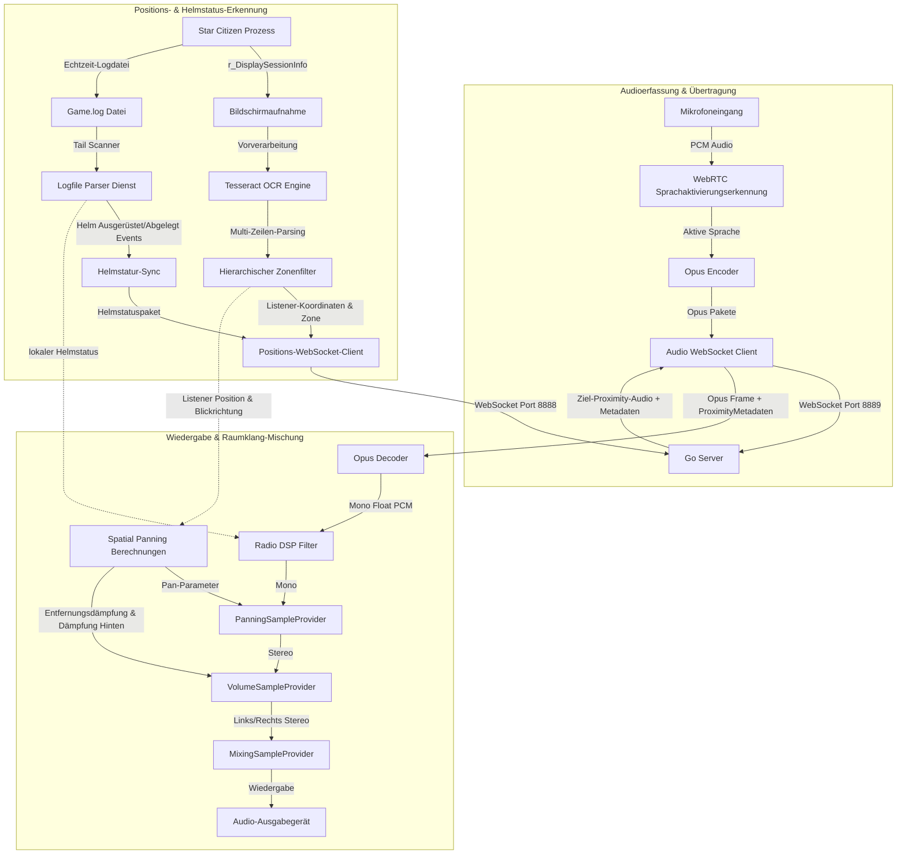

# XuruVoip (Deutsch)

<p align="center">
  <a href="https://github.com/XuruDragon/XuruVOIP/actions/workflows/tests.yml">
    
  </a>
  <a href="https://github.com/XuruDragon/XuruVOIP/releases">
    
  </a>
  <a href="https://github.com/XuruDragon/XuruVOIP/releases">
    
  </a>
</p>

<p align="center">
  <b>Übersetzungen:</b><br/>
  <a href="../README.md">English</a> •
  <a href="README.fr.md">Français</a> •
  <a href="README.de.md">Deutsch</a> •
  <a href="README.es.md">Español</a> •
  <a href="README.pt-BR.md">Português (Brasil)</a> •
  <a href="README.pt-PT.md">Português (Portugal)</a> •
  <a href="README.ja.md">日本語</a> •
  <a href="README.zh.md">简体中文</a>
</p>

<p align="center">
  
</p>

XuruVoip ist eine hochleistungsfähige, sichere und dynamisch spatialisierte **3D-Sprachkommunikations-Suite (VoIP)**, die speziell für die benutzerdefinierte Spieleintegration mit **Star Citizen** entwickelt wurde. Sie besteht aus einem Go-basierten Backend-Server und einem modernen C# WPF-Client.

---

## 📸 Screenshots & Benutzeroberfläche

### 1. Client-Hauptfenster


### 2. Audio-Einstellungen (3D-Raumklang-Steuerung)


### 3. Allgemeine Einstellungen (Sprache & Game.log Pfad)


### 4. Verbindungs-Einstellungen


### 5. Hotkeys-Einstellungen


### 6. Admin-Webportal Login-Seite


### 7. Admin-Webportal Dashboard


### 8. Admin-Webportal Spielerliste


### 9. Admin-Webportal Administrator-Liste


### 10. Admin-Webportal Sperrliste


---

## 🗂️ Projektstruktur

- **/server**: Hochleistungs-Go-Backend, das die Positionierungs-, Audio- und Administrationsdienste hostet.
- **/client**: Moderner C# WPF-Client, der NAudio, WebRtcVad und Tesseract OCR für die automatische Standortverfolgung und Log-Dateianalyse verwendet.

---

## ⚙️ Funktionsweise der Anwendung (Client-Architektur)

Der C# WPF-Client läuft parallel zu Star Citizen und führt Audioerfassung, Sprachaktivierungserkennung, Texterkennung von Koordinaten sowie Audio-Wiedergabe in Echtzeit aus. Unten ist das Ablaufdiagramm des Clients dargestellt:



### 1. Audioerfassung, VAD und Komprimierung
* **Audioerfassung:** Der Client erfasst Mikrofon-Audio über die **NAudio**-API mit 48.000 Hz, 16-Bit Mono.
* **Sprachaktivierungserkennung (VAD):** Audiodaten werden mittels des nativen **WebRtcVad** bewertet. Sinkt die Sprachkonfidenz unter den Schwellenwert, stoppt die Übertragung. So werden Tastaturgeräusche oder Lüfterrauschen ausgefiltert.
* **Komprimierung:** Aktive Audiodaten werden in hochkomprimierte **Opus**-Frames codiert (über **Concentus** C#) und direkt als binäre WebSocket-Frames an den Server gesendet.

### 2. Positionsverfolgung und Richtungsbestimmung
* **Bildschirmaufnahme & OCR:** Der Client fotografiert den Bildschirmbereich mit den Sitzungskoordinaten (`/showlocations` oder `r_DisplaySessionInfo`). Das Bild wird skaliert und die Kontraste erhöht, bevor es von **Tesseract OCR** ausgelesen wird.
* **Hierarchischer Zonenfilter:** Die Koordinaten enthalten hierarchische Zonen (z.B. Planeten, Raumschiffe). Der Client filtert Zonenunterschiede (wie Aufzüge, Sitze) heraus, damit sich Spieler in angrenzenden Zonen unterbrechungsfrei hören.
* **Richtungsbestimmung:** Da Star Citizen die Blickrichtung nicht ausgibt, errechnet der Client die Bewegungsrichtung aus der Positionsänderung ($Position_{aktuell} - Position_{vorherig}$). Im Stillstand bleibt der letzte Wert erhalten.

### 3. Helm-Erkennung in Echtzeit (Logfile-Scanner)
* **Tail Scanner:** Ein Hintergrundprozess liest die Star Citizen `Game.log`-Datei in Echtzeit.
* **Ausrüstungsverfolgung:** Der Scanner filtert Logs wie `<AttachmentReceived>` nach Helmkomponenten (`FP_Visor`, `helmethook_attach`).
* **Auto-Synchronisation:** Wird ein Helm im Spiel auf- oder abgesetzt, ändert sich der Helmmodus des Clients sofort und vollautomatisch.

### 4. Stereo-3D-Raumklang-Mischung & DSP
* **Empfangsschleife:** Der Client empfängt Opus-Audiopakete mit Metadaten (Entfernung, Reichweite, Koordinaten des Sprechers).
* **Raumklang-Berechnung:** Das Signal wird auf die Vektoren des Hörers projiziert:
  * **Stereo Panning (Pan):** Regelt die Links-Rechts-Balance von `-1.0` (voll links) bis `+1.0` (voll rechts).
  * **Hintergrunddämpfung:** Schallquellen von hinten werden um bis zu 25% gedämpft, um die Vorne-Hinten-Verortung im Kopfhörer zu unterstützen.
  * **Entfernungsdämpfung:** Die Lautstärke sinkt linear und erreicht bei maximaler Reichweite (Standard: 50m) null.
* **Wiedergabe:** Die Opus-Frames werden decodiert, laufen durch einen **Radio-DSP-Filter** (falls Sprecher oder Hörer den Helm aufhaben oder auf einem Funkkanal sprechen), werden räumlich verteilt, gedämpft und über den `MixingSampleProvider` von NAudio wiedergegeben.

---

## 🖥️ XuruVoip Server (Go)

Der Server koordiniert die Positionen, authentifiziert Verbindungen und leitet Audiopakete basierend auf Distanzen und Funkkanälen weiter.

### Features
* **Serverseitige Proximity-Steuerung**: Leitet Proximity-Audio nur an Spieler innerhalb der Reichweite (Standard 50m) weiter.
* **Raumklang-Modus**: Umschaltbar über `.env` (`XURUVOIP_SPATIAL_AUDIO`). Bestimmt, ob echte Koordinaten oder nur Entfernungen gesendet werden.
* **Mehrkanal-Funkrouting**: Erlaubt das gleichzeitige Hören mehrerer Funkkanäle bei Übertragung auf dem aktiven Kanal.
* **Audioprofil-System**: Weist Spielern Audioeffekte (z.B. Radio-Effekt, Echo) zu.
* **SQLite-Datenbank**: Speichert Kanäle und Profile dauerhaft.
* **Sicherheitssystem**: Sperrt (bannt) Störenfriede nach Benutzername, IP-Adresse und Hardware-Fingerabdruck (HWID/MachineGuid).
* **Webportal für Admins**: Sichere Weboberfläche (HTTPS/WebSockets) mit Echtzeit-Logs, Dashboard und Ban-Verwaltung.

### Server-Konfiguration (`.env`)
Beim ersten Start wird eine Standard-`.env`-Datei generiert:
```env
XURUVOIP_SERVER_IP=
XURUVOIP_PORT=8888
XURUVOIP_AUDIO_PORT=8889
XURUVOIP_DATA_DIR=.
XURUVOIP_MAX_PLAYERS=500
XURUVOIP_SPATIAL_AUDIO=1
XURUVOIP_PUBLIC_SERVER=0
XURUVOIP_SERVER_PASSWORD=auto_generated_32_chars_token
XURUVOIP_ADMIN_SERVER_PASSWORD=auto_generated_32_chars_token
XURUVOIP_VERBOSE_LOGS=1
XURUVOIP_LIMIT_RATE_POS=50.0
XURUVOIP_LIMIT_BURST_POS=100
XURUVOIP_LIMIT_RATE_AUDIO=60.0
XURUVOIP_LIMIT_BURST_AUDIO=120
XURUVOIP_LOCKOUT_ATTEMPTS=5
XURUVOIP_LOCKOUT_WINDOW=60
XURUVOIP_LOCKOUT_DURATION=600
```

### Server kompilieren

#### Linux
```bash
cd server
GOOS="linux" GOARCH="amd64" go build .
```

#### Windows
```powershell
cd server
$env:GOOS="windows"
$env:GOARCH="amd64"
go build .
```

### Server starten

#### Aus Quellcode:
```bash
cd server
go run .
```

#### Aus Binärdatei:
##### Windows
```powershell
.\server.exe
```

##### Linux
```bash
./server
```

### 🖥️ Headless Server-Einrichtung & Bereitstellung

In Produktivumgebungen sollte der Go-Server im Hintergrund als Systemdienst (Daemon) laufen, um Neustarts bei Abstürzen und Bootstarts zu automatisieren.

#### 1. Netzwerk- & Firewall-Konfiguration
Geben Sie die TCP-Ports der `.env`-Datei (Standard `8888` und `8889`) in der Firewall frei:
* **Linux (UFW):**
  ```bash
  sudo ufw allow 8888/tcp
  sudo ufw allow 8889/tcp
  sudo ufw reload
  ```
* **Linux (firewalld):**
  ```bash
  sudo firewall-cmd --zone=public --add-port=8888/tcp --permanent
  sudo firewall-cmd --zone=public --add-port=8889/tcp --permanent
  sudo firewall-cmd --reload
  ```

---

#### 2. Linux-Bereitstellung (systemd)

So richten Sie den Server als systemd-Dienst ein:

##### Schritt A: Verzeichnisse & Berechtigungen anlegen
Erstellen Sie einen Systembenutzer und das Arbeitsverzeichnis zur Sicherheitsisolation:
```bash
# Systembenutzer ohne Login-Rechte anlegen
sudo useradd -r -s /bin/false xuruvoip

# Ordner anlegen und Binärdatei kopieren
sudo mkdir -p /opt/xuruvoip
sudo cp xuruvoip-server-linux-x64 /opt/xuruvoip/xuruvoip-server
sudo chmod +x /opt/xuruvoip/xuruvoip-server

# Besitzerrechte übertragen
sudo chown -R xuruvoip:xuruvoip /opt/xuruvoip
```

##### Schritt B: Konfigurationsdatei `.env` erstellen
Führen Sie den Server einmalig als Systembenutzer aus, um die Standard-Konfiguration zu erstellen:
```bash
sudo -u xuruvoip /opt/xuruvoip/xuruvoip-server -port 8888 -audio-port 8889
```
*Drücken Sie `Ctrl+C`, sobald die Passwörter ausgegeben wurden.* Passen Sie die `.env`-Datei an:
```bash
sudo nano /opt/xuruvoip/.env
```

##### Schritt C: systemd-Service-Datei erstellen
Kopieren Sie die Servicedatei aus dem Git-Repository `server/xuruvoip.service` nach `/etc/systemd/system/xuruvoip-server.service` oder erstellen Sie sie mit folgendem Inhalt:
```ini
[Unit]
Description=XuruVoip Star Citizen Spatial VOIP Server
After=network.target

[Service]
Type=simple
User=xuruvoip
Group=xuruvoip
WorkingDirectory=/opt/xuruvoip
ExecStart=/opt/xuruvoip/xuruvoip-server
Restart=always
RestartSec=5
LimitNOFILE=65536

[Install]
WantedBy=multi-user.target
```

##### Schritt D: Dienst aktivieren & starten
```bash
sudo systemctl daemon-reload
sudo systemctl enable xuruvoip-server
sudo systemctl start xuruvoip-server
```

##### Schritt E: Logs und Überwachung
```bash
# Dienst-Status anzeigen
sudo systemctl status xuruvoip-server

# Log-Ausgabe in Echtzeit verfolgen
journalctl -u xuruvoip-server -f -n 100
```

---

#### 3. Windows-Bereitstellung (NSSM)

Um den Server als vollwertigen Windows-Dienst im Hintergrund laufen zu lassen, empfiehlt sich das Tool **NSSM (Non-Sucking Service Manager)**:

##### Schritt A: Verzeichnis erstellen
Verschieben Sie die Datei `xuruvoip-server-windows-x64.exe` in einen Ordner (z.B. `C:\XuruVoipServer`).

##### Schritt B: Erste Konfiguration
Führen Sie die Datei einmalig in PowerShell aus, um die Konfigurationen anzulegen. Beenden Sie sie mit `Ctrl+C` und bearbeiten Sie die `.env`.

##### Schritt C: Dienst mit NSSM installieren
```powershell
.\nssm.exe install XuruVoipServer "C:\XuruVoipServer\xuruvoip-server-windows-x64.exe"
```
Geben Sie das Arbeitsverzeichnis `C:\XuruVoipServer` an und installieren Sie den Dienst.

##### Schritt D: Dienst starten
```powershell
Start-Service -Name XuruVoipServer
```

---

## 🎮 Übersicht der XuruVoip-Client-Einstellungen

Das Einstellungsfenster bietet fünf Abschnitte:
1. **General**: Sprachauswahl, Pfad der Star Citizen `Game.log`-Datei und Umschalter für das lokale Logging.
2. **Connection**: Serveradresse, Audio- und Positionsports, Benutzername, Passwort und Serverpasswort/-token.
3. **OCR**: Monitorauswahl, Scanintervall (ms), Scanbereich festlegen und Vorschau der letzten Texterkennung.
4. **Audio**: Audiogeräte auswählen, Lautstärke anpassen, Sendemodus (PTT / VAD) festlegen, VAD-Empfindlichkeit einstellen und **3D Spatial Audio** aktivieren (sofern serverseitig erlaubt).
5. **Hotkeys**: Belegung von Tasten für PTT (Nähe, Funk, Profil), Helm ein/aus, Funkkanal-Umschaltung sowie Mute-Tasten für Ausgang (Mikrofon) und Eingang (Wiedergabe).

### Client kompilieren und ausführen

#### Anforderungen
- Windows 10 oder Windows 11
- .NET 9.0 SDK (mit WPF-Komponenten)

#### Kompilieren & Starten:
```powershell
cd client
dotnet run
```

### Installation des Release-Pakets

Da die Installationsdateien und ausführbaren Dateien nicht digital signiert sind, blockiert Windows SmartScreen den Start standardmäßig. Sie müssen die Sperre in den Dateieigenschaften aufheben.

* **Option A: MSI-Installer (Empfohlen)**
  1. Laden Sie `XuruVoipClient-win-x64.msi` von der [Release-Seite](https://github.com/XuruDragon/XuruVOIP/releases) herunter.
  2. Klicken Sie mit der rechten Maustaste auf die Datei und wählen Sie **Eigenschaften**.
  3. Aktivieren Sie im Reiter *Allgemein* unten das Kontrollkästchen **Zulassen** (oder "Sicherheit: Blockierung aufheben") und klicken Sie auf **Übernehmen**.
  4. Starten Sie das Setup durch Doppelklick.

* **Option B: Portable ZIP-Version**
  1. Laden Sie `XuruVoipClient-win-x64.zip` von der [Release-Seite](https://github.com/XuruDragon/XuruVOIP/releases) herunter.
  2. Machen Sie einen Rechtsklick auf das ZIP-Archiv und heben Sie die Blockierung unter **Eigenschaften** auf. Klicken Sie auf **Übernehmen**.
  3. Entpacken Sie die ZIP-Datei in einen beliebigen Ordner (z.B. `C:\Games\XuruVoip`).
  4. Starten Sie das Programm direkt per Doppelklick auf `XuruVoipClient.exe`.

---

## 👥 Mitwirkende

Entwickelt von **[@XuruDragon](https://github.com/XuruDragon)** in Zusammenarbeit mit **Antigravity IDE**.
