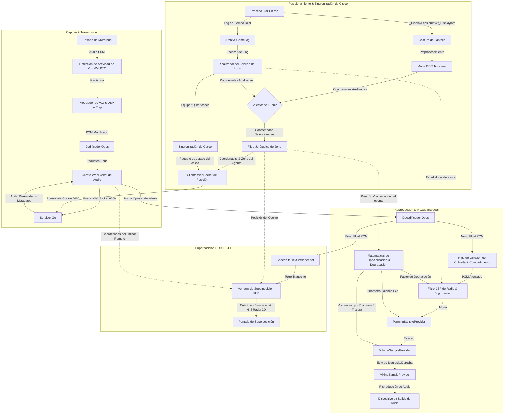

# XuruVoip (Español)

<p align="center">
  <a href="https://github.com/XuruDragon/XuruVOIP/actions/workflows/tests.yml">
    
  </a>
  <a href="https://github.com/XuruDragon/XuruVOIP/releases">
    
  </a>
  <a href="https://github.com/XuruDragon/XuruVOIP/releases">
    
  </a>
</p>

<p align="center">
  <b>Traducciones:</b><br/>
  <a href="../README.md">English</a> •
  <a href="README.fr.md">Français</a> •
  <a href="README.de.md">Deutsch</a> •
  <a href="README.es.md">Español</a> •
  <a href="README.pt-BR.md">Português (Brasil)</a> •
  <a href="README.pt-PT.md">Português (Portugal)</a> •
  <a href="README.ja.md">日本語</a> •
  <a href="README.zh.md">简体中文</a>
</p>

<p align="center">
  
</p>

XuruVoip es una suite de comunicación de voz 3D (VoIP) de alto rendimiento, segura y espacializada dinámicamente, diseñada específicamente para integraciones de juego personalizadas con **Star Citizen**. Consta de un servidor backend en Go y de un cliente moderno en C# WPF.

---

## 📸 Capturas de Pantalla e Interfaz de Usuario

<details>
<summary>📸 Haz clic para ver las capturas de pantalla</summary>

### 1. Ventana Principal del Cliente


### 2. Pestaña de Ajustes de Audio (Control Espacial 3D)


### 3. Pestaña de Ajustes Generales (Idioma y Ruta de Game.log)


### 4. Pestaña de Ajustes de Conexión


### 5. Pestaña de Raccourcis / Atajos de Teclado


### 6. Pestaña de Ajustes de Superposición (HUD Vulkan y DirectX)


### 7. Página de Inicio de Sesión del Portal Web de Administración


### 8. Panel de Control del Portal Web de Administración


### 9. Lista de Jugadores del Portal Web de Administración


### 10. Lista de Administradores del Portal Web de Administración


### 11. Lista de Bloqueados (Baneos) del Portal Web de Administración


</details>

---

## 🗂️ Estructura del Proyecto

- **/server**: Servidor backend en Go de alto rendimiento que aloja los servicios de posición, audio y administración.
- **/client**: Cliente moderno en C# WPF que utiliza NAudio, WebRtcVad y Tesseract OCR para el seguimiento automatizado de ubicaciones y el análisis de registros (logs).

---

## ⚙️ Cómo Funciona la Aplicación (Arquitectura del Cliente)

El cliente C# WPF se ejecuta en paralelo con Star Citizen y realiza captura de audio, procesamiento, reconocimiento de coordenadas y reproducción en tiempo real. A continuación se detalla el flujo de trabajo del sistema cliente:



### 1. Captura de Audio, VAD y Compresión
* **Captura de Audio:** El cliente captura el audio del micrófono utilizando la API **NAudio** a una tasa de alta fidelidad de 48,000 Hz, 16 bits mono.
* **Detección de Actividad de Voz (VAD):** Los búferes de audio son evaluados por el wrapper nativo **WebRtcVad**. Si la confianza de voz cae por debajo del umbral, la transmisión se detiene para evitar emitir el ruido del teclado o ventiladores.
* **Compresión:** Los búferes de voz activa se codifican en tramas **Opus** altamente comprimidas (utilizando el wrapper C# **Concentus**) y se transmiten inmediatamente como tramas WebSocket binarias al servidor de audio Go.

### 2. Seguimiento de Ubicación y Estimación de Orientación
* **Alternar Fuente de Posición:** Los jugadores pueden elegir entre dos metodologías de posicionamiento en la configuración del cliente:
  * **Escáner de Pantalla OCR:** Realiza periódicamente capturas de pantalla de la región configurada (donde se muestran las coordenadas con `/showlocations` o `r_DisplaySessionInfo`), preprocesa la imagen y la envía al motor **Tesseract OCR**.
  * **Lector Game.log (GRTPR):** Escanea directamente el archivo `Game.log` de Star Citizen para obtener las coordenadas registradas. Para habilitar esto, se debe añadir `r_DisplaySessionInfo = 3` (o `1`) al archivo `user.cfg` del juego. Al seleccionar GRTPR, el motor Tesseract OCR se detiene y se libera por completo, reduciendo sustancialmente el uso de CPU y RAM del equipo.
* **Filtrado de Zona Jerárquico:** El texto de posición analizado contiene múltiples líneas de coordenadas jerárquicas (por ejemplo, planetas, compartimentos, ascensores). El cliente filtra dinámicamente las diferencias de subzonas (como ascensores, asientos) para que los jugadores en zonas adyacentes se escuchen sin interrupciones.
* **Estimación de Orientación:** Dado que Star Citizen no proporciona orientación, el cliente calcula la dirección de movimiento a partir del cambio de posición ($Position_{actual} - Position_{anterior}$). En parada, se mantiene el último valor.

### 3. Detección de Casco en Tiempo Real
* **Escáner del Log:** Un proceso en segundo plano lee en tiempo real el archivo `Game.log` de Star Citizen.
* **Seguimiento de Accesorios:** El escáner busca líneas de equipamiento de cascos/visores (`FP_Visor`, `helmethook_attach`). El modo casco (Activo/Inactivo) se sincroniza automáticamente de manera instantánea.

### 4. Mezcla Espacial Estéreo 3D y DSP
* **Bucle de Recepción:** El cliente recibe paquetes Opus con metadatos de proximidad (distancia, rango máximo y coordenadas del emisor).
* **Cálculos Espaciales:** La señal se proyecta sobre los vectores del oyente:
  * **Paneo Estéreo (Pan):** Controla el balance izquierdo/derecho desde `-1.0` (izquierdo completo) hasta `+1.0` (derecho completo).
  * **Resolución de la Ambigüedad Delante-Atrás:** Si el emisor está detrás, se aplica una atenuación de volumen de hasta 25% para ayudar a la localización auditiva.
  * **Atenuación por Distancia:** El volumen disminuye linealmente y se reduce a cero al alcanzar el rango máximo (50m por defecto).
* **Reproducción y DSP de Radio:** Las tramas Opus decodificadas pasan por un **filtro DSP de radio** (si alguno de los jugadores tiene el casco puesto o habla por un canal de radio), se espacializan, se ajustan en volumen y se mezclan.
  * **Degradación Dinámica de la Señal de Radio:** Si está activada, el filtro DSP reduce las frecuencias de corte de paso alto/bajo y mezcla ruido blanco filtrado a medida que se acerca al rango máximo, simulando la degradación de la señal de radio.
  * **Efectos PTT y Tonos de Radio Realistas:** NAudio sintetiza tonos de radio para la activación de transmisiones. Al iniciar la transmisión, se produce un mic-key chirp de 50ms (barrido de frecuencia de 900Hz a 700Hz). Al finalizar la transmisión, se desencadena un ruido de squelch de 180ms al recibir una trama Opus vacía de 0 bytes. Una opción de retorno local permite escuchar sus propios efectos de sonido.

### 5. Estados de Micrófono Dinámicos y Controles de Silenciamiento
* **Pantalla de Micrófono Dinámico:** La etiqueta de estado del micrófono en la ventana principal se actualiza en tiempo real para mostrar el estado exacto de su transmisor:
  * `Proximity PTT (Off)` / `Proximity PTT (On)` (Canal de proximidad Push-To-Talk)
  * `Proximity VAD (OFF)` / `Proximity VAD (ON)` (Modo de activación por voz, cambia a ON cuando se detecta voz)
  * `Radio Channel PTT (ON)` (Transmitiendo en el canal de radio activo)
  * `Profile PTT (ON)` (Transmitiendo en el canal de perfil)
  * `(Muted)` (ej. `Proximity PTT (Muted)`) cuando el micrófono para el canal actual está silenciado.
* **Tabla de Estado de Silenciamiento de Canales:** Debajo del canal activo y el estado del casco, la ventana principal incluye una tabla estructurada que resume el estado activo/silenciado tanto del micrófono (saliente) como del audio (entrante) para los tres canales de comunicación (Proximidad, Radio y Perfil). Los estados están codificados por colores (Verde para ACTIVO, Rojo para SILENCIADO) y se actualizan dinámicamente.
* **Raccourcis de Teclado Separados para Silenciar Micrófono y Audio:**
  * **Silenciar Micrófono (Saliente):** Alterna el silencio del micrófono para cada canal. Por defecto: Proximidad (`M`), Radio (`,`), Perfil (`.`). Cuando está silenciado, las presiones PTT y el habla VAD no transmitirán audio al servidor, y el LED de la ventana principal permanece naranja.
  * **Silenciar Audio (Entrante):** Alterna el silencio de la reproducción de la voz de otros jugadores en cada canal. Los valores predeterminados no están asignados (`Ninguno`) y se pueden personalizar en la ventana de configuración.

### 6. Incrustación HUD (Overlay) Compatible con Vulkan y DirectX
* **Ventana de Incrustación HUD**: El cliente proporciona un overlay WPF opcional y ligero que se muestra en primer plano. Indica el estado de la VoIP, la frecuencia activa y la lista de interlocutores que hablan con indicadores de señal de radio.
* **Integración Transparente Win32**: Gracias a los estilos de ventana Win32 (`WS_EX_TRANSPARENT` y `WS_EX_NOACTIVATE`), la incrustación no roba el foco y permite que todos los clics del mouse pasen directamente al juego.
* **Rendimiento Independiente de la API**: Dado que las ventanas transparentes WPF se basan en la composición del Desktop Window Manager (DWM) de Windows, el overlay no se inyecta en el pipeline gráfico del juego. Esto garantiza una compatibilidad total tanto con **Vulkan** como con **DirectX**, siempre que el juego se ejecute en modo **"Ventana sin Bordes"** (Borderless Windowed).
* **📡 Mini-Radar Táctico HUD**: Muestra las posiciones de los jugadores en un mini-radar circular incrustado en el HUD.
  * **Alineación de Orientación (Heading-Up)**: El radar gira automáticamente según la dirección de movimiento del jugador (vector de desplazamiento).
  * **Proyección Relativa**: Proyecta las coordenadas de los jugadores cercanos cuando hablan en proximidad. Los interlocutores activos muestran ondas de sonido concéntricas pulsadas.
  * **Configurabilidad**: Puede activarse/desactivarse en los ajustes, con un rango máximo ajustable de 10m a 200m.
* **💬 Subtítulos HUD en Tiempo Real (Speech-to-Text)**: Transcribe automáticamente las comunicaciones de voz en tiempo real y las muestra como subtítulos en la superposición del HUD.
  * **Transcripción Sin Conexión**: Utiliza un modelo Whisper ligero y local (`ggml-tiny.bin`) que se ejecuta de forma completamente local (mediante Whisper.net).
  * **Adaptación de Idioma Dinámica**: Sincroniza dinámicamente el idioma de reconocimiento de voz con el idioma de interfaz de usuario seleccionado por el usuario.
  * **Instalación en Segundo Plano**: Descarga el modelo de 75 MB desde HuggingFace solo tras la primera activación de la función. El progreso de descarga se muestra directamente en el HUD.

### 7. Acústica Ambiental (Oclusión y Reverberación)
* **Filtro de Oclusión:** Si el hablante y el oyente están en compartimentos diferentes, el cliente aplica automáticamente un filtro de paso bajo (corte a 600 Hz, volumen al 65%) para simular la obstrucción física. La transición es suave para evitar clics.
* **Reverberación Inteligente:** Si el oyente se encuentra en una cueva, bunker o hangar, un filtro en peine de línea de retardo aplica parámetros específicos:
  * *Cuevas / Túneles:* 45% wet, 100ms de retraso, 0.6 de feedback.
  * *Bunkers / Estaciones:* 25% wet, 50ms de retraso, 0.4 de feedback.
  * *Hangares:* 35% wet, 150ms de retraso, 0.5 de feedback.
* **🗺️ Oclusión Específica de Compartimentos y Cubiertas**: Admite el diseño interno de naves y búnkeres para atenuar el audio en función de las paredes y cubiertas físicas:
  * *Cubiertas de Carrack*: Las divisiones de coordenadas Z (cubierta de mando, cubierta de habitáculo, cubierta técnica) aplican un filtro de paso bajo pronunciado (corte a 350 Hz, volumen al 35%).
  * *Compartimentos de Carrack*: Las divisiones de coordenadas Y (cabina, habitáculo, motores) atenúan el sonido (corte a 900 Hz, volumen al 65%).
  * *Niveles de Búnker*: Las divisiones de coordenadas Z (vestíbulo del ascensor, nivel intermedio, nivel principal) atenúan el sonido (corte a 300 Hz, volumen al 30%).
  * *Salas de Búnker*: Las divisiones de coordenadas X atenúan el sonido (corte a 800 Hz, volumen al 60%).
  * *Cubiertas de Hercules*: Las divisiones de coordenadas Z (habitáculo, bodega de carga) atenúan el sonido (corte a 400 Hz, volumen al 45%).
  * *Compartimentos de Cutlass*: Las divisiones de coordenadas Y (cabina, bodega de carga) atenúan el sonido (corte a 1000 Hz, volumen al 70%).
  * *Heurística de Elevación General*: Cualquier diferencia de altura mayor a 4.5m entre jugadores en la misma zona activa automáticamente la oclusión de suelo/techo (corte a 500 Hz, volumen al 45%).

### 8. Discord Rich Presence sin Dependencias Externas (RPC)
* **Conexión de tubería nombrada robusta:** El cliente se integra con Discord sin requerir dependencias externas pesadas. Para garantizar una conectividad sólida en diferentes configuraciones de Discord o múltiples instancias, escanea e intenta la conexión en todos los índices de tuberías nombradas desde `discord-ipc-0` hasta `discord-ipc-9`.
* **Actualizaciones de Actividad Dinámica:** Actualiza en tiempo real su presencia en Discord:
  * **Detalles:** Zona de ubicación en juego (ej. `"En una cueva de MicroTech"`).
  * **Estado:** Canal activo y estado del casco (ej. `"En la radio: Canal Bravo (Casco puesto)"` o `"En proximidad"`).
  * **Tiempo Transcurrido:** Muestra el cronómetro desde la conexión al servidor VoIP.

### 9. Rotación de registros al inicio
* **Rotación diaria de registros:** Al iniciar, el cliente verifica la fecha del archivo de registro activo. Si se modificó un día anterior, se archiva como `xuru_voip.YYYY-MM-DD.log`.
* **Depuración y retención:** Para limitar el consumo de espacio en disco, el cliente escanea el directorio de registros y conserva solo los 5 archivos de registro rotados más recientes, eliminando los más antiguos.

### 10. 🎙️ Moduladores de Voz y de Traje en Tiempo Real
* **DSP de Modulación de Voz**: Aplica efectos de procesamiento de señal digital en tiempo real al audio del micrófono antes de la compresión Opus:
  * **Pitch Shifter**: Desplazamiento de tono en tiempo real utilizando dos líneas de retraso superpuestas con atenuación cruzada.
  * **Ring Modulator**: Multiplica la señal de audio por una onda portadora para crear sonidos metálicos y robóticos de ciencia ficción.
  * **Flanger**: Filtro de peine con una línea de retraso modulada por LFO para crear un efecto de barrido espacial.
* **Ajustes Preestablecidos del Modulador**:
  * *Alien*: Modulación grave (0.65x) con Ring Modulator (85 Hz) y Flanger.
  * *Cyborg*: Tono metálico (0.82x), Ring Modulator (65 Hz), saturación suave de tanh y reducción de resolución (bitcrushing) a un equivalente de 8 bits.
  * *Robotic*: Modulación aguda (1.25x), Ring Modulator (140 Hz) y Flanger.
  * *Desplazamiento de Tono Personalizado*: Ajuste manual del factor de tono de 0.5x a 2.0x.
* **Modulador de Casco y Traje**: Superpone un sonido de respiración de respirador realista y tonos de timbre al activar/desactivar la transmisión (totalmente configurables de forma independiente).

### 11. 💨 Simulación de Atmósfera en Casco y EVA
* **Silenciamiento en EVA/Vacío:** Cuando los jugadores se encuentran en zonas de vacío o en el espacio (EVA), las comunicaciones de voz por proximidad se desactivan/silencian automáticamente para simular la falta de un medio atmosférico. La comunicación solo es posible a través de canales de radio.
* **Respiración en Visor y Zumbido de Traje:** Cuando el visor del casco está equipado y activo, se superpone un efecto de sonido realista de respiración y un zumbido de ventilación del traje (osciladores de 50Hz/100Hz) en la captura del micrófono. Esto se puede activar o desactivar a través de la configuración del cliente.

### 12. 💬 Intercomunicador de Nave Dinámico y Atenuación de Prioridad de Piloto
* **Canales de Intercomunicador Automáticos:** Cuando los jugadores entran a una nave, el servidor crea automáticamente un canal de intercomunicador dedicado (`Intercom_<ContainerID>`) y suscribe de forma automática a todos los jugadores dentro de ese vehículo.
* **Limpieza Temporizada del Intercomunicador:** Cuando el último jugador sale de la nave, el servidor inicia una cuenta atrás de 5 minutos antes de eliminar el canal del intercomunicador, evitando la sobrecarga de rendimiento por transiciones frecuentes.
* **Atenuación de Prioridad de Piloto:** Cuando un jugador en un asiento de piloto/conductor habla en el canal del intercomunicador, el audio de proximidad de todos los demás jugadores en la nave se atenúa automáticamente en un 85% para garantizar que los comandos del piloto se escuchen con claridad.

### 13. 📱 Aplicación Compañera y Panel Web (Companion App)
* **Servidor HTTP Local:** El cliente aloja un servidor web ligero en el puerto `8891` (si está habilitado en la configuración).
* **Interfaz Web Glassmorphic:** Acceda a `http://localhost:8891/` desde cualquier dispositivo local (incluidos teléfonos móviles o tabletas) para ver un panel elegante con estilo de neón brillante.
* **Controles de la API:** Proporciona actualizaciones de estado en tiempo real (GET `/api/status`) y puntos finales de control (POST `/api/action`) para alternar estados de silencio, el visor del casco, los canales activos y los perfiles del modulador de voz (compatible con Stream Deck).

### 14. 🎛️ Puente de Voz con Discord (Discord Voice Bridge)
* **Transmisión de Audio Bidireccional:** Puente de voz en el lado del servidor que retransmite las comunicaciones de voz entre un canal de radio designado del servidor Go y un canal de voz de Discord en tiempo real.
* **Mapeo de Miembros SSRC:** Asocia automáticamente las ID de usuario de Discord con sus apodos del servidor, mostrando el habla entrante de Discord bajo la etiqueta `"<Apodo> (Discord)"`.

---

## 🎮 Pestañas de Ajustes de XuruVoip Client

El panel de configuración incluye seis secciones:
1. **General**: Selección de idioma, ruta del archivo `Game.log` de Star Citizen y activación del registro local.
2. **Connection**: Dirección IP del servidor, puertos de audio y posición, nombre de usuario, contraseña del perfil y contraseña del servidor.
3. **Position**: Elección de la fuente de posición ("Escáner de Pantalla OCR" vs. "Lector Game.log (GRTPR)"), selección del monitor, frecuencia de escaneo (ms), definición del área de escaneo de pantalla y vista previa del texto parseado (las opciones OCR se ocultan cuando GRTPR está activo).
4. **Audio**: Dispositivos de audio, ajuste de ganancias de volumen, modo de transmisión (PTT / VAD), sensibilidad del VAD, activación de **3D Spatial Audio**, degradación de radio y tonos PTT de micro, activar modulador de traje y elegir/configurar **ajustes preestablecidos del modulador de voz** (Alien, Cyborg, Robotic, PitchShift).
5. **Hotkeys**: Registro de las teclas de atajo de teclado para el PTT, silenciar canales de transmisión y silenciar canales de audio recibidos.
6. **Overlay**: Activación de la superposición HUD transparente, configuración de la ubicación en pantalla, activar el **Mini-Radar Táctico** (con rango máximo configurable) y activar los **subtítulos en tiempo real** (con aviso de descarga del modelo Whisper).

### Compilación y Ejecución del Cliente

#### Requisitos
- Windows 10 o Windows 11

---

## 🖥️ Servidor XuruVoip (Go)

El servidor coordina las posiciones, autentica conexiones y enruta los paquetes de audio según las distancias y los canales de radio.

### Características Claves
* **Control de Proximidad Codo Servidor** : Transmite el audio de proximidad solo a los jugadores dentro del rango (50m por defecto).
* **Configuración del Modo de Spatialización** : Opción `XURUVOIP_SPATIAL_AUDIO` en el archivo `.env` para activar o desactivar el envío de coordenadas reales a los clientes.
* **Enrutamiento de Radio Multicanal** : Permite escuchar múltiples canales de radio a la vez mientras se transmite en el canal activo.
* **Sistema de Perfiles de Audio** : Asigna efectos (ej. radio, eco) a los perfiles de los jugadores.
* **Base de Datos SQLite** : Almacena canales y perfiles de forma permanente.
* **Seguridad Anti-Evasión** : Bloquea por nombre de usuario, dirección IP y huella de hardware (HWID/MachineGuid).
* **Portal de Administración Web** : Interfaz web segura en HTTPS/WebSockets con registros en tiempo real y gestión de baneos.
* **Mapa de Radar de Administración** : Un mapa de radar 2D Canvas HTML5 en tiempo real en el panel de control para seguir a los jugadores, con desplazamiento de clic y arrastre, zoom de rueda de mouse, filtrado por zona y visualización de ondas concéntricas animadas alrededor de los hablantes.
* **Rotación de registros al inicio**: Verifica el registro del servidor (`xuruvoip.log`) al iniciar. Si el archivo de registro contiene entradas de un día anterior, se rota a `xuruvoip.YYYY-MM-DD.log`. El servidor conserva solo los 5 archivos rotados más recientes y elimina los más antiguos para evitar un uso excesivo del espacio en disco.

### Configuración del Servidor (`.env`)
En su primera ejecución, el servidor autogenera un archivo `.env`:
```env
XURUVOIP_SERVER_IP=
XURUVOIP_PORT=8888
XURUVOIP_AUDIO_PORT=8889
XURUVOIP_DATA_DIR=.
XURUVOIP_MAX_PLAYERS=500
XURUVOIP_SPATIAL_AUDIO=1
XURUVOIP_PUBLIC_SERVER=0
XURUVOIP_SERVER_PASSWORD=auto_generated_32_chars_token
XURUVOIP_ADMIN_SERVER_PASSWORD=auto_generated_32_chars_token
XURUVOIP_VERBOSE_LOGS=1
XURUVOIP_LIMIT_RATE_POS=50.0
XURUVOIP_LIMIT_BURST_POS=100
XURUVOIP_LIMIT_RATE_AUDIO=60.0
XURUVOIP_LIMIT_BURST_AUDIO=120
XURUVOIP_LOCKOUT_ATTEMPTS=5
XURUVOIP_LOCKOUT_WINDOW=60
XURUVOIP_LOCKOUT_DURATION=600

# Ajustes de Intercomunicador y EVA (1 = habilitado, 0 = desactivado)
XURUVOIP_ENABLE_INTERCOM=1
XURUVOIP_ENABLE_EVA_MUTING=1

# Ajustes del Puente de Voz de Discord (1 = habilitado, 0 = desactivado)
XURUVOIP_ENABLE_DISCORD_BRIDGE=1
XURUVOIP_DISCORD_TOKEN=tu_token_de_bot_de_discord
XURUVOIP_DISCORD_GUILD_ID=tu_id_de_servidor_de_discord
XURUVOIP_DISCORD_CHANNEL_ID=tu_id_de_canal_de_voz_de_discord
XURUVOIP_DISCORD_BRIDGE_CHANNEL=General
```

### Compilación desde las fuentes

#### Linux
```bash
cd server
GOOS="linux" GOARCH="amd64" go build .
```

#### Windows
```powershell
cd server
$env:GOOS="windows"
$env:GOARCH="amd64"
go build .
```

### Ejecución del Servidor

#### Desde el código fuente:
```bash
cd server
go run .
```

#### Desde el binario:
##### Windows
```powershell
.\server.exe
```

##### Linux
```bash
./server
```

### 🖥️ Configuración y Despliegue del Servidor sin Cabecera (Headless)

Para servidores de producción headless permanentes, se recomienda configurar el servidor para que se ejecute en segundo plano como un servicio del sistema.

#### 1. Configuración de Red y Cortafuegos
Asegúrese de abrir los puertos TCP configurados en el archivo `.env` (puertos 8888 y 8889 por defecto) en el cortafuegos de su sistema:
* **Linux (UFW):**
  ```bash
  sudo ufw allow 8888/tcp
  sudo ufw allow 8889/tcp
  sudo ufw reload
  ```
* **Linux (firewalld):**
  ```bash
  sudo firewall-cmd --zone=public --add-port=8888/tcp --permanent
  sudo firewall-cmd --zone=public --add-port=8889/tcp --permanent
  sudo firewall-cmd --reload
  ```

---

#### 2. Despliegue en Linux (systemd)

Siga estos pasos para desplegar el servidor en Go como un servicio de systemd:

##### Paso A: Crear Directorios y Permisos
Cree un usuario de sistema dedicado y un directorio de trabajo para aislar la seguridad:
```bash
# Crear un usuario de sistema sin permisos de inicio de sesión
sudo useradd -r -s /bin/false xuruvoip

# Crear el directorio de instalación y copiar el binario
sudo mkdir -p /opt/xuruvoip
sudo cp xuruvoip-server-linux-x64 /opt/xuruvoip/xuruvoip-server
sudo chmod +x /opt/xuruvoip/xuruvoip-server

# Establecer la propiedad al usuario del sistema
sudo chown -R xuruvoip:xuruvoip /opt/xuruvoip
```

##### Paso B: Inicializar y Configurar `.env`
Ejecute el servidor una vez bajo el usuario del sistema para generar el archivo `.env` y la base de datos por defecto:
```bash
sudo -u xuruvoip /opt/xuruvoip/xuruvoip-server -port 8888 -audio-port 8889
```
*Presione `Ctrl+C` después de que la consola imprima los tokens generados.* Luego, edite el archivo `.env`:
```bash
sudo nano /opt/xuruvoip/.env
```

##### Paso C: Crear el archivo de servicio de systemd
Copie el archivo de servicio del repositorio `server/xuruvoip.service` a `/etc/systemd/system/xuruvoip-server.service` o créelo con el siguiente contenido:
```ini
[Unit]
Description=XuruVoip Star Citizen Spatial VOIP Server
After=network.target

[Service]
Type=simple
User=xuruvoip
Group=xuruvoip
WorkingDirectory=/opt/xuruvoip
ExecStart=/opt/xuruvoip/xuruvoip-server
Restart=always
RestartSec=5
LimitNOFILE=65536

[Install]
WantedBy=multi-user.target
```

##### Paso D: Habilitar y Iniciar el servicio
```bash
sudo systemctl daemon-reload
sudo systemctl enable xuruvoip-server
sudo systemctl start xuruvoip-server
```

##### Paso E: Monitoreo y Registros
```bash
# Comprobar el estado del servicio
sudo systemctl status xuruvoip-server

# Monitorear los registros del servicio en tiempo real
journalctl -u xuruvoip-server -f -n 100
```

---

#### 3. Despliegue en Windows (NSSM)

Para ejecutar el servidor como un servicio de Windows en segundo plano, se recomienda utilizar **NSSM (Non-Sucking Service Manager)**:

##### Paso A: Configurar el Directorio
Mueva el archivo `xuruvoip-server-windows-x64.exe` a una carpeta dedicada (ej. `C:\XuruVoipServer`).

##### Paso B: Configuración Inicial
Ejecute el archivo una vez en PowerShell para generar los archivos de configuración iniciales, deténgalo con `Ctrl+C` y edite el archivo `.env`.

##### Paso C: Instalar el Servicio con NSSM
```powershell
.\nssm.exe install XuruVoipServer "C:\XuruVoipServer\xuruvoip-server-windows-x64.exe"
```
Defina el directorio de trabajo como `C:\XuruVoipServer` e instale el servicio.

##### Paso D: Iniciar el Servicio
```powershell
Start-Service -Name XuruVoipServer
```

---

### Compilación y Ejecución del Cliente

#### Requisitos
- Windows 10 o Windows 11
- .NET 9.0 SDK (con componentes WPF)

#### Compilar y ejecutar:
```powershell
cd client
dotnet run
```

### Instalación del Paquete de Lanzamiento (Release)

Debido a que el instalador y ejecutables no están firmados digitalmente, Windows SmartScreen los bloqueará en su primera ejecución. Puede desbloquearlos en sus propiedades.

* **Opción A: Instalador MSI (Recomendado)**
  1. Descargue `XuruVoipClient-win-x64.msi` de la [página de versiones (releases)](https://github.com/XuruDragon/XuruVOIP/releases).
  2. Haga clic derecho sobre el archivo `.msi` y seleccione **Propiedades**.
  3. En la pestaña *General* marque la casilla **Desbloquear** en la parte inferior y haga clic en **Aplicar**.
  4. Inicie el instalador y siga las instrucciones del asistente.

* **Opción B: Versión Portable (ZIP)**
  1. Descargue `XuruVoipClient-win-x64.zip` de la [página de versiones (releases)](https://github.com/XuruDragon/XuruVOIP/releases).
  2. Extraiga los archivos del paquete ZIP en cualquier carpeta de su elección (ej. `C:\Games\XuruVoip`).
  3. Luego, haga clic derecho en el archivo `XuruVoipClient.exe` extraído y seleccione **Propiedades**.
     - En la ventana de propiedades, en la pestaña *General*, marque la casilla **Desbloquear** en la parte inferior.
     - Haga clic en **Aplicar** y luego cierre la ventana de propiedades.
  4. Haga doble clic en `XuruVoipClient.exe` para ejecutar el cliente directamente sin instalarlo.

---

## 👥 Créditos

Desarrollado por **[@XuruDragon](https://github.com/XuruDragon)** en colaboración con **Antigravity IDE**.
