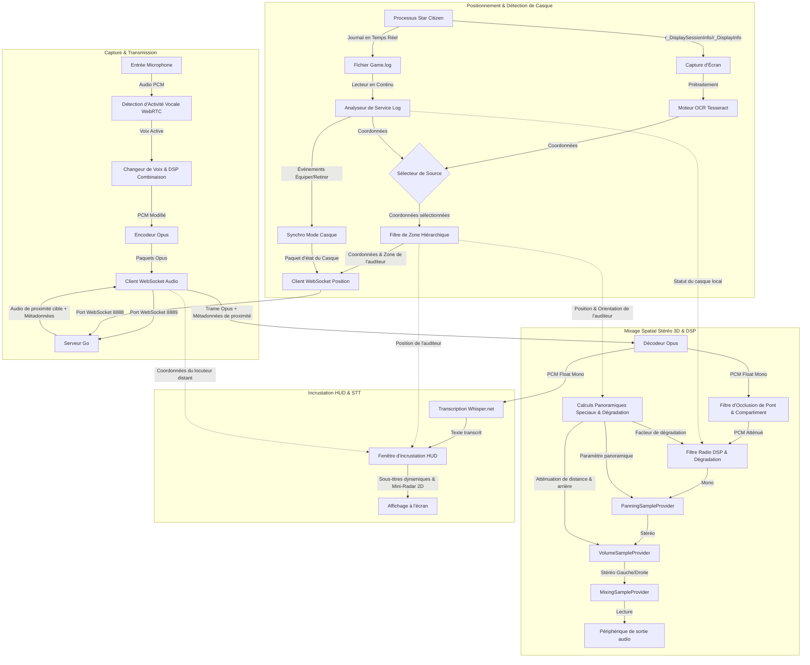

# XuruVoip (Français)

<p align="center">
  <a href="https://github.com/XuruDragon/XuruVOIP/actions/workflows/tests.yml">
    
  </a>
  <a href="https://github.com/XuruDragon/XuruVOIP/releases">
    
  </a>
  <a href="https://github.com/XuruDragon/XuruVOIP/releases">
    
  </a>
</p>

<p align="center">
  <b>Traductions :</b><br/>
  <a href="../README.md">English</a> •
  <a href="README.fr.md">Français</a> •
  <a href="README.de.md">Deutsch</a> •
  <a href="README.es.md">Español</a> •
  <a href="README.pt-BR.md">Português (Brasil)</a> •
  <a href="README.pt-PT.md">Português (Portugal)</a> •
  <a href="README.ja.md">日本語</a> •
  <a href="README.zh.md">简体中文</a>
</p>

<p align="center">
  
</p>

XuruVoip est une suite de communication vocale 3D (VoIP) haute performance, sécurisée et spatialisée dynamiquement, conçue spécifiquement pour des intégrations personnalisées avec **Star Citizen**. Elle se compose d'un serveur backend écrit en Go et d'un client moderne en C# WPF.

---

## 📸 Captures d'écran & Interface Utilisateur

<details>
<summary>📸 Cliquez pour afficher les captures d'écran</summary>

### 1. Fenêtre Principale du Client


### 2. Onglet Paramètres Audio (Contrôle Spatial 3D)


### 3. Onglet Paramètres Généraux (Langue & Sélection de Game.log)


### 4. Onglet Paramètres de Connexion


### 5. Onglet Raccourcis Clavier


### 6. Onglet Paramètres de l'Overlay (HUD Vulkan & DirectX)


### 7. Page de Connexion du Portail Web Admin


### 8. Tableau de Bord du Portail Web Admin


### 9. Liste des Joueurs du Portail Web Admin


### 10. Liste des Administrateurs du Portail Web Admin


### 11. Liste des Bannissements du Portail Web Admin


</details>

---

## 🗂️ Structure du Projet

- **/server** : Backend en Go haute performance gérant la position, l'audio et les services d'administration.
- **/client** : Client moderne en C# WPF utilisant NAudio, WebRtcVad et Tesseract OCR pour le suivi automatique de la localisation et l'analyse des journaux (logs).

---

## ⚙️ Fonctionnement de l'Application (Architecture du Client)

Le client C# WPF fonctionne en parallèle de Star Citizen pour effectuer la capture audio, le traitement, la reconnaissance des coordonnées et la lecture en temps réel. Voici le schéma fonctionnel du système client :



### 1. Capture Audio, VAD et Compression
* **Capture Audio :** Le client capture le microphone en utilisant l'API **NAudio** à un taux de 48 000 Hz, 16 bits mono.
* **Détection d'Activité Vocale (VAD) :** Les tampons audio sont évalués par le wrapper natif **WebRtcVad**. Si la confiance vocale descend sous le seuil configuré, la transmission s'arrête pour éviter de diffuser le bruit du clavier ou des ventilateurs.
* **Compression :** Les voix actives sont encodées en paquets **Opus** compressés (via le wrapper C# **Concentus**) et transmises directement via WebSocket au serveur audio.

### 2. Suivi de Localisation et Orientation
* **Sélecteur de Source de Position :** Les joueurs peuvent escolher entre deux méthodes de positionnement dans les paramètres :
  * **Scanner d'Écran OCR :** Capture régulièrement la zone configurée de l'écran (affichant les coordonnées de session `/showlocations` ou `r_DisplaySessionInfo`), prétraite l'image et la transmet au moteur **Tesseract OCR**.
  * **Lecteur Game.log (GRTPR) :** Analyse en continu le fichier `Game.log` de Star Citizen pour y lire les coordonnées. Pour activer cette méthode, les joueurs doivent ajouter `r_DisplaySessionInfo = 3` (ou `1`) à leur fichier `user.cfg`. Choisir GRTPR désactive et libère complètement le moteur Tesseract OCR, économisant les ressources CPU et RAM de la machine hôte.
* **Filtrage de Zone Hiérarchique :** Les lignes de coordonnées contiennent des zones (compartiments de vaisseaux, ascenseurs, planètes). Le client filtre dynamiquement les sous-zones (comme `elevator`, `transit`, `seat`) et les zones globales (`solarsystem`, `Stanton`) pour éviter les coupures de voix intempestives entre joueurs proches.
* **Estimation de l'Orientation :** Comme Star Citizen ne fournit pas l'orientation, le client calcule le vecteur de déplacement. Si le joueur bouge de plus de 0,5 mètre, l'orientation estimée est mise à jour.

### 3. Détection de Casque en Temps Réel
* **Analyse de Fichier Journal (Tail Scanner) :** Une tâche en arrière-plan lit en temps réel le fichier `Game.log` de Star Citizen.
* **Suivi des Événements :** Elle recherche les lignes d'équipement de casque/visière (`FP_Visor`, `helmethook_attach`). Le mode casque (Actif/Inactif) est alors synchronisé automatiquement.

### 4. Mixage Spatial Stéréo 3D & DSP
* **Réception :** Le client reçoit l'audio de proximité avec des métadonnées (distance, portée maximale, coordonnées de l'émetteur).
* **Calculs Spatiaux :** L'audio est projeté sur les vecteurs de l'auditeur :
  * **Balance Stéréo (Pan) :** Gérée de `-1.0` (gauche) à `+1.0` (droite).
  * **Atténuation Arrière :** Une baisse de volume allant jusqu'à 25% est appliquée si l'émetteur est derrière pour résoudre l'ambiguïté avant-arrière.
  * **Atténuation de Distance :** Le volume s'atténue linéairement jusqu'à atteindre zéro à la portée maximale.
* **Lecture & DSP Radio :** Les frames Opus décodées passent par un **filtre DSP Radio** (si l'un des joueurs porte un casque ou si le canal actif est une radio), sont spatialisées, ajustées en volume et mixées via le `MixingSampleProvider` de NAudio.
  * **Dégradation Radio Dynamique :** Si elle est activée, le filtre DSP rétrécit dynamiquement les fréquences de coupure passe-haut et passe-bas et mélange du bruit blanc filtré lorsque la distance entre les joueurs approche de la portée maximale, simulant la perte de signal radio.
  * **Bruits de Micro PTT Réalistes :** NAudio synthétise des bruits de micro lors de l'activation/désactivation de la transmission. L'activation joue un chirp de 50 ms (balayage de fréquence 900 Hz à 700 Hz). La désactivation déclenche un bruit de squelch (bruit blanc filtré de 180 ms) lors de la réception d'une frame Opus vide de 0 octet. Une option de retour local permet d'entendre ses propres bruitages.

### 5. États Micro Dynamiques & Contrôles de Sourdine
* **Affichage Dynamique du Microphone :** L'étiquette de statut du microphone dans la fenêtre principale se met à jour en temps réel pour afficher l'état exact de votre émetteur :
  * `Proximity PTT (Off)` / `Proximity PTT (On)` (Canal de proximité Push-To-Talk)
  * `Proximity VAD (OFF)` / `Proximity VAD (ON)` (Mode d'activation vocale, passe à ON lorsque la parole est détectée)
  * `Radio Channel PTT (ON)` (Transmission sur le canal radio actif)
  * `Profile PTT (ON)` (Transmission sur le canal de profil)
  * `(Muted)` (ex. `Proximity PTT (Muted)`) quand le microphone du canal actif est coupé.
* **Tableau de Statut des Sourdines de Canaux :** Sous le canal actif et le statut du casque, la fenêtre principale contient un tableau structuré résumant le statut actif/coupé du microphone (sortant) et de l'audio (entrant) pour les trois canaux de communication (Proximité, Radio et Profil). Les statuts sont colorés (Vert pour ACTIF, Rouge pour COUPÉ) et mis à jour de manière dynamique.
* **Raccourcis Clavier Séparés pour Sourdine Micro et Audio :**
  * **Sourdine Microphone (Sortant) :** Active/désactive le micro pour chaque canal. Raccourcis par défaut : Proximité (`M`), Radio (`,`), Profil (`.`). En mode muet, les pressions PTT et la parole VAD ne transmettent pas d'audio au serveur, et la LED de la fenêtre principale reste orange.
  * **Sourdine Audio (Entrant) :** Active/désactive le son des autres joueurs pour chaque canal. Les valeurs par défaut ne sont pas assignées (`Aucun`) et peuvent être configurées dans la fenêtre des paramètres.

### 6. Incrustation HUD (Overlay) Compatible Vulkan et DirectX
* **Fenêtre d'Incrustation HUD** : Le client fournit un overlay WPF optionnel et léger qui s'affiche au premier plan. Il indique le statut de la VoIP, la fréquence active et la liste des interlocuteurs qui parlent avec des indicateurs de signal radio.
* **Intégration Transparente Win32** : Grâce aux styles de fenêtre Win32 (`WS_EX_TRANSPARENT` et `WS_EX_NOACTIVATE`), l'incrustation ne vole pas le focus et laisse passer tous les clics de souris vers le jeu.
* **Rendu Indépendant de l'API** : Étant donné que les fenêtres transparentes WPF s'appuient sur la composition du Desktop Window Manager (DWM) de Windows, l'overlay ne s'injecte pas dans le pipeline graphique du jeu. Cela garantit une compatibilité totale avec **Vulkan** comme **DirectX**, à condition de lancer le jeu en mode **"Fenêtré Sans Bordure"** (Borderless Windowed).
* **📡 Mini-Radar Tactique HUD** : Affiche les positions des joueurs sur un mini-radar circulaire incrusté sur le HUD.
  * **Alignement d'orientation (Heading-Up)** : Le radar tourne automatiquement en fonction de la direction de mouvement du joueur (vecteur de déplacement).
  * **Projection relative** : Projette les coordonnées des joueurs proches lorsqu'ils parlent en proximité. Les interlocuteurs actifs affichent des ondes sonores concentriques pulsées.
  * **Configuration** : Peut être activé/désactivé dans les paramètres, avec une portée maximale réglable de 10m à 200m.
* **💬 Sous-titres HUD en temps réel (Speech-to-Text)** : Transcrit automatiquement les communications vocales en temps réel et les affiche sous forme de sous-titres sur l'overlay.
  * **Transcription hors ligne** : Utilise un modèle Whisper léger et local (`ggml-tiny.bin`) s'exécutant entièrement hors ligne (via Whisper.net).
  * **Adaptation linguistique dynamique** : Aligne dynamiquement la langue de reconnaissance vocale avec celle choisie pour l'interface utilisateur du client.
  * **Téléchargement à la demande** : Télécharge le modèle de 75 Mo depuis Huggingface uniquement lors de la première activation de la fonctionnalité. La progression du téléchargement en arrière-plan est affichée directement sur le HUD.

### 7. Acoustique Environnementale (Occlusion & Réverbération)
* **Filtre d'Occlusion :** Si le locuteur et l'auditeur sont dans des sous-zones ou compartiments différents, le client applique automatiquement un filtre passe-bas (coupure à 600 Hz, volume à 65 %) pour simuler l'obstruction physique. La transition se fait en douceur pour éviter les clics.
* **Réverbération Intelligente :** Si l'auditeur est situé dans un environnement fermé (Grottes, Bunkers, Hangars), un filtre en peigne à ligne de retard applique des paramètres de réverbération spécifiques :
  * *Grottes / Tunnels :* 45 % wet, 100 ms de délai, 0.6 de feedback.
  * *Bunkers / Stations :* 25 % wet, 50 ms de délai, 0.4 de feedback.
  * *Hangars :* 35 % wet, 150 ms de délai, 0.5 de feedback.
* **🗺️ Occlusion spécifique par compartiment et par pont** : Prend en charge la structure interne des vaisseaux et des bunkers pour séparer l'audio selon les cloisons physiques :
  * *Ponts du Carrack* : Séparations selon l'axe Z (pont de commandement, pont d'habitation, pont technique) appliquant un filtre passe-bas prononcé (coupure à 350 Hz, volume à 35 %).
  * *Compartiments du Carrack* : Séparations selon l'axe Y (cockpit, habitation, moteurs) atténuant le son (coupure à 900 Hz, volume à 65 %).
  * *Niveaux de Bunkers* : Séparations selon l'axe Z (hall d'ascenseur, niveau intermédiaire, niveau principal) atténuant le son (coupure à 300 Hz, volume à 30 %).
  * *Pièces de Bunkers* : Séparations selon l'axe X (coupure à 800 Hz, volume à 60 %).
  * *Ponts du Hercules* : Séparations selon l'axe Z (habitation, soute à cargaison) atténuant le son (coupure à 400 Hz, volume à 45 %).
  * *Compartiments du Cutlass* : Séparations selon l'axe Y (cockpit, soute à cargaison) atténuant le son (coupure à 1000 Hz, volume à 70 %).
  * *Heuristique d'élévation générale* : Toute différence d'altitude supérieure à 4,5 m entre les joueurs dans une même zone déclenche automatiquement une occlusion de plafond/plancher (coupure à 500 Hz, volume à 45 %).

### 8. Discord Rich Presence Sans Dépendance (RPC)
* **Connexion par Pipe Nommé Robuste :** Le client s'intègre à Discord sans nécessiter de dépendances externes lourdes. Pour assurer une connectivité robuste à travers différentes configurations Discord ou plusieurs instances, il analyse et tente la connexion sur tous les index de canaux nommés de `discord-ipc-0` à `discord-ipc-9`.
* **Mise à Jour Dynamique de l'Activité :** Met à jour en temps réel votre présence Discord :
  * **Détails :** Zone de position en jeu (ex. `"Dans une grotte sur MicroTech"`).
  * **État :** Canal actif et état du casque (ex. `"Sur la radio : Canal Bravo (Casque équipé)"` ou `"En proximité"`).
  * **Temps Écoulé :** Affiche le chronomètre depuis la connexion au serveur VoIP.

### 9. Rotation des journaux au démarrage
* **Rotation quotidienne des journaux :** Au démarrage, le client vérifie la date du fichier journal actif. S'il a été modifié un jour précédent, il est archivé sous le nom `xuru_voip.YYYY-MM-DD.log`.
* **Nettoyage et conservation :** Pour limiter la consommation d'espace disque, le client analyse le répertoire des journaux et conserve uniquement les 5 fichiers de journaux rotatifs les plus récents, en supprimant les plus anciens.

### 10. 🎙️ Modulateurs de Voix & de Combinaison en Temps Réel
* **DSP de modulation vocale** : Applique des effets de traitement numérique du signal en temps réel sur le flux sortant du microphone avant compression Opus :
  * **Pitch Shifter** : Décale la hauteur de la voix dans le domaine temporel en utilisant deux lignes de retard qui se chevauchent avec fondu enchaîné.
  * **Ring Modulator** : Multiplies le signal audio par une onde porteuse pour créer des sonorités métalliques, robotiques et de science-fiction.
  * **Flanger** : Filtre en peigne avec une ligne de retard modulée par LFO pour créer un effet de balayage spatial caractéristique.
* **Préréglages du changeur de voix** :
  * *Alien* : Voix très grave (0.65x) combinée avec un modulateur en anneau (85 Hz) et un flanger.
  * *Cyborg* : Voix métallique (0.82x), modulateur en anneau (65 Hz), saturation douce en tanh, et réduction de résolution (bitcrushing) équivalente à du 8 bits.
  * *Robotic* : Voix aiguë (1.25x), modulateur en anneau (140 Hz), et flanger.
  * *Pitch Shift personnalisé* : Hauteur réglable manuellement de 0.5x à 2.0x.
* **Modulateur de casque/combinaison** : Lorsque cette option est activée, elle superpose un sifflement de respiration réaliste et des tonalités de fin de transmission (le sifflement et les tonalités sont entièrement désactivables).

### 11. 💨 Simulation d'atmosphère de casque et d'EVA
* **Sourdine EVA/Vide spatial :** Lorsque les joueurs se trouvent dans des zones de vide ou d'espace (EVA), les communications vocales de proximité sont automatiquement désactivées/coupées pour simuler l'absence de milieu atmosphérique. La communication n'est possible que via les canaux radio.
* **Respiration et bourdonnement du casque :** Lorsque la visière du casque est équipée et active, un effet sonore réaliste de respiration (respirateur) et un bourdonnement de combinaison (oscillateurs 50Hz/100Hz) sont superposés à la capture du microphone. Cela peut être activé ou désactivé dans les paramètres du client.

### 12. 💬 Intercom de vaisseau dynamique et atténuation prioritaire du pilote
* **Canaux d'intercom automatiques :** Lorsque des joueurs entrent dans un vaisseau, le serveur crée automatiquement un canal d'intercom dédié (`Intercom_<ContainerID>`) et y abonne automatiquement tous les joueurs présents dans ce véhicule.
* **Nettoyage temporisé de l'intercom :** Lorsque le dernier joueur quitte le vaisseau, le serveur lance un compte à rebours de 5 minutes avant de supprimer le canal d'intercom, évitant ainsi les surcharges de performances dues à des transitions fréquentes.
* **Atténuation prioritaire du pilote :** Lorsqu'un joueur installé sur un siège de pilote ou de conducteur parle sur le canal d'intercom, l'audio de proximité de tous les autres joueurs du vaisseau est automatiquement atténué de 85% pour garantir que les commandes du pilote soient clairement entendues.

### 13. 📱 Application compagnon et tableau de bord Web
* **Serveur HTTP local :** Le client héberge un serveur Web léger sur le port `8891` (si activé dans les paramètres).
* **Interface Web glassmorphe :** Accédez à `http://localhost:8891/` depuis n'importe quel appareil local (y compris les téléphones portables ou tablettes) pour afficher un tableau de bord élégant au style néon lumineux.
* **Contrôles API :** Fournit des mises à jour de statut en temps réel (GET `/api/status`) et des points d'accès de contrôle (POST `/api/action`) pour basculer les états muets, la visière du casque, les canaux actifs et les profils de changeur de voix (compatible avec Stream Deck).

### 14. 🎛️ Pont vocal Discord (Discord Voice Bridge)
* **Relais audio bidirectionnel :** Un pont vocal côté serveur qui relie en temps réel les communications vocales entre un canal radio désigné du serveur Go et un canal vocal Discord.
* **Mise en correspondance des membres SSRC :** Associe automatiquement les identifiants d'utilisateurs Discord à leurs pseudonymes sur le serveur, affichant les voix Discord entrantes sous le format `"<Pseudo> (Discord)"`.

---

## 🎮 Détail des paramètres du Client

La fenêtre des paramètres comporte six onglets :
1. **Général** : Choix de la langue, chemin du fichier `Game.log` et activation de la journalisation locale.
2. **Connexion** : Adresse IP du serveur, ports audio et position, nom d'utilisateur, mot de passe de compte et mot de passe serveur.
3. **Position** : Choix de la source de position ("Scanner d'Écran OCR" vs "Lecteur Game.log (GRTPR)"), sélection du moniteur, intervalle de capture (ms), définition de la région de scan et prévisualisation du texte capturé (les options OCR sont masquées si GRTPR est actif).
4. **Audio** : Sélection des périphériques, réglage des gains de volume, mode de transmission (PTT / VAD), réglage du seuil de détection, activation de l'audio spatial 3D, options de dégradation radio et de bruitages micro PTT, activation du modulateur de combinaison et choix/configuration des **préréglages du changeur de voix** (Alien, Cyborg, Robotic, PitchShift).
5. **Raccourcis** : Enregistrement des touches de raccourci clavier pour le PTT, le casque, le changement de canal et les fonctions de coupure audio (muet).
6. **Incrustation (Overlay)** : Activation de l'overlay HUD transparent, configuration de son emplacement à l'écran, activation du **Mini-Radar Tactique** (avec portée maximale réglable) et activation des **sous-titres en temps réel** (avec message de téléchargement du modèle Whisper).

### Compilation & Lancement du Client

#### Configuration requise
- Windows 10 ou Windows 11
- SDK .NET 9.0 (Support WPF)

#### Compiler et exécuter :
```powershell
```

---

## 🖥️ Serveur XuruVoip (Go)

Le serveur gère la position des joueurs, l'authentification et route dynamiquement les paquets audio selon la distance spatiale et les canaux radio.

### Fonctionnalités Clés
* **Contrôle de Proximité Côté Serveur** : Relaye uniquement l'audio de proximité aux joueurs à portée (50m par défaut).
* **Configuration de la Spatialisation** : Option `XURUVOIP_SPATIAL_AUDIO` dans le fichier `.env` pour activer ou non le transfert des coordonnées réelles aux clients.
* **Routage Radio Multi-Canaux** : Permet d'écouter plusieurs canaux radio simultanément tout en transmettant sur le canal actif.
* **Système de Profils Audio** : Assigne des filtres (radio, écho) aux profils des joueurs.
* **Persistance SQLite** : Conserve la configuration des canaux et des profils des joueurs.
* **Sécurité Anti-Contournement** : Bannissement par nom d'utilisateur, adresse IP et empreinte matérielle (HWID/MachineGuid).
* **Portail Web d'Administration** : Interface sécurisée en HTTPS/WebSockets avec journalisation en temps réel et gestion des bannissements.
* **Carte Radar d'Administration** : Une carte radar 2D Canvas HTML5 en temps réel intégrée au tableau de bord pour suivre les positions des joueurs, avec défilement par clic-glissé, zoom à la molette, filtrage par zone, tracé des déplacements récents (breadcrumbs) et ondes sonores concentriques pulsées autour des joueurs qui parlent.
* **Rotation des journaux au démarrage :** Vérifie le journal du serveur (`xuruvoip.log`) au démarrage. Si le fichier journal contient des entrées d'un jour précédent, il est basculé vers `xuruvoip.YYYY-MM-DD.log`. Le serveur conserve uniquement les 5 fichiers rotatifs les plus récents et supprime les plus anciens pour éviter une utilisation excessive de l'espace disque.

### Configuration du Serveur (`.env`)
Au premier démarrage, le serveur génère un fichier `.env` avec ces valeurs :
```env
XURUVOIP_SERVER_IP=
XURUVOIP_PORT=8888
XURUVOIP_AUDIO_PORT=8889
XURUVOIP_DATA_DIR=.
XURUVOIP_MAX_PLAYERS=500
XURUVOIP_SPATIAL_AUDIO=1
XURUVOIP_PUBLIC_SERVER=0
XURUVOIP_SERVER_PASSWORD=auto_generated_32_chars_token
XURUVOIP_ADMIN_SERVER_PASSWORD=auto_generated_32_chars_token
XURUVOIP_VERBOSE_LOGS=1
XURUVOIP_LIMIT_RATE_POS=50.0
XURUVOIP_LIMIT_BURST_POS=100
XURUVOIP_LIMIT_RATE_AUDIO=60.0
XURUVOIP_LIMIT_BURST_AUDIO=120
XURUVOIP_LOCKOUT_ATTEMPTS=5
XURUVOIP_LOCKOUT_WINDOW=60
XURUVOIP_LOCKOUT_DURATION=600

# Paramètres d'intercom et d'EVA (1 = activé, 0 = désactivé)
XURUVOIP_ENABLE_INTERCOM=1
XURUVOIP_ENABLE_EVA_MUTING=1

# Paramètres du pont vocal Discord (1 = activé, 0 = désactivé)
XURUVOIP_ENABLE_DISCORD_BRIDGE=1
XURUVOIP_DISCORD_TOKEN=votre_jeton_de_bot_discord
XURUVOIP_DISCORD_GUILD_ID=votre_id_de_serveur_discord
XURUVOIP_DISCORD_CHANNEL_ID=votre_id_de_canal_vocal_discord
XURUVOIP_DISCORD_BRIDGE_CHANNEL=General
```

### 🎛️ Guide de Configuration de la Passerelle Vocale Discord

Pour connecter un canal radio du serveur Go local à un canal vocal Discord, suivez ces étapes de configuration :

1. **Créer une Application de Bot Discord :**
   * Visitez le [Portail des Développeurs Discord](https://discord.com/developers/applications) et connectez-vous.
   * Cliquez sur **New Application**, donnez-lui un nom (ex. `XuruVOIP Bridge`) et cliquez sur **Create**.
   * Naviguez vers l'onglet **Bot** dans le menu de gauche, cliquez sur **Reset Token** et copiez le **Token** généré. Collez-le sous la variable `XURUVOIP_DISCORD_TOKEN` dans le fichier `.env` de votre serveur.
   * Dans la section **Privileged Gateway Intents** de cette même page, activez l'option **Message Content Intent** (requis pour lire certaines commandes).

2. **Inviter le Bot sur votre Serveur Discord :**
   * Allez dans l'onglet **OAuth2**, puis sélectionnez **URL Generator**.
   * Sous **Scopes**, cochez les cases `bot` et `applications.commands`.
   * Sous **Bot Permissions**, cochez les privilèges suivants :
     * *Permissions Générales :* `View Channels`
     * *Permissions Textuelles :* `Send Messages`
     * *Permissions Vocales :* `Connect`, `Speak`, `Use Voice Activity`
   * Copiez l'URL générée en bas de la page, collez-la dans votre navigateur web, sélectionnez votre serveur Discord et cliquez sur **Autoriser**.

3. **Obtenir les Identifiants du Serveur (Guild) et du Canal Vocal :**
   * Ouvrez Discord, allez dans les **Paramètres Utilisateur** -> **Avancés** et activez le **Mode Développeur**.
   * Faites un clic droit sur l'icône de votre serveur Discord dans la liste et sélectionnez **Copier l'identifiant du serveur** (Guild ID). Collez-le sous `XURUVOIP_DISCORD_GUILD_ID` dans le fichier `.env`.
   * Faites un clic droit sur le canal vocal Discord cible et sélectionnez **Copier l'identifiant du salon**. Collez-le sous `XURUVOIP_DISCORD_CHANNEL_ID` dans le fichier `.env`.

4. **Associer le Canal Radio Go :**
   * Configurez `XURUVOIP_DISCORD_BRIDGE_CHANNEL` avec le nom exact du canal radio Go que vous souhaitez connecter (ex. `General`, `Bravo`, `Alpha`, etc.). Tout flux audio transmis sur cette fréquence radio Go sera relayé bidirectionnellement vers le canal vocal Discord !

### Compilation du Serveur depuis les sources

#### Linux
```bash
cd server
GOOS="linux" GOARCH="amd64" go build .
```

#### Windows
```powershell
cd server
$env:GOOS="windows"
$env:GOARCH="amd64"
go build .
```

### Lancement du Serveur

#### Depuis les sources :
```bash
cd server
go run .
```

#### Depuis le binaire :
##### Windows
```powershell
.\server.exe
```

##### Linux
```bash
./server
```

### 🖥️ Configuration & Déploiement sans tête (Headless)

Pour des serveurs de production permanents en mode headless, il est recommandé de lancer le serveur en arrière-plan comme démon/service système.

#### 1. Configuration du Réseau & Pare-feu
Ouvrez les ports TCP configurés dans votre fichier `.env` (8888 et 8889 par défaut) :
* **Linux (UFW) :**
  ```bash
  sudo ufw allow 8888/tcp
  sudo ufw allow 8889/tcp
  sudo ufw reload
  ```
* **Linux (firewalld) :**
  ```bash
  sudo firewall-cmd --zone=public --add-port=8888/tcp --permanent
  sudo firewall-cmd --zone=public --add-port=8889/tcp --permanent
  sudo firewall-cmd --reload
  ```

---

#### 2. Déploiement sur Linux (systemd)

##### Étape A : Préparation du dossier et des privilèges
Créez un utilisateur système dédié et un dossier d'installation :
```bash
# Créer un utilisateur sans droits de connexion
sudo useradd -r -s /bin/false xuruvoip

# Créer le dossier et copier le binaire
sudo mkdir -p /opt/xuruvoip
sudo cp xuruvoip-server-linux-x64 /opt/xuruvoip/xuruvoip-server
sudo chmod +x /opt/xuruvoip/xuruvoip-server

# Définir le propriétaire
sudo chown -R xuruvoip:xuruvoip /opt/xuruvoip
```

##### Étape B : Initialisation du fichier `.env`
Lancez le serveur une première fois avec l'utilisateur système pour générer les fichiers par défaut :
```bash
sudo -u xuruvoip /opt/xuruvoip/xuruvoip-server -port 8888 -audio-port 8889
```
*Appuyez sur `Ctrl+C` après la génération des jetons.* Éditez ensuite le fichier `.env` généré :
```bash
sudo nano /opt/xuruvoip/.env
```

##### Étape C : Création du service systemd
Copiez le fichier de service du dépôt `server/xuruvoip.service` vers `/etc/systemd/system/xuruvoip-server.service` ou créez-le avec le contenu suivant :
```ini
[Unit]
Description=XuruVoip Star Citizen Spatial VOIP Server
After=network.target

[Service]
Type=simple
User=xuruvoip
Group=xuruvoip
WorkingDirectory=/opt/xuruvoip
ExecStart=/opt/xuruvoip/xuruvoip-server
Restart=always
RestartSec=5
LimitNOFILE=65536

[Install]
WantedBy=multi-user.target
```

##### Étape D : Activer & Démarrer le service
```bash
sudo systemctl daemon-reload
sudo systemctl enable xuruvoip-server
sudo systemctl start xuruvoip-server
```

##### Étape E : Logs & Diagnostic
```bash
# Statut du service
sudo systemctl status xuruvoip-server

# Afficher les logs en continu
journalctl -u xuruvoip-server -f -n 100
```

---

#### 3. Déploiement sur Windows (NSSM)

##### Étape A : Dossier d'installation
Copiez le fichier `xuruvoip-server-windows-x64.exe` dans un dossier (ex: `C:\XuruVoipServer`).

##### Étape B : Initialisation
Lancez l'exécutable une fois dans PowerShell pour générer la configuration initiale, puis arrêtez-le avec `Ctrl+C` et éditez le fichier `.env`.

##### Étape C : Installer le service Windows avec NSSM
```powershell
.\nssm.exe install XuruVoipServer "C:\XuruVoipServer\xuruvoip-server-windows-x64.exe"
```
Configurez le dossier de travail (`C:\XuruVoipServer`) et validez.

##### Étape D : Lancement du service
```powershell
Start-Service -Name XuruVoipServer
```

---

### Compilation & Lancement du Client

#### Configuration requise
- Windows 10 ou Windows 11
- SDK .NET 9.0 (Support WPF)

#### Compiler et exécuter :
```powershell
cd client
dotnet run
```

### Installation du package de version (Release)

Les fichiers d'installation n'étant pas signés numériquement, Windows SmartScreen peut bloquer le démarrage. Vous devez débloquer les fichiers dans leurs propriétés.

* **Option A : Installateur MSI (Recommandé)**
  1. Téléchargez `XuruVoipClient-win-x64.msi` depuis la [page de version (releases)](https://github.com/XuruDragon/XuruVOIP/releases).
  2. Faites un clic droit sur le fichier `.msi` téléchargé et choisissez **Propriétés**.
  3. Dans l'onglet *Général*, cochez la case **Débloquer** en bas, puis cliquez sur **Appliquer**.
  4. Lancez le fichier d'installation et suivez les instructions.

* **Option B : Version Portable (Archive ZIP)**
  1. Téléchargez `XuruVoipClient-win-x64.zip` depuis la [page de version (releases)](https://github.com/XuruDragon/XuruVOIP/releases).
  2. Extrayez les fichiers de l'archive ZIP dans le dossier de votre choix (ex : `C:\Games\XuruVoip`).
  3. Faites ensuite un clic droit sur le fichier `XuruVoipClient.exe` extrait et sélectionnez **Propriétés**.
     - Dans la fenêtre des propriétés, sous l'onglet *Général*, cochez la case **Débloquer** en bas.
     - Cliquez sur **Appliquer**, puis fermez la fenêtre des propriétés.
  4. Double-cliquez sur `XuruVoipClient.exe` pour lancer directement le client sans l'installer.

---

## 📱 Intégration de l'Application Compagnon & du Stream Deck

XuruVOIP intègre un service web d'application compagnon locale et un plugin Stream Deck officiel pour surveiller et déclencher vos actions vocales depuis un appareil secondaire ou des touches physiques.

### 1. Activer l'Application Compagnon
Par défaut, le serveur HTTP de l'application compagnon est désactivé pour économiser les ressources. Pour l'activer :
1. Ouvrez le client XuruVOIP et cliquez sur l'icône **Settings** (Paramètres).
2. Dans l'onglet **General**, cochez la case **Enable Companion HTTP Server** (Activer le serveur HTTP Compagnon).
3. Sous **Companion Server Port**, vous pouvez personnaliser le numéro de port (par défaut : `8891`).
4. Cliquez sur **Sauvegarder & Fermer** (ou Save & Close). Le serveur HTTP démarre alors localement. Vous pouvez ouvrir `http://localhost:8891` sur n'importe quel navigateur de votre PC ou appareil mobile pour accéder au tableau de bord.

---

### 2. Installation du Plugin Stream Deck
Le package de release inclut le fichier pré-packagé `.streamDeckPlugin`.
1. Téléchargez `com.xuru.voip.streamDeckPlugin` depuis la [page des releases](https://github.com/XuruDragon/XuruVOIP/releases).
2. Double-cliquez sur le fichier pour l'installer directement dans votre logiciel Elgato Stream Deck.
   *(Alternativement, vous pouvez extraire et copier manuellement le dossier `com.xuru.voip.sdPlugin` dans `%appdata%\Elgato\StreamDeck\Plugins\`)*
3. Une fois installé, une nouvelle catégorie d'actions appelée **XuruVOIP** apparaîtra dans la liste de droite de votre application Stream Deck.

---

### 3. Ajouter et Configurer les Actions
Vous pouvez glisser-déposer n'importe laquelle des 8 actions suivantes sur vos touches Stream Deck :
* 🎤 **Proximity Mute** : Active/désactive le micro en proximité.
* 📻 **Radio Mute** : Active/désactive le micro en radio.
* 👤 **Profile Mute** : Active/désactive le micro de profil.
* 🔊 **Audio Proximity Mute** : Active/désactive l'écoute en proximité.
* 🔊 **Audio Radio Mute** : Active/désactive l'écoute en radio.
* 🔊 **Audio Profile Mute** : Active/désactive l'écoute de profil.
* 🪖 **Toggle Helmet** : Ouvre ou ferme la visière de votre casque.
* 🔄 **Cycle Radio** : Fait défiler les canaux radio disponibles.

#### Configuration (Property Inspector) :
Pour chaque action assignée à une touche, cliquez dessus et configurez le port cible dans le panneau **Property Inspector** en bas :
* Définissez le **Companion Port** pour qu'il corresponde au port configuré dans les paramètres de votre client WPF (par défaut : `8891`).
* **Retour Dynamique :** Les commutateurs (comme Proximity Mute) mettent à jour leur icône en temps réel sur votre appareil pour afficher l'état actif (icône cyan brillante) ou muet (icône orange barrée).
* **Affichage de la Fréquence en Direct :** La touche **Cycle Radio** affichera dynamiquement le nom du canal radio actuellement actif (ex. `120.5` ou `General`) directement sur le bouton physique en temps réel !

---

## 👥 Crédits

Développé par **[@XuruDragon](https://github.com/XuruDragon)** en collaboration avec **Antigravity IDE**.
