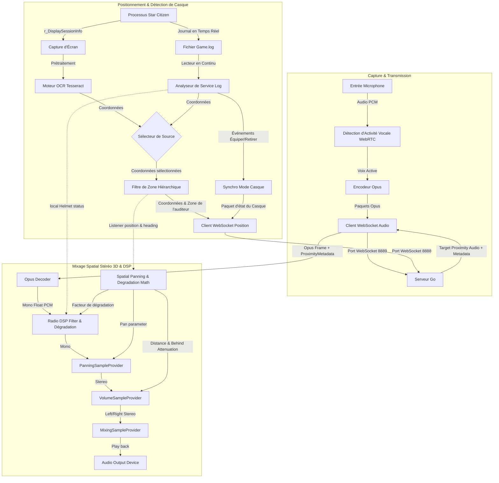

# XuruVoip (Français)

<p align="center">
  <a href="https://github.com/XuruDragon/XuruVOIP/actions/workflows/tests.yml">
    
  </a>
  <a href="https://github.com/XuruDragon/XuruVOIP/releases">
    
  </a>
  <a href="https://github.com/XuruDragon/XuruVOIP/releases">
    
  </a>
</p>

<p align="center">
  <b>Traductions :</b><br/>
  <a href="../README.md">English</a> •
  <a href="README.fr.md">Français</a> •
  <a href="README.de.md">Deutsch</a> •
  <a href="README.es.md">Español</a> •
  <a href="README.pt-BR.md">Português (Brasil)</a> •
  <a href="README.pt-PT.md">Português (Portugal)</a> •
  <a href="README.ja.md">日本語</a> •
  <a href="README.zh.md">简体中文</a>
</p>

<p align="center">
  
</p>

XuruVoip est une suite de communication vocale 3D (VoIP) haute performance, sécurisée et spatialisée dynamiquement, conçue spécifiquement pour des intégrations personnalisées avec **Star Citizen**. Elle se compose d'un serveur backend écrit en Go et d'un client moderne en C# WPF.

---

## 📸 Captures d'écran & Interface Utilisateur

### 1. Fenêtre Principale du Client


### 2. Onglet Paramètres Audio (Contrôle Spatial 3D)


### 3. Onglet Paramètres Généraux (Langue & Sélection de Game.log)


### 4. Onglet Paramètres de Connexion


### 5. Onglet Raccourcis Clavier


### 6. Page de Connexion du Portail Web Admin


### 7. Tableau de Bord du Portail Web Admin


### 8. Liste des Joueurs du Portail Web Admin


### 9. Liste des Administrateurs du Portail Web Admin


### 10. Liste des Bannissements du Portail Web Admin


---

## 🗂️ Structure du Projet

- **/server** : Backend en Go haute performance gérant la position, l'audio et les services d'administration.
- **/client** : Client moderne en C# WPF utilisant NAudio, WebRtcVad et Tesseract OCR pour le suivi automatique de la localisation et l'analyse des journaux (logs).

---

## ⚙️ Fonctionnement de l'Application (Architecture du Client)

Le client C# WPF fonctionne en parallèle de Star Citizen pour effectuer la capture audio, le traitement, la reconnaissance des coordonnées et la lecture en temps réel. Voici le schéma fonctionnel du système client :



### 1. Capture Audio, VAD et Compression
* **Capture Audio :** Le client capture le microphone en utilisant l'API **NAudio** à un taux de 48 000 Hz, 16 bits mono.
* **Détection d'Activité Vocale (VAD) :** Les tampons audio sont évalués par le wrapper natif **WebRtcVad**. Si la confiance vocale descend sous le seuil configuré, la transmission s'arrête pour éviter de diffuser le bruit du clavier ou des ventilateurs.
* **Compression :** Les voix actives sont encodées en paquets **Opus** compressés (via le wrapper C# **Concentus**) et transmises directement via WebSocket au serveur audio.

### 2. Suivi de Localisation et Orientation
* **Sélecteur de Source de Position :** Les joueurs peuvent choisir entre deux méthodes de positionnement dans les paramètres :
  * **Scanner d'Écran OCR :** Capture régulièrement la zone configurée de l'écran (affichant les coordonnées de session `/showlocations` ou `r_DisplaySessionInfo`), prétraite l'image et la transmet au moteur **Tesseract OCR**.
  * **Lecteur Game.log (GRTPR) :** Analyse en continu le fichier `Game.log` de Star Citizen pour y lire les coordonnées. Pour activer cette méthode, les joueurs doivent ajouter `r_DisplaySessionInfo = 3` (ou `1`) à leur fichier `user.cfg`. Choisir GRTPR désactive et libère complètement le moteur Tesseract OCR, économisant les ressources CPU et RAM de la machine hôte.
* **Filtrage de Zone Hiérarchique :** Les lignes de coordonnées contiennent des zones (compartiments de vaisseaux, ascenseurs, planètes). Le client filtre dynamiquement les sous-zones (comme `elevator`, `transit`, `seat`) et les zones globales (`solarsystem`, `Stanton`) pour éviter les coupures de voix intempestives entre joueurs proches.
* **Estimation de l'Orientation :** Comme Star Citizen ne fournit pas l'orientation, le client calcule le vecteur de déplacement. Si le joueur bouge de plus de 0,5 mètre, l'orientation estimée est mise à jour.

### 3. Détection de Casque en Temps Réel
* **Analyse de Fichier Journal (Tail Scanner) :** Une tâche en arrière-plan lit en temps réel le fichier `Game.log` de Star Citizen.
* **Suivi des Événements :** Elle recherche les lignes d'équipement de casque/visière (`FP_Visor`, `helmethook_attach`). Le mode casque (Actif/Inactif) est alors synchronisé automatiquement.

### 4. Mixage Spatial Stéréo 3D & DSP
* **Réception :** Le client reçoit l'audio de proximité avec des métadonnées (distance, portée maximale, coordonnées de l'émetteur).
* **Calculs Spatiaux :** L'audio est projeté sur les vecteurs de l'auditeur :
  * **Balance Stéréo (Pan) :** Gérée de `-1.0` (gauche) à `+1.0` (droite).
  * **Atténuation Arrière :** Une baisse de volume allant jusqu'à 25% est appliquée si l'émetteur est derrière pour résoudre l'ambiguïté avant-arrière.
  * **Atténuation de Distance :** Le volume s'atténue linéairement jusqu'à atteindre zéro à la portée maximale.
* **Lecture & DSP Radio :** Les frames Opus décodées passent par un **filtre DSP Radio** (si l'un des joueurs porte un casque ou si le canal actif est une radio), sont spatialisées, ajustées en volume et mixées via le `MixingSampleProvider` de NAudio.
  * **Dégradation Radio Dynamique :** Si elle est activée, le filtre DSP rétrécit dynamiquement les fréquences de coupure passe-haut et passe-bas et mélange du bruit blanc filtré lorsque la distance entre les joueurs approche de la portée maximale, simulant la perte de signal radio.
  * **Bruits de Micro PTT Réalistes :** NAudio synthétise des bruits de micro lors de l'activation/désactivation de la transmission. L'activation joue un chirp de 50 ms (balayage de fréquence 900 Hz à 700 Hz). La désactivation déclenche un bruit de squelch (bruit blanc filtré de 180 ms) lors de la réception d'une frame Opus vide de 0 octet. Une option de retour local permet d'entendre ses propres bruitages.

### 6. Incrustation HUD (Overlay) Compatible Vulkan et DirectX
* **Fenêtre d'Incrustation HUD** : Le client fournit un overlay WPF optionnel et léger qui s'affiche au premier plan. Il indique le statut de la VoIP, la fréquence active et la liste des interlocuteurs qui parlent avec des indicateurs de signal radio.
* **Intégration Transparente Win32** : Grâce aux styles de fenêtre Win32 (`WS_EX_TRANSPARENT` et `WS_EX_NOACTIVATE`), l'incrustation ne vole pas le focus et laisse passer tous les clics de souris vers le jeu.
* **Rendu Indépendant de l'API** : Étant donné que les fenêtres transparentes WPF s'appuient sur la composition du Desktop Window Manager (DWM) de Windows, l'overlay ne s'injecte pas dans le pipeline graphique du jeu. Cela garantit une compatibilité totale avec **Vulkan** comme **DirectX**, à condition de lancer le jeu en mode **"Fenêtré Sans Bordure"** (Borderless Windowed).

### 7. Acoustique Environnementale (Occlusion & Réverbération)
* **Filtre d'Occlusion :** Si le locuteur et l'auditeur sont dans des sous-zones ou compartiments différents, le client applique automatiquement un filtre passe-bas (coupure à 600 Hz, volume à 65 %) pour simuler l'obstruction physique. La transition se fait en douceur pour éviter les clics.
* **Réverbération Intelligente :** Si l'auditeur est situé dans un environnement fermé (Grottes, Bunkers, Hangars), un filtre en peigne à ligne de retard applique des paramètres de réverbération spécifiques :
  * *Grottes / Tunnels :* 45 % wet, 100 ms de délai, 0.6 de feedback.
  * *Bunkers / Stations :* 25 % wet, 50 ms de délai, 0.4 de feedback.
  * *Hangars :* 35 % wet, 150 ms de délai, 0.5 de feedback.

### 8. Discord Rich Presence Sans Dépendance (RPC)
* **Connexion par Pipe Nommé :** Le client se connecte à Discord via le protocole local des pipes nommés Windows (`\\.\pipe\discord-ipc-0`) sans nécessiter de bibliothèque NuGet lourde.
* **Mise à Jour Dynamique de l'Activité :** Met à jour en temps réel votre présence Discord :
  * **Détails :** Zone de position en jeu (ex. `"Dans une grotte sur MicroTech"`).
  * **État :** Canal actif et état du casque (ex. `"Sur la radio : Canal Bravo (Casque équipé)"` ou `"En proximité"`).
  * **Temps Écoulé :** Affiche le chronomètre depuis la connexion au serveur VoIP.

---

## 🖥️ Serveur XuruVoip (Go)

Le serveur gère la position des joueurs, l'authentification et route dynamiquement les paquets audio selon la distance spatiale et les canaux radio.

### Fonctionnalités Clés
* **Contrôle de Proximité Côté Serveur** : Relaye uniquement l'audio de proximité aux joueurs à portée (50m par défaut).
* **Configuration de la Spatialisation** : Option `XURUVOIP_SPATIAL_AUDIO` dans le fichier `.env` pour activer ou non le transfert des coordonnées réelles aux clients.
* **Routage Radio Multi-Canaux** : Permet d'écouter plusieurs canaux radio simultanément tout en transmettant sur le canal actif.
* **Système de Profils Audio** : Assigne des filtres (radio, écho) aux profils des joueurs.
* **Persistance SQLite** : Conserve la configuration des canaux et des profils des joueurs.
* **Sécurité Anti-Contournement** : Bannissement par nom d'utilisateur, adresse IP et empreinte matérielle (HWID/MachineGuid).
* **Portail Web d'Administration** : Interface sécurisée en HTTPS/WebSockets avec journalisation en temps réel et gestion des bannissements.
* **Carte Radar d'Administration** : Une carte radar 2D Canvas HTML5 en temps réel intégrée au tableau de bord pour suivre les positions des joueurs, avec défilement par clic-glissé, zoom à la molette, filtrage par zone, tracé des déplacements récents (breadcrumbs) et ondes sonores concentriques pulsées autour des joueurs qui parlent.

### Configuration du Serveur (`.env`)
Au premier démarrage, le serveur génère un fichier `.env` avec ces valeurs :
```env
XURUVOIP_SERVER_IP=
XURUVOIP_PORT=8888
XURUVOIP_AUDIO_PORT=8889
XURUVOIP_DATA_DIR=.
XURUVOIP_MAX_PLAYERS=500
XURUVOIP_SPATIAL_AUDIO=1
XURUVOIP_PUBLIC_SERVER=0
XURUVOIP_SERVER_PASSWORD=auto_generated_32_chars_token
XURUVOIP_ADMIN_SERVER_PASSWORD=auto_generated_32_chars_token
XURUVOIP_VERBOSE_LOGS=1
XURUVOIP_LIMIT_RATE_POS=50.0
XURUVOIP_LIMIT_BURST_POS=100
XURUVOIP_LIMIT_RATE_AUDIO=60.0
XURUVOIP_LIMIT_BURST_AUDIO=120
XURUVOIP_LOCKOUT_ATTEMPTS=5
XURUVOIP_LOCKOUT_WINDOW=60
XURUVOIP_LOCKOUT_DURATION=600
```

### Compilation du Serveur depuis les sources

#### Linux
```bash
cd server
GOOS="linux" GOARCH="amd64" go build .
```

#### Windows
```powershell
cd server
$env:GOOS="windows"
$env:GOARCH="amd64"
go build .
```

### Lancement du Serveur

#### Depuis les sources :
```bash
cd server
go run .
```

#### Depuis le binaire :
##### Windows
```powershell
.\server.exe
```

##### Linux
```bash
./server
```

### 🖥️ Configuration & Déploiement sans tête (Headless)

Pour des serveurs de production permanents en mode headless, il est recommandé de lancer le serveur en arrière-plan comme démon/service système.

#### 1. Configuration du Réseau & Pare-feu
Ouvrez les ports TCP configurés dans votre fichier `.env` (8888 et 8889 par défaut) :
* **Linux (UFW) :**
  ```bash
  sudo ufw allow 8888/tcp
  sudo ufw allow 8889/tcp
  sudo ufw reload
  ```
* **Linux (firewalld) :**
  ```bash
  sudo firewall-cmd --zone=public --add-port=8888/tcp --permanent
  sudo firewall-cmd --zone=public --add-port=8889/tcp --permanent
  sudo firewall-cmd --reload
  ```

---

#### 2. Déploiement sur Linux (systemd)

##### Étape A : Préparation du dossier et des privilèges
Créez un utilisateur système dédié et un dossier d'installation :
```bash
# Créer un utilisateur sans droits de connexion
sudo useradd -r -s /bin/false xuruvoip

# Créer le dossier et copier le binaire
sudo mkdir -p /opt/xuruvoip
sudo cp xuruvoip-server-linux-x64 /opt/xuruvoip/xuruvoip-server
sudo chmod +x /opt/xuruvoip/xuruvoip-server

# Définir le propriétaire
sudo chown -R xuruvoip:xuruvoip /opt/xuruvoip
```

##### Étape B : Initialisation du fichier `.env`
Lancez le serveur une première fois avec l'utilisateur système pour générer les fichiers par défaut :
```bash
sudo -u xuruvoip /opt/xuruvoip/xuruvoip-server -port 8888 -audio-port 8889
```
*Appuyez sur `Ctrl+C` après la génération des jetons.* Éditez ensuite le fichier `.env` généré :
```bash
sudo nano /opt/xuruvoip/.env
```

##### Étape C : Création du service systemd
Copiez le fichier de service du dépôt `server/xuruvoip.service` vers `/etc/systemd/system/xuruvoip-server.service` ou créez-le avec le contenu suivant :
```ini
[Unit]
Description=XuruVoip Star Citizen Spatial VOIP Server
After=network.target

[Service]
Type=simple
User=xuruvoip
Group=xuruvoip
WorkingDirectory=/opt/xuruvoip
ExecStart=/opt/xuruvoip/xuruvoip-server
Restart=always
RestartSec=5
LimitNOFILE=65536

[Install]
WantedBy=multi-user.target
```

##### Étape D : Activer & Démarrer le service
```bash
sudo systemctl daemon-reload
sudo systemctl enable xuruvoip-server
sudo systemctl start xuruvoip-server
```

##### Étape E : Logs & Diagnostic
```bash
# Statut du service
sudo systemctl status xuruvoip-server

# Afficher les logs en continu
journalctl -u xuruvoip-server -f -n 100
```

---

#### 3. Déploiement sur Windows (NSSM)

##### Étape A : Dossier d'installation
Copiez le fichier `xuruvoip-server-windows-x64.exe` dans un dossier (ex: `C:\XuruVoipServer`).

##### Étape B : Initialisation
Lancez l'exécutable une fois dans PowerShell pour générer la configuration initiale, puis arrêtez-le avec `Ctrl+C` et éditez le fichier `.env`.

##### Étape C : Installer le service Windows avec NSSM
```powershell
.\nssm.exe install XuruVoipServer "C:\XuruVoipServer\xuruvoip-server-windows-x64.exe"
```
Configurez le dossier de travail (`C:\XuruVoipServer`) et validez.

##### Étape D : Lancement du service
```powershell
Start-Service -Name XuruVoipServer
```

---

## 🎮 Détail des paramètres du Client

La fenêtre des paramètres comporte six onglets :
1. **Général** : Choix de la langue, chemin du fichier `Game.log` et activation de la journalisation locale.
2. **Connexion** : Adresse IP du serveur, ports audio et position, nom d'utilisateur, mot de passe de compte et mot de passe serveur.
3. **Position** : Choix de la source de position ("Scanner d'Écran OCR" vs "Lecteur Game.log (GRTPR)"), sélection du moniteur, intervalle de capture (ms), définition de la région de scan et prévisualisation du texte capturé (les options OCR sont masquées si GRTPR est actif).
4. **Audio** : Sélection des périphériques, réglage des gains de volume, mode de transmission (PTT / VAD), réglage du seuil de détection, activation de l'audio spatial 3D, ainsi que les options avancées de dégradation radio et de bruitages micro PTT.
5. **Raccourcis** : Enregistrement des touches de raccourci clavier pour le PTT, le casque, le changement de canal et les fonctions de coupure audio (muet).
6. **Incrustation (Overlay)** : Activation de l'overlay HUD transparent et configuration de son emplacement à l'écran (ex. En haut à gauche, En haut à droite).

### Compilation & Lancement du Client

#### Configuration requise
- Windows 10 ou Windows 11
- SDK .NET 9.0 (Support WPF)

#### Compiler et exécuter :
```powershell
cd client
dotnet run
```

### Installation du package de version (Release)

Les fichiers d'installation n'étant pas signés numériquement, Windows SmartScreen peut bloquer le démarrage. Vous devez débloquer les fichiers dans leurs propriétés.

* **Option A : Installateur MSI (Recommandé)**
  1. Téléchargez `XuruVoipClient-win-x64.msi` depuis la [page de version (releases)](https://github.com/XuruDragon/XuruVOIP/releases).
  2. Faites un clic droit sur le fichier `.msi` téléchargé et choisissez **Propriétés**.
  3. Dans l'onglet *Général*, cochez la case **Débloquer** en bas, puis cliquez sur **Appliquer**.
  4. Lancez le fichier d'installation et suivez les instructions.

* **Option B : Version Portable (Archive ZIP)**
  1. Téléchargez `XuruVoipClient-win-x64.zip` depuis la [page de version (releases)](https://github.com/XuruDragon/XuruVOIP/releases).
  2. Faites un clic droit sur le fichier `.zip` et cochez la case **Débloquer** dans l'onglet *Général*. Cliquez sur **Appliquer**.
  3. Extrayez l'archive dans le dossier de votre choix (ex: `C:\Games\XuruVoip`).
  4. Double-cliquez sur `XuruVoipClient.exe` pour lancer le client.

---

## 👥 Crédits

Développé par **[@XuruDragon](https://github.com/XuruDragon)** en collaboration avec **Antigravity IDE**.
