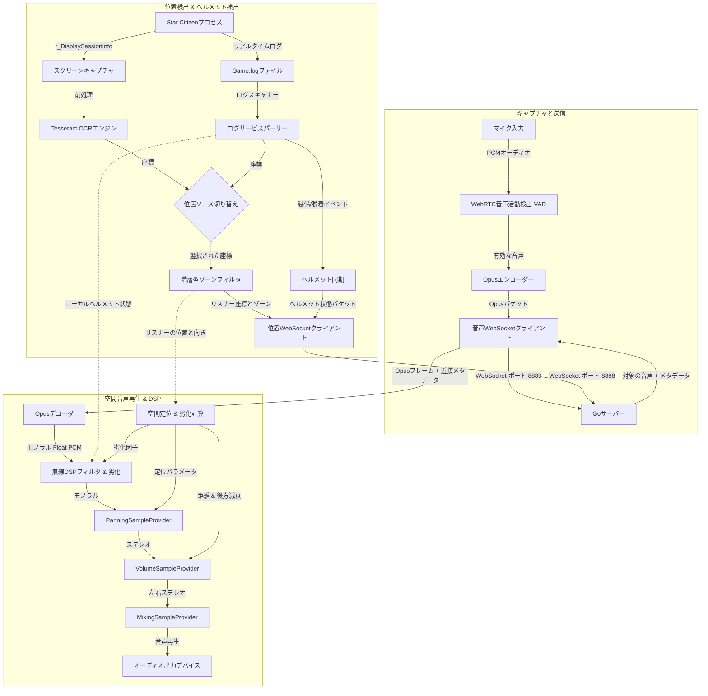

# XuruVoip (日本語)

<p align="center">
  <a href="https://github.com/XuruDragon/XuruVOIP/actions/workflows/tests.yml">
    
  </a>
  <a href="https://github.com/XuruDragon/XuruVOIP/releases">
    
  </a>
  <a href="https://github.com/XuruDragon/XuruVOIP/releases">
    
  </a>
</p>

<p align="center">
  <b>翻訳:</b><br/>
  <a href="../README.md">English</a> •
  <a href="README.fr.md">Français</a> •
  <a href="README.de.md">Deutsch</a> •
  <a href="README.es.md">Español</a> •
  <a href="README.pt-BR.md">Português (Brasil)</a> •
  <a href="README.pt-PT.md">Português (Portugal)</a> •
  <a href="README.ja.md">日本語</a> •
  <a href="README.zh.md">简体中文</a>
</p>

<p align="center">
  
</p>

XuruVoipは、**Star Citizen**とのカスタム統合向けに特別に設計された、高性能、安全、かつ動的に空間化された**3D音声通信（VoIP）スイート**です。Goベースのバックエンドサーバーと、モダンなC# WPFクライアントで構成されています。

---

## 📸 スクリーンショットとUI

### 1. メインクライアントウィンドウ


### 2. オーディオ設定タブ（3D空間オーディオ制御）


### 3. 一般設定タブ（言語とGame.logの選択）


### 4. 接続設定タブ


### 5. ホットキー設定タブ


### 6. 管理者Webポータル ログインページ


### 7. 管理者Webポータル ダッシュボード


### 8. 管理者Webポータル プレイヤー一覧


### 9. 管理者Webポータル 管理者一覧


### 10. 管理者Webポータル BANリスト


---

## 🗂️ プロジェクト構成

- **/server**：位置情報、音声、および管理サービスを提供する高性能Goバックエンド。
- **/client**：自動位置追跡とログ解析のためにNAudio、WebRtcVad、Tesseract OCRを利用するモダンなC# WPFクライアント。

---

## ⚙️ アプリケーションの仕組み（クライアントアーキテクチャ）

C# WPFクライアントはStar Citizenと並行して動作し、リアルタイムの音声キャプチャ、処理、座標認識、および再生を行います。以下はクライアントシステムのワークフローです：



### 1. 音声キャプチャ、VAD、および圧縮
* **音声キャプチャ：** **NAudio** APIを使用し、マイク音声を48,000 Hz、16ビットモノラルでキャプチャします。
* **音声活動検出 (VAD)：** キャプチャされた音声は、ネイティブの **WebRtcVad** ラッパーを使用して評価されます。音声の信頼度がしきい値を下回ると送信を停止し、キーボードの打鍵音やファンノイズなどの環境音をカットします。
* **圧縮：** 有効な音声バッファは、高度に圧縮された **Opus** フレームにエンコード（C# **Concentus** ラッパー経由）され、WebSocketを通じてサーバーに直接送信されます。

### 2. 位置追跡と向きの推定
* **位置ソースの切り替え：** プレイヤーはクライアント設定で2つの位置決定方法を選択できます：
  * **OCR画面スキャナー：** セッション座標（`/showlocations` または `r_DisplaySessionInfo` で出力される座標）が表示される設定された画面領域を定期的にキャプチャし、画像前処理を行ってから **Tesseract OCR** エンジンに送ります。
  * **Game.logリーダー (GRTPR)：** ゲームによって記録される座標を Star Citizen の `Game.log` ファイルから直接読み取ります。これを有効にするには、ゲームの `user.cfg` ファイルに `r_DisplaySessionInfo = 3`（または `1`）を追加する必要があります。GRTPR を選択すると、Tesseract OCR エンジンは完全に停止・解放され、ホストマシンの CPU と RAM リソースを大幅に節約します。
* **階層型ゾーンフィルタ：** 座標には階層的なゾーン情報（惑星、宇宙船、エレベーター等）が含まれます。クライアントはこれらを判別し、隣接する部屋にいるプレイヤー同士が途切れることなくスムーズに会話できるように制御します。
* **向きの推定：** 前後の位置情報の変化（$Position_{現在} - Position_{過去}$）から移動ベクトルを算出し、向きを自動推定します。

### 3. リアルタイムヘルメット検出（ログスキャン）
* **Game.logスキャナー：** バックグラウンドタスクがStar Citizenの `Game.log` ファイルをリアルタイムに監視します。
* **装備追跡：** ヘルメットの装備ログ（`FP_Visor`、`helmethook_attach`）を検出すると、即座にヘルメットモード（ON/OFF）を同期します。

### 4. ステレオ3D空間ミキシングとDSP
* **受信処理：** 音声とともに発言者の座標、距離、最大範囲を受け取ります。
* **空間計算：** リスナーのベクトルに音源を投影します：
  * **ステレオパン：** 左右のバランスを `-1.0`（左極）から `+1.0`（右極）で調節します。
  * **背面減衰：** 後方からの音声に対して音量を最大25%減衰させ、前後の位置関係を明確にします。
  * **距離減衰：** 距離に応じて線形に減衰し、最大会話範囲（標準50m）でゼロになります。
* **再生＆無線DSP：** デコードされたOpusフレームは、必要に応じて無線DSPフィルタを通され、位置調整と音量調整後にミキシング再生されます。
  * **動的な無線信号 of 劣化：** 有効にすると、プレイヤー間の距離が最大通信範囲に近づくにつれて、DSPフィルタがハイパスおよびローパスのカットオフ周波数を自動的に絞り込み、バンドパスフィルタリングされたホワイトノイズをブレンドして、リアルな無線信号の劣化をシミュレートします。
  * **本格的なPTT＆無線チャイム音：** NAudioは送信開始・終了時の無線チャイム音を合成します。送信開始時には50msのピッチスイープ **マイクキークリック音**（900Hzから700Hz）を再生します。送信終了時には、キャプチャサービスから送信される最後の0バイトOpus空フレームを検出し、180msのバンドパスホワイトノイズ **スケルチテール音** をトリガーします。ローカルループバックオプションにより、プレイヤーは自分のマイク切り替え音をローカルで聞くことができます。

### 6. VulkanおよびDirectX対応の境界線なしHUDオーバーレイ
* **HUDオーバーレイウィンドウ** : クライアントは、最前面に描画されるオプションの軽量な透明WPFオーバーレイウィンドウを提供します。VoIP接続ステータス、現在のチャンネル周波数、および無線信号インジケータ付きのリアルタイムアクティブスピーカーリストを表示します。
* **Win32クリックスルー統合** : Win32 APIウィンドウスタイル（`WS_EX_TRANSPARENT` および `WS_EX_NOACTIVATE`）を使用することで、オーバーレイはフォーカスを奪わず、マウスクリックをゲームに直接透過させます。
* **APIに依存しないレンダリング** : 標準の透明なWPFウィンドウはWindowsのDWM（Desktop Window Manager）コンポジションによって描画されるため、ゲームのグラフィックスパイプラインにフックしません。これにより、ゲームを **「境界線なしウィンドウモード（Borderless Windowed）」** で実行している限り、**Vulkan** および **DirectX** の両方で動作します。

---

## 🖥️ XuruVoip サーバー (Go)

各プレイヤーの位置情報を統合し、距離や無線チャネルに基づいてオーディオパケットを動的に配信します。

### 主な機能
* **サーバーサイドの範囲制御**：会話範囲内にいるプレイヤーにのみ音声を中継します。
* **空間構成の切り替え**：`.env` 内の `XURUVOIP_SPATIAL_AUDIO` で、座標を渡すか、単に距離情報のみを渡すかを変更可能です。
* **マルチチャネル無線**：アクティブな無線チャネルで発言しつつ、複数のチャネルを同時に傍受できます。
* **オーディオプロファイル**：無線エフェクトやエコーなどの効果音をプレイヤーに適用します。
* **SQLiteデータベース**：再起動後もチャンネル設定やプロファイルを保持します。
* **セキュリティ機能**：Username、IP、およびハードウェアフィンガープリント（HWID/MachineGuid）によるBAN処理に対応。
* **管理者ポータル**：リアルタイムダッシュボード、ログストリーム、BAN管理機能を備えたHTTPS/WebSockets対応のWeb管理画面。
* **管理者用レーダーマップ**：管理者ダッシュボードに統合された2D HTML5 Canvasリアルタイムプレイヤーレーダー。ドラッグによるスクロール、マウスホイールによるズーム、およびアクティブなゾーンフィルタをサポートします。

### サーバー構成 (`.env`)
初回起動時に自動生成されます：
```env
XURUVOIP_SERVER_IP=
XURUVOIP_PORT=8888
XURUVOIP_AUDIO_PORT=8889
XURUVOIP_DATA_DIR=.
XURUVOIP_MAX_PLAYERS=500
XURUVOIP_SPATIAL_AUDIO=1
XURUVOIP_PUBLIC_SERVER=0
XURUVOIP_SERVER_PASSWORD=auto_generated_32_chars_token
XURUVOIP_ADMIN_SERVER_PASSWORD=auto_generated_32_chars_token
XURUVOIP_VERBOSE_LOGS=1
XURUVOIP_LIMIT_RATE_POS=50.0
XURUVOIP_LIMIT_BURST_POS=100
XURUVOIP_LIMIT_RATE_AUDIO=60.0
XURUVOIP_LIMIT_BURST_AUDIO=120
XURUVOIP_LOCKOUT_ATTEMPTS=5
XURUVOIP_LOCKOUT_WINDOW=60
XURUVOIP_LOCKOUT_DURATION=600
```

### ソースからのコンパイル

#### Linux
```bash
cd server
GOOS="linux" GOARCH="amd64" go build .
```

#### Windows
```powershell
cd server
$env:GOOS="windows"
$env:GOARCH="amd64"
go build .
```

### サーバーの起動

#### ソースから起動：
```bash
cd server
go run .
```

#### バイナリから起動：
##### Windows
```powershell
.\server.exe
```

##### Linux
```bash
./server
```

### 🖥️ ヘッドレスサーバーのセットアップとデプロイ

恒久的な本番環境のセットアップでは、サーバーが自動的に起動し、クラッシュから復旧できるようにバックグラウンドのシステムサービス（デーモン）として動作させることをお勧めします。

#### 1. ネットワークとファイアウォールの設定
`.env` ファイルで設定された着信TCPポート（標準はポータル/座標用に `8888`、音声用に `8889`）をファイアウォールで開放してください：
* **Linux (UFW):**
  ```bash
  sudo ufw allow 8888/tcp
  sudo ufw allow 8889/tcp
  sudo ufw reload
  ```
* **Linux (firewalld):**
  ```bash
  sudo firewall-cmd --zone=public --add-port=8888/tcp --permanent
  sudo firewall-cmd --zone=public --add-port=8889/tcp --permanent
  sudo firewall-cmd --reload
  ```

---

#### 2. Linuxへのデプロイ (systemd)

Goサーバーを systemd サービスとして動作させるには、以下の手順に従います：

##### 手順A：ディレクトリと権限の設定
セキュリティを確保するため、専用のシステムユーザーと作業ディレクトリを作成します：
```bash
# ログイン権限のないシステムユーザーを作成
sudo useradd -r -s /bin/false xuruvoip

# インストールディレクトリを作成してバイナリをコピー
sudo mkdir -p /opt/xuruvoip
sudo cp xuruvoip-server-linux-x64 /opt/xuruvoip/xuruvoip-server
sudo chmod +x /opt/xuruvoip/xuruvoip-server

# 所有者をシステムユーザーに変更
sudo chown -R xuruvoip:xuruvoip /opt/xuruvoip
```

##### 手順B：`.env` 設定ファイルの生成
システムユーザーの権限でサーバーを一度実行し、初期設定ファイルを生成します：
```bash
sudo -u xuruvoip /opt/xuruvoip/xuruvoip-server -port 8888 -audio-port 8889
```
*コンソールにパスワードが表示されたら `Ctrl+C` で終了します。* その後、生成された `.env` ファイルを編集します：
```bash
sudo nano /opt/xuruvoip/.env
```

##### 手順C：systemd サービスファイルの作成
リポジトリ内の `server/xuruvoip.service` を `/etc/systemd/system/xuruvoip-server.service` にコピーするか、以下の内容で作成します：
```ini
[Unit]
Description=XuruVoip Star Citizen Spatial VOIP Server
After=network.target

[Service]
Type=simple
User=xuruvoip
Group=xuruvoip
WorkingDirectory=/opt/xuruvoip
ExecStart=/opt/xuruvoip/xuruvoip-server
Restart=always
RestartSec=5
LimitNOFILE=65536

[Install]
WantedBy=multi-user.target
```

##### 手順D：サービスの有効化と起動
```bash
sudo systemctl daemon-reload
sudo systemctl enable xuruvoip-server
sudo systemctl start xuruvoip-server
```

##### 手順E：ログと動作確認
```bash
# サービスの状態を確認
sudo systemctl status xuruvoip-server

# ログをリアルタイムで追跡
journalctl -u xuruvoip-server -f -n 100
```

---

#### 3. Windowsへのデプロイ (NSSM)

Windows上でバックグラウンドサービスとして恒久的に動作させるには、**NSSM (Non-Sucking Service Manager)** を使用することをお勧めします：

##### 手順A：フォルダの作成
`xuruvoip-server-windows-x64.exe` を任意のフォルダ（例: `C:\XuruVoipServer`）に配置します。

##### 手順B：初期設定
PowerShellを管理者として開き、バイナリを一度実行して設定ファイルを生成します。`Ctrl+C` で停止させ、必要に応じて `.env` を調整します。

##### 手順C：NSSMによるサービスのインストール
```powershell
.\nssm.exe install XuruVoipServer "C:\XuruVoipServer\xuruvoip-server-windows-x64.exe"
```
作業ディレクトリを `C:\XuruVoipServer` に設定し、サービスをインストールします。

##### 手順D：サービスの開始
```powershell
Start-Service -Name XuruVoipServer
```

---

## 🎮 クライアント設定タブの解説

設定ウィンドウは6つのタブで構成されています：
1. **General (全般)**：表示言語の選択、Star Citizenの `Game.log` パスの指定、クライアントログ出力のオン/オフ。
2. **Connection (接続)**：サーバーアドレス、音声/位置ポート、ユーザー名、パスワード、およびサーバーパスワード。
3. **Position (位置情報)**：位置ソースの切り替え（「OCR画面スキャナー」vs.「Game.logリーダー (GRTPR)」）、対象モニターの選択、キャプチャ間隔（ms）、スキャン領域の指定、文字認識結果プレビュー（GRTPRアクティブ時はOCRオプション非表示）。
4. **Audio (音声)**：入出力デバイスの選択、音量ゲイン、発話モード（PTT / VAD）、VAD感度設定、**3D空間オーディオ**の有効化、無線信号の劣化設定、およびPTTマイクチャイム音の設定。
5. **Hotkeys (ホットキー)**：PTTホットキー、ヘルメット切り替え、無線チャネル変更、マイクミュート、受話ミュートキーの割り当て。
6. **Overlay (オーバーレイ)**：透明HUDオーバーレイの有効化、表示位置（画面の四隅など）の指定。

### クライアントのビルドと起動

#### 必要要件
- Windows 10 または Windows 11
- .NET 9.0 SDK (WPFサポート)

#### コンパイルと起動:
```powershell
cd client
dotnet run
```

### リリースパッケージのインストール

配布バイナリはデジタル署名されていないため、初回実行時にWindows SmartScreenが警告を表示する場合があります。その場合は、ファイルのプロパティからロックを解除できます。

* **オプションA：MSIインストーラー（推奨）**
  1. [リリース一覧](https://github.com/XuruDragon/XuruVOIP/releases)から `XuruVoipClient-win-x64.msi` をダウンロードします。
  2. ファイルを右クリックして **プロパティ** を開きます。
  3. *全般*タブの最下部にある **許可する** (または「ブロックの解除」) にチェックを入れ、**適用** をクリックします。
  4. ダブルクリックしてインストーラーを起動します。

* **オプションB：ポータブルZIP版**
  1. [リリース一覧](https://github.com/XuruDragon/XuruVOIP/releases)から `XuruVoipClient-win-x64.zip` をダウンロードします。
  2. ZIPファイルを右クリックし、同様にプロパティから **ブロック解除** を行い適用します。
  3. 任意のフォルダ（例: `C:\Games\XuruVoip`）にファイルを展開します。
  4. `XuruVoipClient.exe` を起動して利用を開始します。

---

## 👥 クレジット

**[@XuruDragon](https://github.com/XuruDragon)** が **Antigravity IDE** と共同で開発しました。
