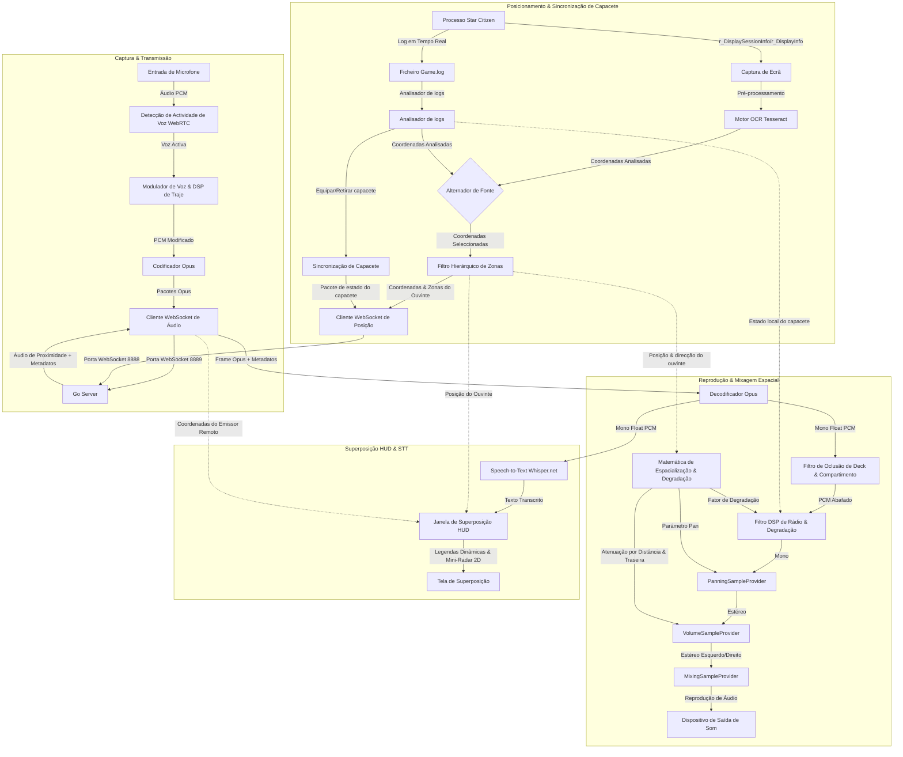

# XuruVoip (Português - Portugal)

<p align="center">
  <a href="https://github.com/XuruDragon/XuruVOIP/actions/workflows/tests.yml">
    
  </a>
  <a href="https://github.com/XuruDragon/XuruVOIP/releases">
    
  </a>
  <a href="https://github.com/XuruDragon/XuruVOIP/releases">
    
  </a>
</p>

<p align="center">
  <b>Traduções:</b><br/>
  <a href="../README.md">English</a> •
  <a href="README.fr.md">Français</a> •
  <a href="README.de.md">Deutsch</a> •
  <a href="README.es.md">Español</a> •
  <a href="README.pt-BR.md">Português (Brasil)</a> •
  <a href="README.pt-PT.md">Português (Portugal)</a> •
  <a href="README.ja.md">日本語</a> •
  <a href="README.zh.md">简体中文</a>
</p>

<p align="center">
  
</p>

XuruVoip é uma suite de comunicação de voz 3D (VoIP) de alto desempenho, segura e espacializada dinamicamente, concebida especificamente para integrações personalizadas com o **Star Citizen**. É composta por um servidor backend escrito em Go e um cliente desktop moderno em C# WPF.

---

## 📸 Capturas de Ecrã e Interface

<details>
<summary>📸 Clique para ver as capturas de ecrã</summary>

### 1. Janela Principal do Cliente


### 2. Painel de Definições de Áudio (Controlo de Áudio Espacial 3D)


### 3. Painel de Definições Gerais (Idioma & Caminho do Game.log)


### 4. Painel de Definições de Conexão


### 5. Painel de Definições de Atalhos de Teclado


### 6. Painel de Definições do Overlay (HUD Vulkan e DirectX)


### 7. Página de Login do Portal Web Administrativo


### 8. Painel Geral (Dashboard) do Portal Web Administrativo


### 9. Lista de Jogadores do Portal Web Administrativo


### 10. Lista de Administradores do Portal Web Administrativo


### 11. Lista de Bloqueios (Banimentos) do Portal Web Administrativo


</details>

---

## 🗂️ Estrutura do Projeto

- **/server**: Servidor backend de alto desempenho escrito em Go que gere as posições dos jogadores, sessões de áudio e os serviços de administração web.
- **/client**: Cliente moderno em C# WPF que utiliza as bibliotecas NAudio, WebRtcVad e Tesseract OCR para localização automática e leitura de ficheiros de log do jogo.

---

## ⚙️ Como a Aplicação Funciona (Arquitetura do Cliente)

O cliente C# WPF corre em paralelo com o Star Citizen para capturar áudio, processar pacotes, reconhecer as coordenadas no ecrã e reproduzir o som em tempo real. Veja o fluxo detalhado da arquitetura:



### 1. Captura de Áudio, VAD e Compressão
* **Captura de Áudio:** O cliente captura o áudio do microfone usando a API **NAudio** a uma taxa de alta fidelidade de 48.000 Hz, 16 bits mono.
* **Detecção de Actividade de Voz (VAD):** O wrapper nativo do **WebRtcVad** analisa o áudio em tempo real. Se o som cair abaixo do limite definido, a transmissão cessa para evitar a difusão de ruídos do teclado ou ventoinha.
* **Compressão:** Os buffers de voz ativa são codificados em frames **Opus** altamente comprimidos (usando o wrapper C# **Concentus**) e transmitidos imediatamente como frames WebSocket binários para o Servidor de Áudio em Go.

### 2. Rastreamento de Localização e Estimativa de Direção
* **Alternância de Fonte de Posição:** Os jogadores podem escolher entre duas metodologias de posicionamento nas configurações do cliente:
  * **Scanner de Ecrã OCR:** Captura periodicamente a região configurada do ecrã (onde as coordenadas são exibidas via `/showlocations` ou `r_DisplaySessionInfo`), pré-processa a imagem e envia-a para o motor **Tesseract OCR**.
  * **Leitor de Game.log (GRTPR):** Monitoriza diretamente o ficheiro `Game.log` do Star Citizen para ler as coordenadas registadas pelo jogo. Para habilitar isso, o utilizador deve adicionar `r_DisplaySessionInfo = 3` (ou `1`) ao seu ficheiro `user.cfg`. A seleção do GRTPR desativa e descarta completamente o motor Tesseract OCR, poupando recursos significativos de CPU e RAM no computador do utilizador.
* **Filtragem de Zona Hierárquica:** O texto da posição analisada contém múltiplas linhas hierárquicas de coordenadas do jogador (por exemplo, coordenadas planetárias, compartimentos de naves, elevadores). O cliente analisa essas linhas e filtra dinamicamente as subzonas (como `elevator`, `transit`, `seat`) e zonas globais (como `solarsystem`, `Stanton`). Isso garante que os jogadores dentro de um compartimento de nave possam ouvir os jogadores no corredor adjacente sem interrupções de áudio causadas por pequenas diferenças de subzona.
* **Estimativa de Direção:** Como o Star Citizen não exporta a orientação do jogador, o cliente rastreia o deslocamento de coordenadas ($Posição_{atual} - Posição_{anterior}$). Se o jogador se mover mais de 0,5 metros, o cliente calcula o vetor de direção do movimento como a direção de visão estimada. Quando o jogador está parado, a última direção calculada é preservada.

### 3. Detecção de Capacete em Tempo Real (Escaneamento do Log)
* **Scanner do Log:** O cliente inicia uma tarefa em segundo plano que lê o arquivo `Game.log` do Star Citizen em tempo real.
* **Rastreamento de Equipamentos:** O scanner monitora notificações de log (como `<AttachmentReceived>`) para itens que correspondem a capacetes e viseiras utilitárias (por exemplo, `FP_Visor`, `helmethook_attach`).
* **Auto-sincronização:** Quando um capacete é equipado ou removido no jogo, o cliente sincroniza instantaneamente o modo Capacete (Ligado/Desligado) do jogador sem requerer teclas de atalho manuais.

### 4. Mixagem Espacial Estéreo 3D e DSP
* **Loop de Recebimento:** O cliente recebe pacotes de áudio Opus binários do servidor. Os pacotes de áudio de proximidade contêm metadados adicionais: distância do interlocutor, alcance máximo e as coordenadas do interlocutor.
* **Cálculos Espaciais:** O ouvinte calcula o ângulo entre a direção de visão estimada e a localização do interlocutor. As coordenadas são projetadas nos vetores **Forward** (Frente) e **Right** (Direita) do ouvinte:
  * **Pan Estéreo:** A projeção no vetor Direito controla o balanço dos canais esquerdo/direito (de `-1.0` totalmente à esquerda a `+1.0` totalmente à direita) usando o `PanningSampleProvider` da NAudio.
  * **Resolução da Ambiguidade Frente/Trás:** Se a projeção frontal for negativa (o interlocutor está atrás do ouvinte), uma atenuação de volume psicoacústica (redução de até 25%) é aplicada.
  * **Atenuação por Distância:** O volume do áudio diminui de forma linear com a distância, chegando a zero no limite de proximidade (padrão de 50m).
* **Reprodução e DSP de Rádio:** Os frames Opus são decodificados, espacializados, atenuados em volume e misturados em um fluxo estéreo. O áudio é processado através de um **filtro DSP de rádio** (se o interlocutor ou o ouvinte estiver usando capacete, ou em canais de rádio).
  * **Degradação Dinâmica de Rádio:** Se ativada, o filtro DSP estreita dinamicamente as frequências de corte passa-altas/baixas e adiciona ruído branco filtrado à medida que a distância entre os jogadores se aproxima do alcance máximo de comunicação, simulando a perda de sinal de rádio.
  * **PTT Realista e Chimes de Rádio:** O NAudio fornece efeitos de rádio para o acionamento e liberação da transmissão. Iniciar a transmissão toca um mic-key chirp de 50ms (varredura de frequência de 900Hz a 700Hz). O fim da transmissão dispara um ruído de squelch de 180ms ao receber um frame Opus vazio de 0 bytes. Uma opção de retorno local permite ouvir seus próprios efeitos.

### 5. Estados do Microfone Dinâmicos e Controles de Mudo
* **Exibição Dinâmica do Microfone:** O indicador de status do microfone na janela principal atualiza-se em tempo real para exibir o estado exato do seu transmissor:
  * `Proximity PTT (Off)` / `Proximity PTT (On)` (Canal de proximidade Push-To-Talk)
  * `Proximity VAD (OFF)` / `Proximity VAD (ON)` (Modo de ativação por voz, muda para ON quando a voz é detectada)
  * `Radio Channel PTT (ON)` (Transmitindo no canal de rádio ativo)
  * `Profile PTT (ON)` (Transmitindo no canal de perfil)
  * `(Muted)` (ex. `Proximity PTT (Muted)`) quando o microfone para o canal atual está silenciado.
* **Tabela de Status de Silenciamento de Canais:** Abaixo do canal ativo e do estado do capacete, a janela principal inclui uma tabela estruturada que resume o estado ativo/silenciado tanto do microfone (saída) quanto do áudio (entrada) para os três canais de comunicação (Proximidade, Rádio e Perfil). Os estados são codificados por cores (Verde para ATIVO, Vermelho para SILENCIADO) e atualizados dinamicamente.
* **Raccourcis de Teclado Separados para Silenciar Microfone e Áudio:**
  * **Silenciar Microfone (Saída):** Alterna o silenciamento do microfone para cada canal. Padrões: Proximidade (`M`), Rádio (`,`), Perfil (`.`). Quando silenciado, as pressões PTT e a fala VAD não transmitirão áudio ao servidor, e o LED da janela principal permanece laranja.
  * **Silenciar Áudio (Entrada):** Alterna o silenciamento da reprodução da voz de outros jogadores em cada canal. Os valores padrão não são atribuídos (`Nenhum`) e podem ser personalizados na janela de configurações.

### 6. Overlay HUD Sem Bordas Compatível com Vulkan e DirectX
* **Janela de Overlay HUD**: O cliente fornece uma janela de overlay WPF opcional e leve que é exibida em primeiro plano. Ela mostra o status do VoIP, a frequência do canal ativo e a lista de interlocutores ativos com ícones de sinal de rádio.
* **Integração Transparente Win32**: Através dos estilos de janela Win32 (`WS_EX_TRANSPARENT` e `WS_EX_NOACTIVATE`), o overlay não rouba o foco do jogo e permite que os cliques do rato passem diretamente para o jogo.
* **Renderização Independente de API**: Como as janelas transparentes do WPF dependem da composição do Desktop Window Manager (DWM) do Windows, o overlay não se injeta na pipeline gráfica do jogo. Isso garante compatibilidade total tanto com **Vulkan** quanto com **DirectX**, desde que o jogo seja executado no modo **"Janela sem Bordas"** (Borderless Windowed).
* **📡 Mini-Radar HUD Tático**: Renderiza as posições dos utilizadores num mini-radar circular desenhado no overlay.
  * **Alinhamento Heading-Up**: O radar gira automaticamente com base no vetor da direção de movimento do utilizador.
  * **Projeção Relativa**: Projeta as coordenadas de utilizadores próximos enquanto falam em proximidade.
  * **Configuração**: Pode ser ligado/desligado nas Definições, com alcance máximo ajustável de 10m a 200m.
* **💬 Legendas HUD em Tempo Real (Speech-to-Text)**: Transcreve comunicações de voz automaticamente em tempo real e as exibe como legendas no overlay.
  * **Transcrição Offline**: Utiliza um modelo Whisper leve e offline (`ggml-tiny.bin`) executado localmente (via Whisper.net).
  * **Adaptação de Idioma Dinâmica**: Sincroniza o idioma do reconhecimento de fala com o idioma da interface selecionado pelo utilizador.
  * **Instalação Sob Demanda**: Baixa o modelo de 75MB do Huggingface apenas no primeiro acionamento. O progresso do download é exibido no HUD.

### 7. Acústica Ambiental (Oclusão e Reverberação)
* **Filtro de Oclusão:** Se o interlocutor e o ouvinte estiverem em compartimentos diferentes, o cliente aplica automaticamente um filtro passa-baixas (corte de 600 Hz, volume em 65%) para simular a obstrução física. A transição é suave para evitar cliques.
* **Reverberação Inteligente:** Si o ouvinte estiver em uma caverna, bunker ou hangar, um filtro em pente de linha de atraso aplica parâmetros específicos:
  * *Cavernas / Túneis:* 45% wet, 100ms de atraso, 0.6 de feedback.
  * *Bunkers / Estações:* 25% wet, 50ms de atraso, 0.4 de feedback.
  * *Hangares:* 35% wet, 150ms de atraso, 0.5 de feedback.
* **🗺️ Oclusão Específica de Compartimentos e Decks**: Suporta layouts internos de naves e instalações para atenuar o áudio com base em barreiras físicas reais:
  * *Decks de Carrack*: Divisões em Z aplicam filtro passa-baixas acentuado (corte de 350 Hz, volume em 35%).
  * *Compartimentos de Carrack*: Divisões em Y (cockpit, habitação, engenharia) filtram o áudio (corte de 900 Hz, volume em 65%).
  * *Níveis de Bunkers*: Divisões em Z (lobby do elevador, nível intermediário, nível principal) filtram o áudio (corte de 300 Hz, volume em 30%).
  * *Salas de Bunkers*: Divisões em X filtram o áudio (corte de 800 Hz, volume em 60%).
  * *Decks de Hercules*: Divisões em Z (habitação, compartimento de carga) filtram o áudio (corte de 400 Hz, volume em 45%).
  * *Compartimentos de Cutlass*: Divisões em Y (cockpit, compartimento de carga) filtram o áudio (corte de 1000 Hz, volume em 70%).
  * *Heurística de Elevação Geral*: Diferenças de altura maiores que 4,5m entre utilizadores na mesma zona ativam a oclusão de piso/teto.

### 8. Discord Rich Presence Sem Dependências (RPC)
* **Conexão de pipe nomeado robusta:** O cliente integra-se com o Discord sem a necessidade de dependências NuGet externas pesadas. Para garantir uma conectividade robusta em diferentes configurações do Discord ou em várias instâncias, ele varre e tenta ligação em todos os índices de pipes nomeados de `discord-ipc-0` a `discord-ipc-9`.
* **Atualizações de Atividade Dinâmica:** Atualiza em tempo real sua presença no Discord:
  * **Detalhes:** Zona de localização em jogo (ex. `"Numa caverna em MicroTech"`).
  * **Estado:** Canal ativo e estado do capacete (ex. `"No rádio: Canal Bravo (Capacete equipado)"` ou `"Em proximidade"`).
  * **Tempo Decorrido:** Mostra o cronómetro desde a conexão ao servidor VoIP.

### 9. Rotação de logs na inicialização
* **Rotação diária de logs:** Na inicialização, o cliente verifica a data do arquivo de log ativo. Se ele tiver sido modificado em um dia anterior, será arquivado como `xuru_voip.YYYY-MM-DD.log`.
* **Limpeza e retenção:** Para limitar o consumo de espaço em disco, o cliente varre o diretório de logs e retém apenas os 5 arquivos de log rotacionados mais recentes, excluindo os mais antigos.

### 10. 🎙️ Moduladores de Voz e de Traje em Tempo Real
* **DSP do Modulador de Voz**: Aplica efeitos de processamento digital de sinal em tempo real ao microfone de saída antes da compressão Opus:
  * **Pitch Shifter**: Deslocamento de tom no domínio do tempo usando duas linhas de atraso sobrepostas com atenuação cruzada.
  * **Ring Modulator**: Multiplica o sinal por uma onda portadora para gerar tons metálicos e robóticos de ficção científica.
  * **Flanger**: Filtro pente com linha de atraso modulada por LFO para criar efeitos de varredura espacial.
* **Predefinições do Modulador**:
  * *Alien*: Modulação grave (0.65x) combinada com Ring Modulator (85 Hz) e Flanger.
  * *Cyborg*: Tom metálico (0.82x), Ring Modulator (65 Hz), saturação suave de tanh e redução de bits (bitcrushing) equivalente a 8 bits.
  * *Robotic*: Tom agudo (1.25x), Ring Modulator (140 Hz) e Flanger.
  * *Ajuste de Tom Personalizado*: Fator de tom ajustável manualmente de 0.5x a 2.0x.
* **Modulador de Capacete e Traje**: Superpõe um som realista de respiração e chimes nas bordas de transmissão (a respiração e os chimes são totalmente desativáveis).

### 11. 💨 Simulação Atmosférica de Capacete e EVA
* **Silenciamento em EVA/Vácuo:** Quando os jogadores estão no vácuo ou em zonas espaciais (EVA), as comunicações de voz por proximidade são desativadas/mutadas automaticamente para simular a ausência de meio atmosférico. A comunicação só é possível através de canais de rádio.
* **Respiração no Visor e Ruído do Fato:** Quando o visor do capacete está equipado e ativo, um efeito sonoro realista de respiração e um zumbido de ventilação do fato (osciladores de 50Hz/100Hz) são sobrepostos na captação do microfone. Isto pode ser ativado ou desativado nas configurações do cliente.

### 12. 💬 Interfone Dinâmico de Nave e Atenuação de Prioridade do Piloto
* **Canais de Interfone Automáticos:** Quando os jogadores entram numa nave, o servidor cria automaticamente um canal de interfone dedicado (`Intercom_<ContainerID>`) e inscreve automaticamente todos os jogadores dentro do veículo.
* **Limpeza Temporizada do Interfone:** Quando o último jogador sai da nave, o servidor inicia uma contagem decrescente de 5 minutos antes de apagar o canal do interfone, evitando sobrecarga de desempenho devido a transições frequentes.
* **Atenuação de Prioridade do Piloto:** Quando um jogador no assento do piloto/condutor fala no canal do interfone, o áudio de proximidade de todos os outros jogadores na nave é atenuado automaticamente em 85% para garantir que os comandos do piloto são ouvidos com clareza.

### 13. 📱 Aplicação Companheira e Painel Web (Companion App)
* **Servidor HTTP Local:** O cliente hospeda um servidor web leve na porta `8891` (se ativado nas configurações).
* **Interface Web Glassmorphic:** Aceda a `http://localhost:8891/` de qualquer dispositivo local (incluindo telemóveis ou tablets) para visualizar um painel elegante com estilo néon brilhante.
* **Controlos de API:** Fornece atualizações de estado em tempo real (GET `/api/status`) e endpoints de controlo (POST `/api/action`) para alternar estados de silêncio, visor do capacete, canais ativos e perfis do modulador de voz (compatível com Stream Deck).

### 14. 🎛️ Ponte de Voz do Discord (Discord Voice Bridge)
* **Retransmissão de Áudio Bidirecional:** Uma ponte de voz no lado do servidor que retransmite as comunicações de voz entre um canal de rádio designado do servidor Go e um canal de voz do Discord em tempo real.
* **Mapeamento de Membros SSRC:** Mapeia automaticamente as IDs de utilizadores do Discord para os seus nomes no servidor, exibindo as vozes vindas do Discord sob o rótulo `"<Nome> (Discord)"`.

---

## 🖥️ Servidor XuruVoip (Go)

Garante o encaminhamento dinâmico de áudio com base na distância de proximidade e canais de rádio, além de gerir a segurança e persistência dos dados.

### Principais Recursos
* **Controlo de Proximidade no Servidor**: O servidor entrega os pacotes de som apenas para jogadores dentro do raio de alcance.
* **Modo Espacial Personalizado**: Através do `.env` (`XURUVOIP_SPATIAL_AUDIO`), define se as coordenadas físicas reais serão partilhadas com outros clientes ou se apenas a distância será informada.
* **Encaminhamento de Canais de Rádio Simultâneos**: O jogador pode ouvir múltiplos canais de rádio ao mesmo tempo enquanto transmite no canal activo.
* **Efeitos e Perfis de Áudio**: Adiciona distorções (rádio clássico, eco) de acordo com o perfil registado.
* **Persistência SQLite**: Grava todos os canais e atribuições dos jogadores de forma nativa.
* **Sistema de Segurança e Banimento**: Bloqueia utilizadores por Username, IP e assinatura física de hardware (HWID/MachineGuid).
* **Painel Administrativo Web**: Interface segura (HTTPS/WebSockets) com acompanhamento de logs ao vivo e painel de banimentos.
* **Mapa de Radar de Administração**: Mapa de radar 2D em HTML5 Canvas integrado no painel web para monitorizar as coordenadas dos utilizadores em tempo real, com rolagem por arrastar, zoom pela roda do rato, filtros de zona, trilhos históricos de caminhada (breadcrumbs) e ondas sonoras concêntricas pulsantes ao redor de utilizadores a falar.
* **Rotação de logs na inicialização**: Verifica o log do servidor (`xuruvoip.log`) na inicialização. Se o arquivo de log contiver entradas de um dia anterior, ele será rotacionado para `xuruvoip.YYYY-MM-DD.log`. O servidor retém apenas os 5 arquivos rotacionados mais recentes e exclui os mais antigos para evitar o uso excessivo de espaço em disco.

### Configuração do Servidor (`.env`)
No primeiro arranque, o servidor gera automaticamente um ficheiro de configurações padrão:
```env
XURUVOIP_SERVER_IP=
XURUVOIP_PORT=8888
XURUVOIP_AUDIO_PORT=8889
XURUVOIP_DATA_DIR=.
XURUVOIP_MAX_PLAYERS=500
XURUVOIP_SPATIAL_AUDIO=1
XURUVOIP_PUBLIC_SERVER=0
XURUVOIP_SERVER_PASSWORD=auto_generated_32_chars_token
XURUVOIP_ADMIN_SERVER_PASSWORD=auto_generated_32_chars_token
XURUVOIP_VERBOSE_LOGS=1
XURUVOIP_LIMIT_RATE_POS=50.0
XURUVOIP_LIMIT_BURST_POS=100
XURUVOIP_LIMIT_RATE_AUDIO=60.0
XURUVOIP_LIMIT_BURST_AUDIO=120
XURUVOIP_LOCKOUT_ATTEMPTS=5
XURUVOIP_LOCKOUT_WINDOW=60
XURUVOIP_LOCKOUT_DURATION=600

# Configurações de Interfone e EVA (1 = habilitado, 0 = desativado)
XURUVOIP_ENABLE_INTERCOM=1
XURUVOIP_ENABLE_EVA_MUTING=1

# Configurações da Ponte de Voz do Discord (1 = habilitado, 0 = desativado)
XURUVOIP_ENABLE_DISCORD_BRIDGE=1
XURUVOIP_DISCORD_TOKEN=seu_token_de_bot_do_discord
XURUVOIP_DISCORD_GUILD_ID=seu_id_do_servidor_do_discord
XURUVOIP_DISCORD_CHANNEL_ID=seu_id_do_canal_de_voz_do_discord
XURUVOIP_DISCORD_BRIDGE_CHANNEL=General
```

### 🎛️ Guia de Configuração da Ponte de Voz do Discord

Para interligar um canal de rádio do servidor Go local a um canal de voz do Discord, siga estes passos de configuração:

1. **Criar uma Aplicação de Bot do Discord:**
   * Visite o [Portal de Desenvolvedores do Discord](https://discord.com/developers/applications) e inicie sessão.
   * Clique em **New Application**, dê-lhe um nome (ex. `XuruVOIP Bridge`) e clique em **Create**.
   * Vá para o separador **Bot** no menu lateral esquerdo, clique em **Reset Token** e copie o **Token** gerado. Cole-o como `XURUVOIP_DISCORD_TOKEN` no ficheiro `.env` do seu servidor.
   * Na secção **Privileged Gateway Intents** dessa mesma página, ative o **Message Content Intent** (necessário para ler comandos específicos).

2. **Convidar o Bot para o seu Servidor do Discord:**
   * Aceda ao separador **OAuth2** e selecione **URL Generator**.
   * Em **Scopes**, selecione `bot` e `applications.commands`.
   * Em **Bot Permissions**, selecione os seguintes privilégios:
     * *Permissões Gerais:* `View Channels`
     * *Permissões de Texto:* `Send Messages`
     * *Permissões de Voz:* `Connect`, `Speak`, `Use Voice Activity`
   * Copie o URL gerado no fundo da página, cole-o num navegador Web, selecione o seu servidor do Discord e clique em **Autorizar**.

3. **Obter IDs do Servidor (Guild) e do Canal de Voz:**
   * Abra o Discord, vá a **Definições de Utilizador** -> **Avançado** e ative o **Modo de Programador**.
   * Clique com o botão direito do rato no ícone do seu servidor do Discord na lista de servidores e selecione **Copiar ID do servidor** (Guild ID). Cole como `XURUVOIP_DISCORD_GUILD_ID` no ficheiro `.env`.
   * Clique com o botão direito do rato no canal de voz de destino e selecione **Copiar ID do canal**. Cole como `XURUVOIP_DISCORD_CHANNEL_ID` no ficheiro `.env`.

4. **Mapear Canal de Rádio Go:**
   * Configure `XURUVOIP_DISCORD_BRIDGE_CHANNEL` com o nome exato do canal de rádio Go que deseja interligar (ex. `General`, `Bravo`, `Alpha`, etc.). Qualquer áudio transmitido nesta frequência de rádio do Go será retransmitido bidirecionalmente para o canal de voz do Discord!

### Compilar o Servidor a partir das fontes

#### Linux
```bash
cd server
GOOS="linux" GOARCH="amd64" go build .
```

#### Windows
```powershell
cd server
$env:GOOS="windows"
$env:GOARCH="amd64"
go build .
```

### Inicializar o Servidor

#### A partir das fontes:
```bash
cd server
go run .
```

#### A partir do executável compilado:
##### Windows
```powershell
.\server.exe
```

##### Linux
```bash
./server
```

### 🖥️ Configuração e Instalação de Servidor Sem Interface (Headless)

Para servidores dedicados permanentes de produção, recomenda-se configurar a aplicação para correr como um serviço ou daemon do sistema operativo.

#### 1. Portas de Rede e Firewall
Configure a sua firewall para abrir as portas de entrada especificadas no ficheiro `.env` (padrões `8888` para dados/painel de controlo e `8889` para fluxo de áudio):
* **Linux (UFW):**
  ```bash
  sudo ufw allow 8888/tcp
  sudo ufw allow 8889/tcp
  sudo ufw reload
  ```
* **Linux (firewalld):**
  ```bash
  sudo firewall-cmd --zone=public --add-port=8888/tcp --permanent
  sudo firewall-cmd --zone=public --add-port=8889/tcp --permanent
  sudo firewall-cmd --reload
  ```

---

#### 2. Instalação no Linux (systemd)

Siga estas instruções para configurar o servidor escrito em Go como um serviço do systemd:

##### Passo A: Criar Diretórios e Utilizador
Crie um utilizador exclusivo sem privilégios de login para isolar a segurança do processo:
```bash
# Criar utilizador do sistema sem consola de login
sudo useradd -r -s /bin/false xuruvoip

# Criar a pasta de instalação e mover o executável
sudo mkdir -p /opt/xuruvoip
sudo cp xuruvoip-server-linux-x64 /opt/xuruvoip/xuruvoip-server
sudo chmod +x /opt/xuruvoip/xuruvoip-server

# Definir as permissões da pasta para o utilizador
sudo chown -R xuruvoip:xuruvoip /opt/xuruvoip
```

##### Passo B: Inicializar Ficheiro `.env`
Execute o binário uma primeira vez como o utilizador restrito para gerar o `.env` padrão e a base de dados SQLite:
```bash
sudo -u xuruvoip /opt/xuruvoip/xuruvoip-server -port 8888 -audio-port 8889
```
*Aperte `Ctrl+C` após a exibição das chaves de acesso geradas automaticamente.* Edite as variáveis no ficheiro `.env`:
```bash
sudo nano /opt/xuruvoip/.env
```

##### Passo C: Criar o Ficheiro de Serviço systemd
Copie o ficheiro de serviço do repositório `server/xuruvoip.service` para `/etc/systemd/system/xuruvoip-server.service` ou crie-o com as seguintes configurações:
```ini
[Unit]
Description=XuruVoip Star Citizen Spatial VOIP Server
After=network.target

[Service]
Type=simple
User=xuruvoip
Group=xuruvoip
WorkingDirectory=/opt/xuruvoip
ExecStart=/opt/xuruvoip/xuruvoip-server
Restart=always
RestartSec=5
LimitNOFILE=65536

[Install]
WantedBy=multi-user.target
```

##### Passo D: Registar e Iniciar o Serviço
```bash
sudo systemctl daemon-reload
sudo systemctl enable xuruvoip-server
sudo systemctl start xuruvoip-server
```

##### Passo E: Logs e Acompanhamento
```bash
# Consultar o status do serviço
sudo systemctl status xuruvoip-server

# Monitorizar a saída do terminal ao vivo
journalctl -u xuruvoip-server -f -n 100
```

---

#### 3. Instalação no Windows (NSSM)

Para registar e correr a aplicação em segundo plano no Windows, é indicado o uso do gestor **NSSM (Non-Sucking Service Manager)**:

##### Passo A: Organizar as Pastas
Mova o ficheiro `xuruvoip-server-windows-x64.exe` para uma pasta de sua escolha (como `C:\XuruVoipServer`).

##### Passo B: Execução Inicial
Inicie o executável num terminal PowerShell como administrador para criar a estrutura inicial. Feche-o pressionando `Ctrl+C` e personalize as configurações no `.env`.

##### Passo C: Registar o Serviço com NSSM
```powershell
# Executar a interface gráfica de instalação do NSSM
.\nssm.exe install XuruVoipServer "C:\XuruVoipServer\xuruvoip-server-windows-x64.exe"
```
Preencha a pasta de trabalho como `C:\XuruVoipServer` e clique em *Install service*.

##### Passo D: Iniciar o Serviço
```powershell
Start-Service -Name XuruVoipServer
```

---

## 🎮 Visão Geral das Definições do Cliente

A janela de definições está dividida em 6 secções principais:
1. **General**: Defina o idioma, informe o caminho do ficheiro `Game.log` do Star Citizen e ative gravações locais de log do cliente.
2. **Connection**: Configura IP do servidor, portas de áudio/posição, utilizador, palavras-passe da conta e do servidor.
3. **Position**: Escolha a fonte de posição ("Scanner de Ecrã OCR" vs. "Leitor de Game.log (GRTPR)"), selecciona monitor, frequência de varrimento (ms), delimita a região de leitura e visualiza a última extração de texto (opções de OCR são ocultadas se o GRTPR estiver activo).
4. **Audio**: Escolhe os dispositivos de áudio, ganhos, modo de ativação de voz (PTT / VAD), limiar de ruído, ativação de **3D Spatial Audio**, bem como configurações avançadas de degradação de rádio, chimes de microfone PTT, ligar/desligar modulador de traje, e escolher/configurar **predefinições do modulador de voz** (Alien, Cyborg, Robotic, PitchShift).
5. **Hotkeys**: Regista as teclas físicas para falar no PTT, alternar capacete, mudar canal activo de rádio e as teclas de mute.
6. **Overlay (Incrustação)**: Ativação do HUD overlay transparente, configuração do canto do ecrã para posicionamento, habilitar o **Mini-Radar HUD Tático** (com limite ajustável) e habilitar **legendas em tempo real** (com aviso de download do modelo Whisper).

### Compilar e Executar o Cliente

#### Requisitos
- Windows 10 ou Windows 11
- SDK .NET 9.0 (com recursos WPF)

#### Compilar & Correr:
```powershell
cd client
dotnet run
```

### Instalar o Pacote de Lançamento (Release)

Como os ficheiros não possuem assinatura digital comercial, o SmartScreen do Windows pode alertar que o software provém de uma fonte desconhecida. Siga as instruções abaixo para desbloquear:

* **Option A: Instalador MSI (Recomendado)**
  1. Transfira o ficheiro `XuruVoipClient-win-x64.msi` na [página de versões (releases)](https://github.com/XuruDragon/XuruVOIP/releases).
  2. Clique com o botão direito no instalador `.msi` e abra **Propriedades**.
  3. Na guia *Geral*, marque a caixa **Desbloquear** no rodapé e clique em **Aplicar**.
  4. Execute o ficheiro e siga os passos do assistente de instalação.

* **Option B: Versão Portátil (ZIP)**
  1. Transfira o ficheiro `XuruVoipClient-win-x64.zip` na [página de versões (releases)](https://github.com/XuruDragon/XuruVOIP/releases).
  2. Extraia os ficheiros do pacote ZIP para qualquer pasta de sua escolha (ex: `C:\Games\XuruVoip`).
  3. Em seguida, clique com o botão direito no ficheiro `XuruVoipClient.exe` extraído e seleccione **Propriedades**.
     - Na janela de propriedades, sob a guia *Geral*, marque a caixa de selecção **Desbloquear** na parte inferior.
     - Clique em **Aplicar** e, em seguida, feche a janela de propriedades.
  4. Dê um clique duplo em `XuruVoipClient.exe` para executar o cliente directamente, sem instalá-lo.

---

## 📱 Integração com a Aplicação Companion e Stream Deck

O XuruVOIP inclui um serviço Web local da aplicação Companion e um plugin oficial do Stream Deck que permitem monitorizar e acionar ações de voz diretamente a partir de dispositivos secundários ou teclas físicas.

### 1. Ativar a Aplicação Companion
Por predefinição, o servidor HTTP local da aplicação Companion está desativado para poupar recursos do sistema. Para o ativar:
1. Abra o cliente XuruVOIP e clique no ícone **Definições** (Settings).
2. No separador **Geral** (General), marque a caixa **Ativar servidor HTTP Companion** (Enable Companion HTTP Server).
3. Em **Porta do servidor Companion** (Companion Server Port), pode personalizar o número da porta (predefinição: `8891`).
4. Clique em **Guardar e Fechar** (ou Save & Close). O servidor HTTP será iniciado localmente. Pode abrir `http://localhost:8891` em qualquer navegador do seu PC ou dispositivo móvel para aceder ao painel de controlo.

---

### 2. Instalação do Plugin do Stream Deck
O pacote de lançamento inclui o ficheiro `.streamDeckPlugin` pré-embalado.
1. Transfira `com.xuru.voip.streamDeckPlugin` a partir da [página de lançamentos](https://github.com/XuruDragon/XuruVOIP/releases).
2. Clique duas vezes no ficheiro para o instalar diretamente no seu software Elgato Stream Deck.
   *(Em alternativa, pode extrair e copiar manualmente a pasta `com.xuru.voip.sdPlugin` para `%appdata%\Elgato\StreamDeck\Plugins\`)*
3. Depois de instalado, uma nova categoria de ações chamada **XuruVOIP** aparecerá na lista do lado direito da sua aplicação de ambiente de trabalho Stream Deck.

---

### 3. Adicionar e Configurar Ações
Pode arrastar e largar qualquer uma das seguintes 8 ações nas suas teclas do Stream Deck:
* 🎤 **Proximity Mute**: Ativa/desativa o silenciamento do microfone de proximidade.
* 📻 **Radio Mute**: Ativa/desavita o silenciamento do microfone de rádio.
* 👤 **Profile Mute**: Ativa/desativa o silenciamento do microfone de perfil.
* 🔊 **Audio Proximity Mute**: Ativa/desativa o silenciamento do áudio de proximidade recebido.
* 🔊 **Audio Radio Mute**: Ativa/desativa o silenciamento do áudio de rádio recebido.
* 🔊 **Audio Profile Mute**: Ativa/desativa o silenciamento do áudio de perfil recebido.
* 🪖 **Toggle Helmet**: Abre ou fecha a viseira do seu capacete.
* 🔄 **Cycle Radio**: Alterna entre os canais de rádio disponíveis.

#### Configuração (Property Inspector):
Para cada ação arrastada para uma tecla, clique nela e configure a porta de destino no painel **Property Inspector** na parte inferior:
* Defina **Companion Port** para corresponder à porta configurada nas definições do seu cliente WPF (predefinição: `8891`).
* **Feedback Dinâmico:** Os interruptores (como Proximity Mute) atualizam o seu ícone em tempo real no seu dispositivo para mostrar se o estado está ativo (ícone ciano brilhante) ou silenciado (ícone laranja riscado).
* **Exibição de Frequência ao Vivo:** A tecla **Cycle Radio** apresentará dinamicamente o nome do canal de rádio ativo (ex. `120.5` o `General`) diretamente na tecla física em tempo real!## 👥 Créditos

Desenvolvido por **[@XuruDragon](https://github.com/XuruDragon)** em colaboração com **Antigravity IDE**.
