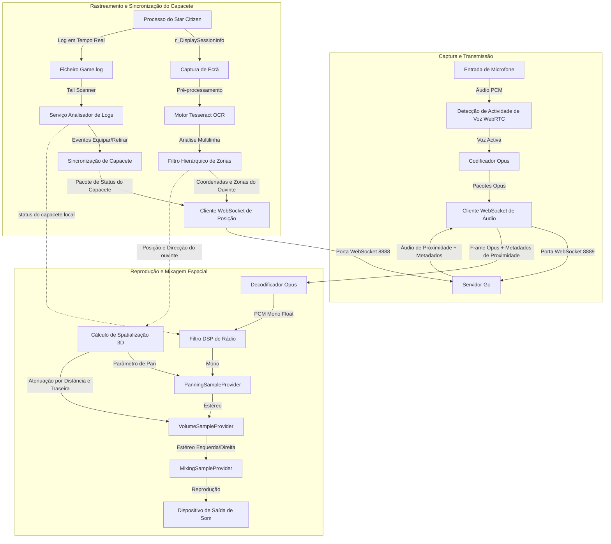

# XuruVoip (Português - Portugal)

<p align="center">
  <a href="https://github.com/XuruDragon/XuruVOIP/actions/workflows/tests.yml">
    
  </a>
  <a href="https://github.com/XuruDragon/XuruVOIP/releases">
    
  </a>
  <a href="https://github.com/XuruDragon/XuruVOIP/releases">
    
  </a>
</p>

<p align="center">
  <b>Traduções:</b><br/>
  <a href="../README.md">English</a> •
  <a href="README.fr.md">Français</a> •
  <a href="README.de.md">Deutsch</a> •
  <a href="README.es.md">Español</a> •
  <a href="README.pt-BR.md">Português (Brasil)</a> •
  <a href="README.pt-PT.md">Português (Portugal)</a> •
  <a href="README.ja.md">日本語</a> •
  <a href="README.zh.md">简体中文</a>
</p>

<p align="center">
  
</p>

XuruVoip é uma suite de comunicação de voz 3D (VoIP) de alto desempenho, segura e espacializada dinamicamente, concebida especificamente para integrações personalizadas com o **Star Citizen**. É composta por um servidor backend escrito em Go e um cliente desktop moderno em C# WPF.

---

## 📸 Capturas de Ecrã e Interface

### 1. Janela Principal do Cliente


### 2. Painel de Definições de Áudio (Controlo de Áudio Espacial 3D)


### 3. Painel de Definições Gerais (Idioma & Caminho do Game.log)


### 4. Painel de Definições de Conexão


### 5. Painel de Definições de Atalhos de Teclado


### 6. Página de Login do Portal Web Administrativo


### 7. Painel Geral (Dashboard) do Portal Web Administrativo


### 8. Lista de Jogadores do Portal Web Administrativo


### 9. Lista de Administradores do Portal Web Administrativo


### 10. Lista de Bloqueios (Banimentos) do Portal Web Administrativo


---

## 🗂️ Estrutura do Projeto

- **/server**: Servidor backend de alto desempenho escrito em Go que gere as posições dos jogadores, sessões de áudio e os serviços de administração web.
- **/client**: Cliente moderno em C# WPF que utiliza as bibliotecas NAudio, WebRtcVad e Tesseract OCR para localização automática e leitura de ficheiros de log do jogo.

---

## ⚙️ Como a Aplicação Funciona (Arquitetura do Cliente)

O cliente C# WPF corre em paralelo com o Star Citizen para capturar áudio, processar pacotes, reconhecer as coordenadas no ecrã e reproduzir o som em tempo real. Veja o fluxo detalhado da arquitetura:



### 1. Captura de Som, VAD e Compressão
* **Captura de Som:** O microfone é capturado pela biblioteca **NAudio** em 48.000 Hz, 16-bit mono.
* **Detecção de Actividade de Voz (VAD):** O wrapper nativo do **WebRtcVad** analisa o áudio em tempo real. Se o som cair abaixo do limite definido, a transmissão cessa para evitar a difusão de ruídos do teclado ou ventoinha.
* **Compressão:** O áudio é codificado no formato **Opus** (através da biblioteca C# **Concentus**) e transmitido via WebSockets para o servidor.

### 2. Localização e Orientação 3D
* **Captura de Ecrã e OCR:** O cliente captura a região do ecrã onde o Star Citizen imprime a localização (`/showlocations` ou `r_DisplaySessionInfo`). O texto da imagem é filtrado e processado pelo **Tesseract OCR**.
* **Filtro Hierárquico de Zonas:** O texto detectado contém localizações em árvore (planetas, naves, cabinas). O sistema remove ruídos (como cabinas de elevador ou assentos) para que jogadores próximos em diferentes divisões continuem a conversar de forma contínua.
* **Estimativa de Orientação:** A direcção do jogador é estimada a partir da variação espacial consecutiva ($Posição_{atual} - Posição_{anterior}$). Quando parado, a última orientação é mantida.

### 3. Leitura e Monitorização de Capacete em Tempo Real
* **Log Tail Scanner:** Um serviço analisa o final do ficheiro `Game.log` do Star Citizen continuamente.
* **Detecção de Itens:** Identifica linhas de equipar capacete (`FP_Visor`, `helmethook_attach`) e altera o modo de processamento de áudio do jogador instantaneamente de forma autónoma.

### 4. Mixagem e Processamento Espacial 3D
* **Recepção:** Recebe pacotes Opus do servidor junto com dados espaciais do emissor (distância, coordenadas e alcance).
* **Cálculos de Áudio Espacial:** O sinal é decomposto nos eixos relativos do ouvinte:
  * **Pan Estéreo:** Controla o balanço de volume esquerdo/direito de `-1.0` a `+1.0`.
  * **Atenuação Traseira:** Sons vindos de trás sofrem uma redução de até 25% no volume para auxiliar na percepção física da direcção do som.
  * **Atenuação por Distância:** O volume diminui linearmente até zerar no raio máximo definido para a conversa (50 metros).
* **Reprodução:** Os dados Opus decodificados passam por um **filtro DSP de rádio** (caso o emissor ou o receptor estejam com capacete ou a usar um canal de rádio), recebem o balanço espacial e são mixados com as demais fontes no `MixingSampleProvider` do NAudio.

---

## 🖥️ Servidor XuruVoip (Go)

Garante o encaminhamento dinâmico de áudio com base na distância de proximidade e canais de rádio, além de gerir a segurança e persistência dos dados.

### Principais Recursos
* **Controlo de Proximidade no Servidor**: O servidor entrega os pacotes de som apenas para jogadores dentro do raio de alcance.
* **Modo Espacial Personalizado**: Através do `.env` (`XURUVOIP_SPATIAL_AUDIO`), define se as coordenadas físicas reais serão partilhadas com outros clientes ou se apenas a distância será informada.
* **Encaminhamento de Canais de Rádio Simultâneos**: O jogador pode ouvir múltiplos canais de rádio ao mesmo tempo enquanto transmite no canal activo.
* **Efeitos e Perfis de Áudio**: Adiciona distorções (rádio clássico, eco) de acordo com o perfil registado.
* **Persistência SQLite**: Grava todos os canais e atribuições dos jogadores de forma nativa.
* **Sistema de Segurança e Banimento**: Bloqueia utilizadores por Username, IP e assinatura física de hardware (HWID/MachineGuid).
* **Painel Administrativo Web**: Interface segura (HTTPS/WebSockets) com acompanhamento de logs ao vivo e painel de banimentos.

### Configuração do Servidor (`.env`)
No primeiro arranque, o servidor gera automaticamente um ficheiro de configurações padrão:
```env
XURUVOIP_SERVER_IP=
XURUVOIP_PORT=8888
XURUVOIP_AUDIO_PORT=8889
XURUVOIP_DATA_DIR=.
XURUVOIP_MAX_PLAYERS=500
XURUVOIP_SPATIAL_AUDIO=1
XURUVOIP_PUBLIC_SERVER=0
XURUVOIP_SERVER_PASSWORD=auto_generated_32_chars_token
XURUVOIP_ADMIN_SERVER_PASSWORD=auto_generated_32_chars_token
XURUVOIP_VERBOSE_LOGS=1
XURUVOIP_LIMIT_RATE_POS=50.0
XURUVOIP_LIMIT_BURST_POS=100
XURUVOIP_LIMIT_RATE_AUDIO=60.0
XURUVOIP_LIMIT_BURST_AUDIO=120
XURUVOIP_LOCKOUT_ATTEMPTS=5
XURUVOIP_LOCKOUT_WINDOW=60
XURUVOIP_LOCKOUT_DURATION=600
```

### Compilar o Servidor a partir das fontes

#### Linux
```bash
cd server
GOOS="linux" GOARCH="amd64" go build .
```

#### Windows
```powershell
cd server
$env:GOOS="windows"
$env:GOARCH="amd64"
go build .
```

### Inicializar o Servidor

#### A partir das fontes:
```bash
cd server
go run .
```

#### A partir do executável compilado:
##### Windows
```powershell
.\server.exe
```

##### Linux
```bash
./server
```

### 🖥️ Configuração e Instalação de Servidor Sem Interface (Headless)

Para servidores dedicados permanentes de produção, recomenda-se configurar a aplicação para correr como um serviço ou daemon do sistema operativo.

#### 1. Portas de Rede e Firewall
Configure a sua firewall para abrir as portas de entrada especificadas no ficheiro `.env` (padrões `8888` para dados/painel de controlo e `8889` para fluxo de áudio):
* **Linux (UFW):**
  ```bash
  sudo ufw allow 8888/tcp
  sudo ufw allow 8889/tcp
  sudo ufw reload
  ```
* **Linux (firewalld):**
  ```bash
  sudo firewall-cmd --zone=public --add-port=8888/tcp --permanent
  sudo firewall-cmd --zone=public --add-port=8889/tcp --permanent
  sudo firewall-cmd --reload
  ```

---

#### 2. Instalação no Linux (systemd)

Siga estas instruções para configurar o servidor escrito em Go como um serviço do systemd:

##### Passo A: Criar Diretórios e Utilizador
Crie um utilizador exclusivo sem privilégios de login para isolar a segurança do processo:
```bash
# Criar utilizador do sistema sem consola de login
sudo useradd -r -s /bin/false xuruvoip

# Criar a pasta de instalação e mover o executável
sudo mkdir -p /opt/xuruvoip
sudo cp xuruvoip-server-linux-x64 /opt/xuruvoip/xuruvoip-server
sudo chmod +x /opt/xuruvoip/xuruvoip-server

# Definir as permissões da pasta para o utilizador
sudo chown -R xuruvoip:xuruvoip /opt/xuruvoip
```

##### Passo B: Inicializar Ficheiro `.env`
Execute o binário uma primeira vez como o utilizador restrito para gerar o `.env` padrão e a base de dados SQLite:
```bash
sudo -u xuruvoip /opt/xuruvoip/xuruvoip-server -port 8888 -audio-port 8889
```
*Aperte `Ctrl+C` após a exibição das chaves de acesso geradas automaticamente.* Edite as variáveis no ficheiro `.env`:
```bash
sudo nano /opt/xuruvoip/.env
```

##### Passo C: Criar o Ficheiro de Serviço systemd
Copie o ficheiro de serviço do repositório `server/xuruvoip.service` para `/etc/systemd/system/xuruvoip-server.service` ou crie-o com as seguintes configurações:
```ini
[Unit]
Description=XuruVoip Star Citizen Spatial VOIP Server
After=network.target

[Service]
Type=simple
User=xuruvoip
Group=xuruvoip
WorkingDirectory=/opt/xuruvoip
ExecStart=/opt/xuruvoip/xuruvoip-server
Restart=always
RestartSec=5
LimitNOFILE=65536

[Install]
WantedBy=multi-user.target
```

##### Passo D: Registar e Iniciar o Serviço
```bash
sudo systemctl daemon-reload
sudo systemctl enable xuruvoip-server
sudo systemctl start xuruvoip-server
```

##### Passo E: Logs e Acompanhamento
```bash
# Consultar o status do serviço
sudo systemctl status xuruvoip-server

# Monitorizar a saída do terminal ao vivo
journalctl -u xuruvoip-server -f -n 100
```

---

#### 3. Instalação no Windows (NSSM)

Para registar e correr a aplicação em segundo plano no Windows, é indicado o uso do gestor **NSSM (Non-Sucking Service Manager)**:

##### Passo A: Organizar as Pastas
Mova o ficheiro `xuruvoip-server-windows-x64.exe` para uma pasta de sua escolha (como `C:\XuruVoipServer`).

##### Passo B: Execução Inicial
Inicie o executável num terminal PowerShell como administrador para criar a estrutura inicial. Feche-o pressionando `Ctrl+C` e personalize as configurações no `.env`.

##### Passo C: Registar o Serviço com NSSM
```powershell
# Executar a interface gráfica de instalação do NSSM
.\nssm.exe install XuruVoipServer "C:\XuruVoipServer\xuruvoip-server-windows-x64.exe"
```
Preencha a pasta de trabalho como `C:\XuruVoipServer` e clique em *Install service*.

##### Passo D: Iniciar o Serviço
```powershell
Start-Service -Name XuruVoipServer
```

---

## 🎮 Visão Geral das Definições do Cliente

A janela de definições está dividida em 5 secções principais:
1. **General**: Defina o idioma, informe o caminho do ficheiro `Game.log` do Star Citizen e ative gravações locais de log do cliente.
2. **Connection**: Configura IP do servidor, portas de áudio/posição, utilizador, palavras-passe da conta e do servidor.
3. **OCR**: Selecciona monitor, frequência de varrimento (ms), delimita a região de leitura e visualiza a última extração de texto.
4. **Audio**: Escolhe os dispositivos de áudio, ganhos, modo de ativação de voz (PTT / VAD), limiar de ruído e ativação de **3D Spatial Audio**.
5. **Hotkeys**: Regista as teclas físicas para falar no PTT, alternar capacete, mudar canal activo de rádio e as teclas de mute.

### Compilar e Executar o Cliente

#### Requisitos
- Windows 10 ou Windows 11
- SDK .NET 9.0 (com recursos WPF)

#### Compilar & Correr:
```powershell
cd client
dotnet run
```

### Instalar o Pacote de Lançamento (Release)

Como os ficheiros não possuem assinatura digital comercial, o SmartScreen do Windows pode alertar que o software provém de uma fonte desconhecida. Siga as instruções abaixo para desbloquear:

* **Option A: Instalador MSI (Recomendado)**
  1. Transfira o ficheiro `XuruVoipClient-win-x64.msi` na [página de versões (releases)](https://github.com/XuruDragon/XuruVOIP/releases).
  2. Clique com o botão direito no instalador `.msi` e abra **Propriedades**.
  3. Na guia *Geral*, marque a caixa **Desbloquear** no rodapé e clique em **Aplicar**.
  4. Execute o ficheiro e siga os passos do assistente de instalação.

* **Option B: Versão Portátil (ZIP)**
  1. Transfira o ficheiro `XuruVoipClient-win-x64.zip` na [página de versões (releases)](https://github.com/XuruDragon/XuruVOIP/releases).
  2. Clique com o botão direito no ficheiro `.zip`, seleccione **Propriedades** e marque a opção **Desbloquear** na guia *Geral*. Aplique as alterações.
  3. Extraia o conteúdo para a pasta desejada (ex: `C:\Games\XuruVoip`).
  4. Dê um clique duplo em `XuruVoipClient.exe` para usar o cliente.

---

## 👥 Créditos

Desenvolvido por **[@XuruDragon](https://github.com/XuruDragon)** em colaboração com **Antigravity IDE**.
