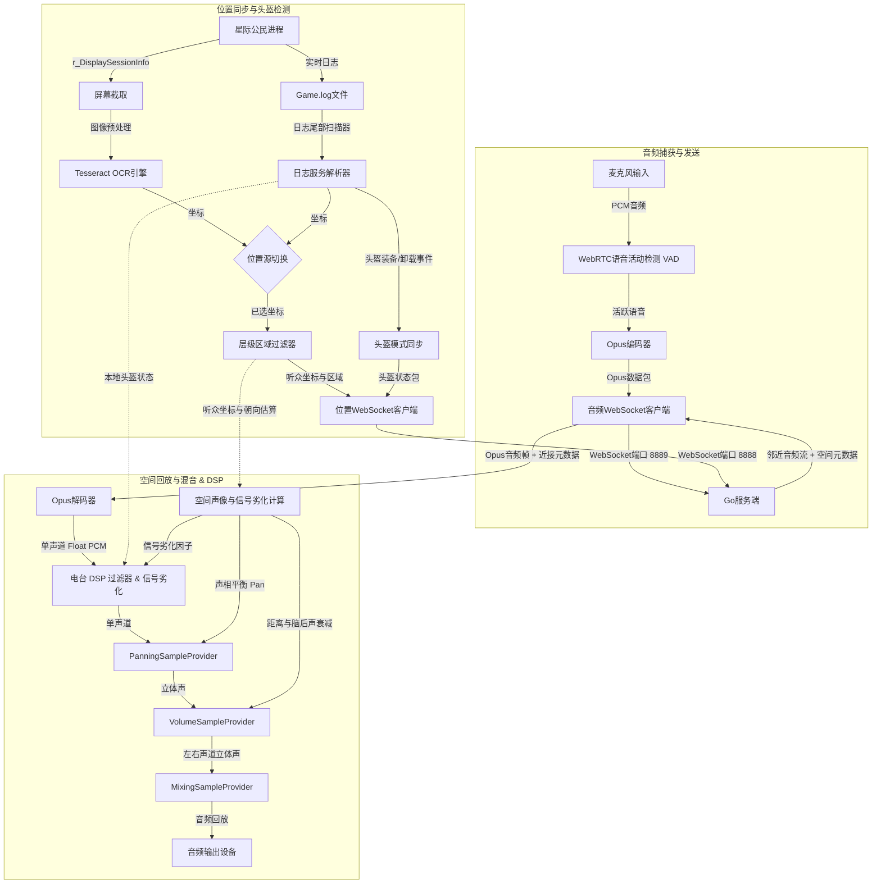

# XuruVoip (简体中文)

<p align="center">
  <a href="https://github.com/XuruDragon/XuruVOIP/actions/workflows/tests.yml">
    
  </a>
  <a href="https://github.com/XuruDragon/XuruVOIP/releases">
    
  </a>
  <a href="https://github.com/XuruDragon/XuruVOIP/releases">
    
  </a>
</p>

<p align="center">
  <b>语言翻译:</b><br/>
  <a href="../README.md">English</a> •
  <a href="README.fr.md">Français</a> •
  <a href="README.de.md">Deutsch</a> •
  <a href="README.es.md">Español</a> •
  <a href="README.pt-BR.md">Português (Brasil)</a> •
  <a href="README.pt-PT.md">Português (Portugal)</a> •
  <a href="README.ja.md">日本語</a> •
  <a href="README.zh.md">简体中文</a>
</p>

<p align="center">
  
</p>

XuruVoip 是一款专为 **星际公民 (Star Citizen)** 自定义游戏集成设计的高性能、安全且支持动态 3D 空间音效的**语音通信 (VoIP) 套件**。它由基于 Go 的后端服务端和现代 C# WPF 客户端组成。

---

## 📸 屏幕截图与用户界面

### 1. 客户端主窗口


### 2. 音频设置选项卡 (3D 空间音频控制)


### 3. 常规设置选项卡 (语言与 Game.log 选择)


### 4. 连接设置选项卡


### 5. 快捷键设置选项卡


### 6. 管理员网页后台登录页面


### 7. 管理员网页后台仪表盘


### 8. 管理员网页后台玩家列表


### 9. 管理员网页后台管理员列表


### 10. 管理员网页后台封禁列表


---

## 🗂️ 项目结构

- **/server**: 基于 Go 的高性能后端，托管位置同步、音频转发及网页后台管理服务。
- **/client**: 现代 C# WPF 客户端，利用 NAudio、WebRtcVad 以及 Tesseract OCR 进行自动位置跟踪和日志解析。

---

## ⚙️ 应用程序工作原理 (客户端架构)

C# WPF 客户端与星际公民进程并发运行，执行实时音频捕获、语音检测、屏幕坐标识别以及混音回放。以下是客户端工作原理的工作流拓扑：



### 1. 音频捕获、VAD 语音活动检测和压缩
* **音频捕获：** 客户端使用 **NAudio** API 以高保真度 48,000 Hz、16-bit 单声道录制麦克风。
* **语音活动检测 (VAD)：** 通过内置原生 **WebRtcVad** 进行实时评估。若语音置信度低于预设阈值则停止发送，有效隔离键盘打字声和风扇噪音。
* **数据压缩：** 活跃的语音段通过 C# **Concentus** 库压缩为 **Opus** 数据包，并通过 WebSockets 直接传输至音频服务器。

### 2. 位置跟踪和朝向估算
* **位置源切换：** 玩家可以在客户端设置中选择两种位置获取方式：
  * **OCR 屏幕扫描器：** 定期截取屏幕中输出游戏坐标的预设区域（`/showlocations` 或 `r_DisplaySessionInfo` 渲染坐标的区域），对图像进行预处理，然后送入 **Tesseract OCR** 引擎进行字符识别。
  * **Game.log 读取器 (GRTPR)：** 直接实时扫描星际公民的 `Game.log` 文件以读取游戏记录的坐标。要启用此方法，玩家必须在游戏的 `user.cfg` 文件中添加 `r_DisplaySessionInfo = 3` (或 `1`)。选择 GRTPR 后，Tesseract OCR 引擎将完全关闭并释放，从而节省主机的大量 CPU 和内存资源。
* **层级区域过滤：** 识别结果包含层级区域（行星、飞船舱室、电梯等）。客户端自动忽略细微区域波动（如电梯内或座椅上），从而保证邻近区域的玩家依然可以连贯无阻地通话。
* **朝向估算：** 客户端通过坐标差（$Position_{当前} - Position_{历史}$）自动计算位移向量作为视角朝向。在角色静止时，朝向将维持最后移动时的状态。

### 3. 头盔装备状态实时检测
* **日志尾部读取 (Tail Scan)：** 后台线程实时监测星际公民生成的 `Game.log` 文件。
* **状态同步：** 检测到头盔部件装备日志（`FP_Visor`、`helmethook_attach`）时，立即自动更新头盔模式（开启/关闭），无须手动按键。

### 4. 3D 空间立体声混音与 DSP
* **数据接收：** 接收来自服务端的 Opus 音频流，附带发声者坐标、距离和最大作用范围。
* **空间混音声学投影：** 音频将被投影至听众的相对坐标系中：
  * **立体声声相 (Pan)：** 控制左右声道的平衡比（`-1.0` 极左至 `+1.0` 极右）。
  * **脑后声衰减：** 若发声者位于听众身后，音量自动降低最多 25%，用于克服声学前/后定位模糊。
  * **距离衰减：** 随距离成线性比例淡出，到达最大传播范围（默认 50m）时降低为零。
* **回放与电台 DSP 处理：** Opus 帧经解码后，进行空间定位和距离衰减，最终混合回放。
  * **动态电台信号劣化：** 如果启用，随着玩家之间的距离接近最大通信范围，DSP 滤波器将动态收窄高通和低通截止频率，并混入经带通滤波的白 noise，以模拟真实无线电波在大气中传播时的低保真和杂音劣化。
  * **逼真的 PTT 麦克风咔哒声与电台尾音：** NAudio 合成逼真的电台开关麦音效。开始发送时播放 50ms 的扫频 **麦克风咔哒声 (Mic Key Chirp)**（900Hz 到 700Hz）。结束发送时，当回放服务接收到由捕获服务发送的最后一个 0 字节 Opus 空帧，即触发 180ms 带通滤波静电噪音 **电台尾音 (Squelch Tail)**。可选择开启本地 PTT 音效回显，使玩家能够听到自己电台的开关麦提示音。

### 6. 兼容 Vulkan 与 DirectX 的无边框 HUD 悬浮窗 (Overlay)
* **HUD 悬浮窗** : 客户端提供一个可选的、位于最顶层的轻量透明 WPF 悬浮窗，显示客户端 VoIP 状态、当前电台频道频率以及带电台信号指示器的实时说话人列表。
* **Win32 鼠标穿透集成** : 通过使用 Win32 API 窗口样式（`WS_EX_TRANSPARENT` 和 `WS_EX_NOACTIVATE`），悬浮窗不会夺取焦点，并允许鼠标点击直接穿透到游戏中。
* **与渲染 API 无关的渲染** : 由于标准的透明 WPF 窗口依赖 Windows 桌面窗口管理器 (DWM) 混色图层进行合成渲染，因此无需注入游戏图形管线。只要游戏在 **“无边框窗口模式” (Borderless Windowed)** 下运行，就能完美兼容 **Vulkan** 和 **DirectX**。

---

## 🖥️ XuruVoip 服务端 (Go)

服务端整合各玩家的位置，进行鉴权，并根据距离和电台频道动态投递音频数据包。

### 核心功能
* **服务端邻近控制**：仅向处于近接范围内（默认 50m）的玩家转发音频包。
* **空间数据共享**：在 `.env` 中通过 `XURUVOIP_SPATIAL_AUDIO` 调节是共享物理坐标，还是仅向客户端共享两者的相对距离。
* **多电台频道**：允许玩家在主力电台频道通话时，同时旁听其他多个设定的电台广播。
* **音频 Profile 特效**：为玩家应用电台滤波、回声等声学特效。
* **SQLite 数据库持久化**：长期保存服务器频道结构和玩家的偏好。
* **高强度封禁安全保障**：支持按 Username、IP 以及硬件指纹 (HWID/MachineGuid) 进行封禁，防止绕过。
* **Web 后台管理系统**：支持 HTTPS/WebSockets，可在浏览器端实时监视日志、活动和配置封禁列表。
* **服务端管理员雷达地图**：管理员后台集成 2D HTML5 Canvas 实时玩家雷达地图，支持鼠标拖拽平移、滚轮缩放以及活跃区域过滤。

### 服务端配置选项 (`.env`)
初次运行服务端时，将自动创建如下默认设置文件：
```env
XURUVOIP_SERVER_IP=
XURUVOIP_PORT=8888
XURUVOIP_AUDIO_PORT=8889
XURUVOIP_DATA_DIR=.
XURUVOIP_MAX_PLAYERS=500
XURUVOIP_SPATIAL_AUDIO=1
XURUVOIP_PUBLIC_SERVER=0
XURUVOIP_SERVER_PASSWORD=auto_generated_32_chars_token
XURUVOIP_ADMIN_SERVER_PASSWORD=auto_generated_32_chars_token
XURUVOIP_VERBOSE_LOGS=1
XURUVOIP_LIMIT_RATE_POS=50.0
XURUVOIP_LIMIT_BURST_POS=100
XURUVOIP_LIMIT_RATE_AUDIO=60.0
XURUVOIP_LIMIT_BURST_AUDIO=120
XURUVOIP_LOCKOUT_ATTEMPTS=5
XURUVOIP_LOCKOUT_WINDOW=60
XURUVOIP_LOCKOUT_DURATION=600
```

### 从源码编译

#### Linux
```bash
cd server
GOOS="linux" GOARCH="amd64" go build .
```

#### Windows
```powershell
cd server
$env:GOOS="windows"
$env:GOARCH="amd64"
go build .
```

### 运行服务端

#### 源码运行：
```bash
cd server
go run .
```

#### 运行二进制文件：
##### Windows
```powershell
.\server.exe
```

##### Linux
```bash
./server
```

### 🖥️ 无头 (Headless) 服务端安装与部署

对于永久运行的生产服务器，建议在无图形界面的系统下，将服务端注册为后台守护进程 (Service/Daemon) 以支持自启动和崩溃自动拉起。

#### 1. 网络与防火墙配置
确保放行在 `.env` 中定义的 TCP 端口（默认端口：`8888` 网页端/数据端口，`8889` 音频端口）：
* **Linux (UFW):**
  ```bash
  sudo ufw allow 8888/tcp
  sudo ufw allow 8889/tcp
  sudo ufw reload
  ```
* **Linux (firewalld):**
  ```bash
  sudo firewall-cmd --zone=public --add-port=8888/tcp --permanent
  sudo firewall-cmd --zone=public --add-port=8889/tcp --permanent
  sudo firewall-cmd --reload
  ```

---

#### 2. Linux 部署环境 (systemd)

按照以下步骤将 Go 服务端封装为 systemd 独立服务：

##### 步骤 A: 准备独立运行用户与目录
创建独立的系统服务账号和目录，防止提权安全漏洞：
```bash
# 创建无登录壳的系统账号
sudo useradd -r -s /bin/false xuruvoip

# 创建工作文件夹并拷贝运行文件
sudo mkdir -p /opt/xuruvoip
sudo cp xuruvoip-server-linux-x64 /opt/xuruvoip/xuruvoip-server
sudo chmod +x /opt/xuruvoip/xuruvoip-server

# 转移文件夹所有权
sudo chown -R xuruvoip:xuruvoip /opt/xuruvoip
```

##### 步骤 B: 初始化生成 `.env` 配置文件
以该独立系统用户身份，手动拉起运行一次生成默认配置文件：
```bash
sudo -u xuruvoip /opt/xuruvoip/xuruvoip-server -port 8888 -audio-port 8889
```
*在控制台输出完成随机密码后按 `Ctrl+C` 结束运行。* 然后调整 `.env` 变量配置：
```bash
sudo nano /opt/xuruvoip/.env
```

##### 步骤 C: 创建 systemd 服务配置文件
拷贝仓库中的配置文件 `server/xuruvoip.service` 至 `/etc/systemd/system/xuruvoip-server.service` 或新建文件写入以下内容：
```ini
[Unit]
Description=XuruVoip Star Citizen Spatial VOIP Server
After=network.target

[Service]
Type=simple
User=xuruvoip
Group=xuruvoip
WorkingDirectory=/opt/xuruvoip
ExecStart=/opt/xuruvoip/xuruvoip-server
Restart=always
RestartSec=5
LimitNOFILE=65536

[Install]
WantedBy=multi-user.target
```

##### 步骤 D: 激活并开启服务
```bash
sudo systemctl daemon-reload
sudo systemctl enable xuruvoip-server
sudo systemctl start xuruvoip-server
```

##### 步骤 E: 查询状态与日志监控
```bash
# 查询当前运行状态
sudo systemctl status xuruvoip-server

# 追踪实时日志输出
journalctl -u xuruvoip-server -f -n 100
```

---

#### 3. Windows 部署环境 (NSSM)

建议使用 **NSSM (Non-Sucking Service Manager)** 工具将该服务端注册为 Windows 后台服务运行：

##### 步骤 A: 新建工作目录
将程序 `xuruvoip-server-windows-x64.exe` 移入专用空目录（如 `C:\XuruVoipServer`）。

##### 步骤 B: 初始化生成设置
在管理员 PowerShell 中手动执行该文件一次，自动生成设置文件后按 `Ctrl+C` 退出，并调整 `.env`。

##### 步骤 C: 通过 NSSM 安装服务
```powershell
# 打开 NSSM 图形化服务安装向导
.\nssm.exe install XuruVoipServer "C:\XuruVoipServer\xuruvoip-server-windows-x64.exe"
```
在向导界面中配置 *Startup directory* 为 `C:\XuruVoipServer`，确认安装。

##### 步骤 D: 运行服务
```powershell
Start-Service -Name XuruVoipServer
```

---

## 🎮 XuruVoip 客户端设置选项卡详解

客户端的配置被规划为六个功能选项卡：
1. **General (常规)**: 选择界面语言、星际公民日志（`Game.log`）路径以及是否允许生成本地诊断日志。
2. **Connection (连接)**: 配置后端 IP、音频与位置同步端口、游戏代号、本地存储密码和登录服务器的鉴权 Password。
3. **Position (位置)**: 选择位置源获取方式（“OCR 屏幕扫描器”vs.“Game.log 读取器 (GRTPR)”）、指派截屏显示器、设定扫描精度（ms）、拖动规划扫描区域以及读取分析器输出预览（GRTPR 激活时自动隐藏 OCR 选项）。
4. **Audio (音频)**: 绑定耳麦设备、调整麦克风与回放增益、指定激活机制（按键 PTT / 门限 VAD）、调整 VAD 灵敏度并启用 **3D 空间音频**、以及配置高级电台劣化特效与 PTT 电台音效。
5. **Hotkeys (快捷键)**: 绑定近接、电台、群组的 PTT 键，开关头盔的按键，切换电台频道键和各项信道的禁音 (Mute) 键。
6. **Overlay (悬浮窗)**: 启用无边框 HUD 悬浮窗，并设定其在屏幕中的悬停方位（如左上角、右上角等）。

### 编译并启动客户端

#### 运行环境
- Windows 10 或 Windows 11
- .NET 9.0 SDK（含 WPF 开发框架支持）

#### 编译与运行：
```powershell
cd client
dotnet run
```

### 安装发布包

因为没有购买商业数字证书对二进制文件签名，双击安装可能会被 Windows SmartScreen 拦截阻碍。您需要手动解除阻止属性。

* **选项 A: MSI 安装包 (推荐)**
  1. 从 [Releases 页面](https://github.com/XuruDragon/XuruVOIP/releases) 下载 `XuruVoipClient-win-x64.msi`。
  2. 右击该文件选择 **属性**。
  3. 在 *常规* 选项卡的最底部，勾选 **解除锁定** 选框，并点击 **应用**。
  4. 双击运行安装，按照向导完成即可。

* **选项 B: 便携式 ZIP 压缩包**
  1. 下载 `XuruVoipClient-win-x64.zip`。
  2. 右键查看属性，勾选 **解除锁定** 确认。
  3. 将压缩包解压至指定空目录中 (例如 `C:\Games\XuruVoip`)。
  4. 双击双击 `XuruVoipClient.exe` 直接运行使用。

---

## 👥 鸣谢

由 **[@XuruDragon](https://github.com/XuruDragon)** 与 **Antigravity IDE** 合作开发。
