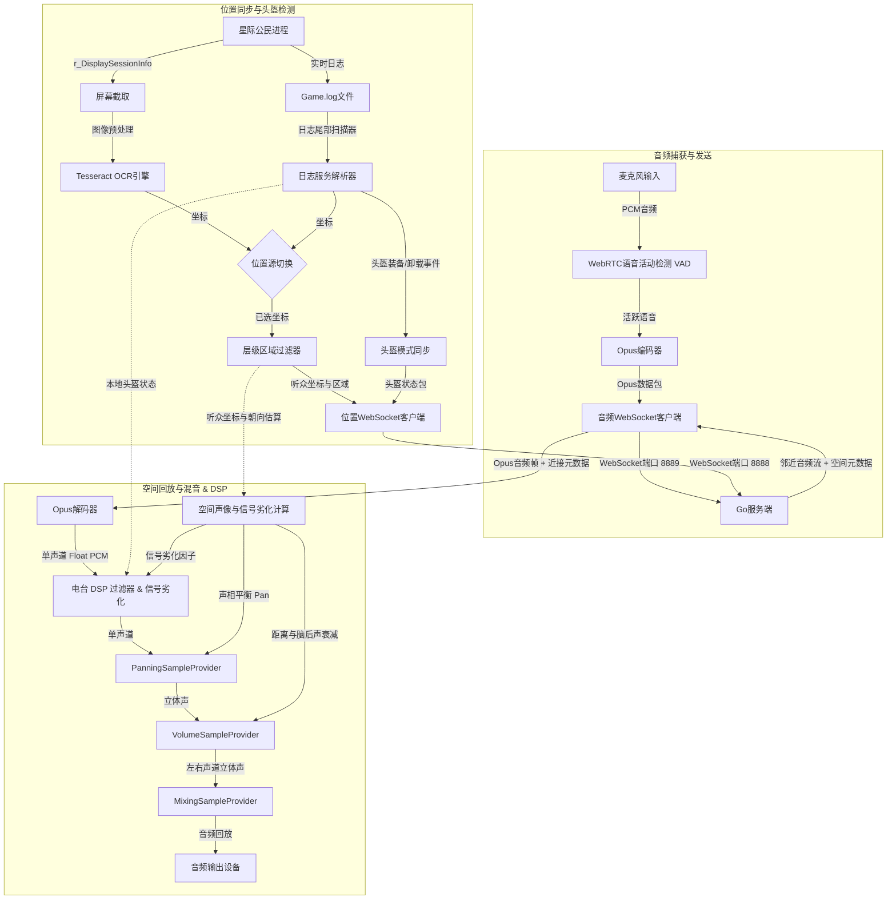

# XuruVoip (简体中文)

<p align="center">
  <a href="https://github.com/XuruDragon/XuruVOIP/actions/workflows/tests.yml">
    
  </a>
  <a href="https://github.com/XuruDragon/XuruVOIP/releases">
    
  </a>
  <a href="https://github.com/XuruDragon/XuruVOIP/releases">
    
  </a>
</p>

<p align="center">
  <b>语言翻译:</b><br/>
  <a href="../README.md">English</a> •
  <a href="README.fr.md">Français</a> •
  <a href="README.de.md">Deutsch</a> •
  <a href="README.es.md">Español</a> •
  <a href="README.pt-BR.md">Português (Brasil)</a> •
  <a href="README.pt-PT.md">Português (Portugal)</a> •
  <a href="README.ja.md">日本語</a> •
  <a href="README.zh.md">简体中文</a>
</p>

<p align="center">
  
</p>

XuruVoip 是一款专为 **星际公民 (Star Citizen)** 自定义游戏集成设计的高性能、安全且支持动态 3D 空间音效的**语音通信 (VoIP) 套件**。它由基于 Go 的后端服务端和现代 C# WPF 客户端组成。

---

## 📸 屏幕截图与用户界面

<details>
<summary>📸 点击展开屏幕截图</summary>

### 1. 客户端主窗口


### 2. 音频设置选项卡 (3D 空间音频控制)


### 3. 常规设置选项卡 (语言与 Game.log 选择)


### 4. 连接设置选项卡


### 5. 快捷键设置选项卡


### 6. 覆盖层设置选项卡 (Vulkan 与 DirectX HUD)


### 7. 管理员网页后台登录页面


### 8. 管理员网页后台仪表盘


### 9. 管理员网页后台玩家列表


### 10. 管理员网页后台管理员列表


### 11. 管理员网页后台封禁列表


</details>

---

## 🗂️ 项目结构

- **/server**: 基于 Go 的高性能后端，托管位置同步、音频转发及网页后台管理服务。
- **/client**: 现代 C# WPF 客户端，利用 NAudio、WebRtcVad 以及 Tesseract OCR 进行自动位置跟踪和日志解析。

---

## ⚙️ 应用程序工作原理 (客户端架构)

C# WPF 客户端与星际公民进程并发运行，执行实时音频捕获、语音检测、屏幕坐标识别以及混音回放。以下是客户端工作原理的工作流拓扑：



### 1. 音频捕获、VAD 语音活动检测和压缩
* **音频捕获：** 客户端使用 **NAudio** API 以高保真度 48,000 Hz、16-bit 单声道录制麦克风。
* **语音活动检测 (VAD)：** 通过内置原生 **WebRtcVad** 进行实时评估。若语音置信度低于预设阈值则停止发送，有效隔离键盘打字声和风扇噪音。
* **单文件原生依赖解析:** 客户端在启动时使用自定义程序集解析回调，从 `runtimes\win-x64\native` 子目录动态加载原生的 `WebRtcVad.dll`，从而解决以单文件形式发布包时的 DLL 加载问题。
* **数据压缩：** 活跃的语音段通过 C# **Concentus** 库压缩为 **Opus** 数据包，并通过 WebSockets 直接传输至音频服务器。

### 2. 位置跟踪和朝向估算
* **位置源切换：** 玩家可以在客户端设置中选择两种位置获取方式：
  * **OCR 屏幕扫描器：** 定期截取屏幕中输出游戏坐标的预设区域（`/showlocations` 或 `r_DisplaySessionInfo` 渲染坐标的区域），对图像进行预处理，然后送入 **Tesseract OCR** 引擎进行字符识别。
  * **单文件原生依赖解析:** 在运行时从 `x64` 子目录中通过程序动态解析 Tesseract 的原生二进制文件（`tesseract50.dll` 和 `leptonica-1.82.0.dll`），确保在作为自包含单文件可执行文件部署时，OCR 能够稳定运行。
  * **Game.log 读取器 (GRTPR)：** 直接实时扫描星际公民的 `Game.log` 文件以读取游戏记录的坐标。要启用此方法，玩家必须在游戏的 `user.cfg` 文件中添加 `r_DisplaySessionInfo = 3` (或 `1`)。选择 GRTPR 后，Tesseract OCR 引擎将完全关闭并释放，从而节省主机的大量 CPU 和内存资源。
* **层级区域过滤：** 识别结果包含层级区域（行星、飞船舱室、电梯等）。客户端自动忽略细微区域波动（如电梯内或座椅上），从而保证邻近区域的玩家依然可以连贯无阻地通话。
* **朝向估算：** 客户端通过坐标差（$Position_{当前} - Position_{历史}$）自动计算位移向量作为视角朝向。在角色静止时，朝向将维持最后移动时的状态。

### 3. 头盔装备状态实时检测
* **日志尾部读取 (Tail Scan)：** 后台线程实时监测星际公民生成的 `Game.log` 文件。
* **状态同步：** 检测到头盔部件装备日志（`FP_Visor`、`helmethook_attach`）时，立即自动更新头盔模式（开启/关闭），无须手动按键。

### 4. 3D 空间立体声混音与 DSP
* **数据接收：** 接收来自服务端的 Opus 音频流，附带发声者坐标、距离和最大作用范围。
* **空间混音声学投影：** 音频将被投影至听众的相对坐标系中：
  * **立体声声相 (Pan)：** 控制左右声道的平衡比（`-1.0` 极左至 `+1.0` 极右）。
  * **脑后声衰减：** 若发声者位于听众身后，音量自动降低最多 25%，用于克服声学前/后定位模糊。
  * **距离衰减：** 随距离成线性比例淡出，到达最大传播范围（默认 50m）时降低为零。
* **回放与电台 DSP 处理：** Opus 帧经解码后，进行空间定位和距离衰减，最终混合回放。
  * **动态电台信号劣化：** 如果启用，随着玩家之间的距离接近最大通信范围，DSP 滤波器将动态收窄高通和低通截止频率，并混入经带通滤波的白 noise，以模拟真实无线电波在大气中传播时的低保真和杂音劣化。
  * **逼真的 PTT 麦克风咔哒声与电台尾音：** NAudio 合成逼真的电台开关麦音效。开始发送时播放 50ms 的扫频 **麦克风咔哒声 (Mic Key Chirp)**（900Hz 到 700Hz）。结束发送时，当回放服务接收到由捕获服务发送的最后一个 0 字节 Opus 空帧，即触发 180ms 带通滤波静电噪音 **电台尾音 (Squelch Tail)**。可选择开启本地 PTT 音效回显，使玩家能够听到自己电台的开关麦提示音。

### 6. 兼容 Vulkan 与 DirectX 的无边框 HUD 悬浮窗 (Overlay)
* **HUD 悬浮窗** : 客户端提供一个可选的、位于最顶层的轻量透明 WPF 悬浮窗，显示客户端 VoIP 状态、当前电台频道频率以及带电台信号指示器的实时说话人列表。
* **Win32 鼠标穿透集成** : 通过使用 Win32 API 窗口样式（`WS_EX_TRANSPARENT` 和 `WS_EX_NOACTIVATE`），悬浮窗不会夺取焦点，并允许鼠标点击直接穿透到游戏中。
* **与渲染 API 无关的渲染** : 由于标准的透明 WPF 窗口依赖 Windows 桌面窗口管理器 (DWM) 混色图层进行合成渲染，因此无需注入游戏图形管线。只要游戏在 **“无边框窗口模式” (Borderless Windowed)** 下运行，就能完美兼容 **Vulkan** 和 **DirectX**。
* **📡 战术 HUD 微型雷达 (Tactical HUD Mini-Radar)**：在悬浮窗上渲染的圆形微型雷达上显示玩家位置。
  * **车头/朝向对齐 (Heading-Up Alignment)**：雷达根据玩家的移动方向向量（视向朝向）自动旋转。
  * **相对投影 (Relative Projection)**：投射附近说话玩家的相对坐标。活跃的说话者会显示脉动的声波环。
  * **可配置性**：可在设置中开启/关闭，最大显示范围可在 10 米到 200 米之间调节。
* **💬 实时 HUD 字幕 (语音转文字 Speech-to-Text)**：实时自动转录语音通信，并在悬浮窗上显示为字幕。
  * **离线转录**：使用本地运行的离线轻量级 Whisper 模型 (`ggml-tiny.bin`)（通过 Whisper.net）。
  * **动态语言自适应**：根据用户选择的界面语言动态匹配语音识别参数。
  * **按需后台安装**：仅在首次激活该功能时从 Huggingface 下载 75MB 的模型。后台下载进度将直接在 HUD 上显示。

### 7. 环境声学（遮挡与混响）
* **遮挡滤波器：** 如果说话者与听众处于不同的区域或隔间，客户端将自动应用低通滤波器以模拟物理遮挡/声学遮挡。截止频率会平滑过渡以防止产生音频咔哒声。
* **位置感知混响：** 如果听众位于特定环境（洞穴、地堡或机库），反馈延迟线梳状滤波器（comb filter）会应用针对该环境的湿声混合（wet mix）、延迟和反馈参数：
  * *洞穴/隧道：* 45% 湿声，100ms 延迟，0.6 反馈。
  * *地堡/空间站：* 25% 湿声，50ms 延迟，0.4 反馈。
  * *机库：* 35% 湿声，150ms 延迟，0.5 反馈。
* **🗺️ 舱室特定与甲板遮挡 (Compartment-Specific and Deck Occlusion)**：支持特定的飞船布局和设施，基于内部物理边界对音频进行隔离：
  * *Carrack 甲板*：Z 轴坐标划分（指挥甲板 vs 居住甲板 vs 技术甲板）应用低通滤波（截止频率 350Hz，音量 35%）。
  * *Carrack 舱室*：Y 轴坐标划分（驾驶舱 vs 居住舱 vs 引擎室）过滤音频（截止频率 900Hz，音量 65%）。
  * *地堡楼层*：Z 轴坐标划分（电梯大厅 vs 中间层 vs 主层）过滤音频（截止频率 300Hz，音量 30%）。
  * *地堡房间*：X 轴坐标划分过滤音频（截止频率 800Hz，音量 60%）。
  * *Hercules 甲板*：Z 轴坐标划分（居住舱 vs 货舱）过滤音频（截止频率 400Hz，音量 45%）。
  * *Cutlass 舱室*：Y 轴坐标划分（驾驶舱 vs 货舱）过滤音频（截止频率 1000Hz，音量 70%）。
  * *高度差启发式算法*：同一区域内的玩家之间若高度差大于 4.5 米，将自动触发地板/天花板遮挡（截止频率 500Hz，音量 45%）。

### 8. 无依赖的 Discord 状态呈现 (Discord Rich Presence / RPC)
* **鲁棒的命名管道连接:** 客户端直接与 Discord 进行集成，无需引入庞大的外部依赖。为了确保在不同的 Discord 配置或多个 Discord 实例下实现鲁棒的连接，它会扫描并尝试连接从 `discord-ipc-0` 到 `discord-ipc-9` 的所有命名管道索引。
* **动态状态更新：** 实时更新您的 Discord 活动状态，展示：
  * **详情：** 当前游戏内位置区域（例如 `"At MicroTech Cave"`）。
  * **状态：** 已连接的频道和状态（例如 `"On Radio: Bravo Channel (Helmet On)"` 或 `"In Proximity"`）。
  * **已用时间：** 显示自与服务器建立连接以来所经过的时间。

### 9. 启动时日志轮转
* **每日日志轮转:** 启动时，客户端检查活动日志文件的日期。如果它是在前一天修改的，则将其归档为 `xuru_voip.YYYY-MM-DD.log`。
* **清理与保留:** 为了限制磁盘空间占用，客户端会扫描日志目录，仅保留最近的 5 个已轮转日志文件，并删除更早的日志。

### 10. 🎙️ 实时语音变声器与太空服调制器
* **语音调制器 DSP (Voice Modulator DSP)**：在 Opus 压缩前，对输出的麦克风音频应用实时数字信号处理效果：
  * **音高移位器 (Pitch Shifter)**：使用两个重叠且淡入淡出的延迟线的实时时域音高移位器。
  * **环形调制器 (Ring Modulator)**：将音频信号乘以载波，产生具有金属感、科幻机器人风格的音调。
  * **法兰器 (Flanger)**：带低频振荡器 (LFO) 调制延迟线组合滤波器，产生席卷式的、太空般的“呼啸”音效。
* **变声器预设 (Voice Changer Presets)**：
  * *外星人 (Alien)*：低沉的音高移位 (0.65x) 结合环形调制 (85Hz) 和法兰器。
  * *半机械人 (Cyborg)*：金属音高移位 (0.82x)、环形调制 (65Hz)、软 tanh 饱和以及 8 位比特破碎 (Bitcrushing)。
  * *机器人 (Robotic)*：高亢的音高移位 (1.25x)、环形调制 (140Hz) 和法兰器。
  * *自定义音高移位 (Custom Pitch Shift)*：手动可调的音高系数（0.5x 至 2.0x）。
* **头盔/太空服通讯调制器 (Helmet/Suit Comms Modulator)**：启用后，在传输开始/结束时叠加逼真的呼吸器呼吸嘶嘶声和按键提示音（嘶嘶声和提示音完全可以单独切换）。

### 11. 💨 头盔与 EVA 太空舱外环境模拟
* **EVA/真空静音：** 当玩家处于太空或真空区域（EVA）时，近距离（Proximity）语音通信将自动禁用/静音，以模拟缺乏空气介质的环境。此时玩家只能通过无线电频道进行沟通。
* **面罩呼吸声与宇航服蜂鸣音：** 当装备并启用头盔面罩时，系统会在麦克风录音中混合逼真的呼吸器呼吸声以及宇航服排气蜂鸣声（50Hz/100Hz振荡器）。该功能可在客户端设置中开启或关闭。

### 12. 💬 动态飞船内联通（对讲）与飞行员优先降音
* **自动内联频道：** 当玩家进入飞船时，服务器会自动创建一个专属的内联对讲频道（`Intercom_<ContainerID>`），并自动让飞船内的所有玩家收听该频道。
* **内联频道冷却清理：** 当飞船内的最后一名玩家离开时，服务器会启动一个 5 分钟的倒计时，倒计时结束后才会删除该对讲频道，以避免频繁进出造成的服务器性能损耗。
* **飞行员优先降音（Ducking）：** 当处于驾驶员或飞行员席位的玩家在对讲频道说话时，飞船内其他所有玩家的近距离语音音量会自动降低 85%，以确保飞行员的指令能被清晰听到。

### 13. 📱 伴侣应用程序与 Web 控制面板 (Companion App)
* **本地 HTTP 服务器：** 客户端会在本地的 `8891` 端口运行一个轻量级的 Web 服务器（如果在设置中启用）。
* **磨砂玻璃风格 Web UI：** 可通过本地的任何设备（包括手机或平板电脑）访问 `http://localhost:8891/`，查看极具现代感的霓虹灯特效磨砂玻璃控制面板。
* **API 控制接口：** 提供实时状态获取接口（GET `/api/status`）以及控制端点（POST `/api/action`），用于切换静音状态、开闭头盔面罩、更改活动频道及切换变声器配置文件（完美兼容 Stream Deck）。

### 14. 🎛️ Discord 语音网桥 (Discord Voice Bridge)
* **双向音频中继：** 服务器端的语音网桥可实时中继指定的 Go 服务器无线电频道与 Discord 语音频道之间的语音通话。
* **SSRC 成员映射：** 自动将 Discord 用户 ID 映射为他们在服务器中的昵称，并将传入的 Discord 语音以 `“<昵称> (Discord)”` 的形式进行展示与播放。

---

## 🖥️ XuruVoip 服务端 (Go)

服务端整合各玩家的位置，进行鉴权，并根据距离和电台频道动态投递音频数据包。

### 核心功能
* **服务端邻近控制**：仅向处于近接范围内（默认 50m）的玩家转发音频包。
* **空间数据共享**：在 `.env` 中通过 `XURUVOIP_SPATIAL_AUDIO` 调节是共享物理坐标，还是仅向客户端共享两者的相对距离。
* **多电台频道**：允许玩家在主力电台频道通话时，同时旁听其他多个设定的电台广播。
* **音频 Profile 特效**：为玩家应用电台滤波、回声等声学特效。
* **SQLite 数据库持久化**：长期保存服务器频道结构和玩家的偏好。
* **高强度封禁安全保障**：支持按 Username、IP 以及硬件指纹 (HWID/MachineGuid) 进行封禁，防止绕过。
* **Web 后台管理系统**：支持 HTTPS/WebSockets，可在浏览器端实时监视日志、活动和配置封禁列表。
* **服务端管理员雷达地图**：管理员后台集成 2D HTML5 Canvas 实时玩家雷达地图，支持鼠标拖拽平移、滚轮缩放、活跃区域过滤、历史行进轨迹（面包屑导航）以及说话玩家周围的动态脉冲同心圆声波纹。
* **启动时日志轮转**: 在启动时检查服务端日志（`xuruvoip.log`）。如果日志文件中包含前一天的日志记录，则将其轮转为 `xuruvoip.YYYY-MM-DD.log`。服务端仅保留最近的 5 个已轮转日志文件并删除更早的日志，以防止磁盘空间过度占用。

### 服务端配置选项 (`.env`)
初次运行服务端时，将自动创建如下默认设置文件：
```env
XURUVOIP_SERVER_IP=
XURUVOIP_PORT=8888
XURUVOIP_AUDIO_PORT=8889
XURUVOIP_DATA_DIR=.
XURUVOIP_MAX_PLAYERS=500
XURUVOIP_SPATIAL_AUDIO=1
XURUVOIP_PUBLIC_SERVER=0
XURUVOIP_SERVER_PASSWORD=auto_generated_32_chars_token
XURUVOIP_ADMIN_SERVER_PASSWORD=auto_generated_32_chars_token
XURUVOIP_VERBOSE_LOGS=1
XURUVOIP_LIMIT_RATE_POS=50.0
XURUVOIP_LIMIT_BURST_POS=100
XURUVOIP_LIMIT_RATE_AUDIO=60.0
XURUVOIP_LIMIT_BURST_AUDIO=120
XURUVOIP_LOCKOUT_ATTEMPTS=5
XURUVOIP_LOCKOUT_WINDOW=60
XURUVOIP_LOCKOUT_DURATION=600

# 飞船内联通与 EVA 设置 (1 = 启用, 0 = 禁用)
XURUVOIP_ENABLE_INTERCOM=1
XURUVOIP_ENABLE_EVA_MUTING=1

# Discord 语音网桥设置 (1 = 启用, 0 = 禁用)
XURUVOIP_ENABLE_DISCORD_BRIDGE=1
XURUVOIP_DISCORD_TOKEN=your_discord_bot_token
XURUVOIP_DISCORD_GUILD_ID=your_discord_guild_id
XURUVOIP_DISCORD_CHANNEL_ID=your_discord_channel_id
XURUVOIP_DISCORD_BRIDGE_CHANNEL=General
```

### 🎛️ Discord 语音桥接器设置指南

要将本地 Go 服务器的无线电频道与 Discord 语音频道进行桥接，请遵循以下配置步骤：

1. **创建 Discord 机器人应用：**
   * 访问 [Discord 开发者门户](https://discord.com/developers/applications) 并登录。
   * 点击 **New Application**，为其命名（例如 `XuruVOIP Bridge`），然后点击 **Create**。
   * 在左侧边栏中导航到 **Bot** 选项卡，点击 **Reset Token** 并复制生成的 **Bot Token**。将其粘贴到服务器 `.env` 文件中的 `XURUVOIP_DISCORD_TOKEN`。
   * 在同一页面上的 **Privileged Gateway Intents** 下，启用 **Message Content Intent**（读取特定命令所需）。

2. **邀请机器人加入您的 Discord 服务器：**
   * 转到 **OAuth2** 选项卡，然后选择 **URL Generator**。
   * 在 **Scopes** 下，勾选 `bot` 和 `applications.commands`。
   * 在 **Bot Permissions** 下，选择以下权限：
     * *通用权限：* `View Channels`
     * *文本权限：* `Send Messages`
     * *语音权限：* `Connect`、`Speak`、`Use Voice Activity`
   * 复制页面底部生成的 URL，粘贴到 Web 浏览器中，选择目标 Discord 服务器（Guild），然后点击 **Authorize**。

3. **获取服务器（Guild）和语音频道 ID：**
   * 打开 Discord，转到 **用户设置** -> **高级**，然后开启 **开发者模式**。
   * 在服务器列表中右键点击您的 Discord 服务器图标，选择 **复制服务器 ID**（此为 Guild ID）。将其作为 `XURUVOIP_DISCORD_GUILD_ID` 粘贴到 `.env`。
   * 右键点击目标 Discord 语音频道，选择 **复制频道 ID**。将其作为 `XURUVOIP_DISCORD_CHANNEL_ID` 粘贴到 `.env` 文件中。

4. **映射 Go 服务器电台频道：**
   * 将 `XURUVOIP_DISCORD_BRIDGE_CHANNEL` 配置为您想要桥接的 Go 服务器电台频道的准确名称（例如 `General`、`Bravo`、`Alpha` 等）。在此 Go 服务器无线电频率上传输的任何音频都将双向广播到 Discord 语音频道！

### 从源码编译

#### Linux
```bash
cd server
GOOS="linux" GOARCH="amd64" go build .
```

#### Windows
```powershell
cd server
$env:GOOS="windows"
$env:GOARCH="amd64"
go build .
```

### 运行服务端

#### 源码运行：
```bash
cd server
go run .
```

#### 运行二进制文件：
##### Windows
```powershell
.\server.exe
```

##### Linux
```bash
./server
```

### 🖥️ 无头 (Headless) 服务端安装与部署

对于永久运行的生产服务器，建议在无图形界面的系统下，将服务端注册为后台守护进程 (Service/Daemon) 以支持自启动和崩溃自动拉起。

#### 1. 网络与防火墙配置
确保放行在 `.env` 中定义的 TCP 端口（默认端口：`8888` 网页端/数据端口，`8889` 音频端口）：
* **Linux (UFW):**
  ```bash
  sudo ufw allow 8888/tcp
  sudo ufw allow 8889/tcp
  sudo ufw reload
  ```
* **Linux (firewalld):**
  ```bash
  sudo firewall-cmd --zone=public --add-port=8888/tcp --permanent
  sudo firewall-cmd --zone=public --add-port=8889/tcp --permanent
  sudo firewall-cmd --reload
  ```

---

#### 2. Linux 部署环境 (systemd)

按照以下步骤将 Go 服务端封装为 systemd 独立服务：

##### 步骤 A: 准备独立运行用户与目录
创建独立的系统服务账号和目录，防止提权安全漏洞：
```bash
# 创建无登录壳的系统账号
sudo useradd -r -s /bin/false xuruvoip

# 创建工作文件夹并拷贝运行文件
sudo mkdir -p /opt/xuruvoip
sudo cp xuruvoip-server-linux-x64 /opt/xuruvoip/xuruvoip-server
sudo chmod +x /opt/xuruvoip/xuruvoip-server

# 转移文件夹所有权
sudo chown -R xuruvoip:xuruvoip /opt/xuruvoip
```

##### 步骤 B: 初始化生成 `.env` 配置文件
以该独立系统用户身份，手动拉起运行一次生成默认配置文件：
```bash
sudo -u xuruvoip /opt/xuruvoip/xuruvoip-server -port 8888 -audio-port 8889
```
*在控制台输出完成随机密码后按 `Ctrl+C` 结束运行。* 然后调整 `.env` 变量配置：
```bash
sudo nano /opt/xuruvoip/.env
```

##### 步骤 C: 创建 systemd 服务配置文件
拷贝仓库中的配置文件 `server/xuruvoip.service` 至 `/etc/systemd/system/xuruvoip-server.service` 或新建文件写入以下内容：
```ini
[Unit]
Description=XuruVoip Star Citizen Spatial VOIP Server
After=network.target

[Service]
Type=simple
User=xuruvoip
Group=xuruvoip
WorkingDirectory=/opt/xuruvoip
ExecStart=/opt/xuruvoip/xuruvoip-server
Restart=always
RestartSec=5
LimitNOFILE=65536

[Install]
WantedBy=multi-user.target
```

##### 步骤 D: 激活并开启服务
```bash
sudo systemctl daemon-reload
sudo systemctl enable xuruvoip-server
sudo systemctl start xuruvoip-server
```

##### 步骤 E: 查询状态与日志监控
```bash
# 查询当前运行状态
sudo systemctl status xuruvoip-server

# 追踪实时日志输出
journalctl -u xuruvoip-server -f -n 100
```

---

#### 3. Windows 部署环境 (NSSM)

建议使用 **NSSM (Non-Sucking Service Manager)** 工具将该服务端注册为 Windows 后台服务运行：

##### 步骤 A: 新建工作目录
将程序 `xuruvoip-server-windows-x64.exe` 移入专用空目录（如 `C:\XuruVoipServer`）。

##### 步骤 B: 初始化生成设置
在管理员 PowerShell 中手动执行该文件一次，自动生成设置文件后按 `Ctrl+C` 退出，并调整 `.env`。

##### 步骤 C: 通过 NSSM 安装服务
```powershell
# 打开 NSSM 图形化服务安装向导
.\nssm.exe install XuruVoipServer "C:\XuruVoipServer\xuruvoip-server-windows-x64.exe"
```
在向导界面中配置 *Startup directory* 为 `C:\XuruVoipServer`，确认安装。

##### 步骤 D: 运行服务
```powershell
Start-Service -Name XuruVoipServer
```

---

## 🎮 XuruVoip 客户端设置选项卡详解

客户端的配置被规划为六个功能选项卡：
1. **常规 (General)**: 选择界面语言、星际公民日志（`Game.log`）路径以及是否允许生成本地诊断日志。
2. **连接 (Connection)**: 配置服务端 IP 地址、位置与音频端口、游戏用户名、用户密码和服务器访问口令/密码。
3. **位置 (Position)**: 切换位置坐标获取源（“OCR 屏幕扫描器” vs “Game.log 读取器 (GRTPR)”）、选择显示器、设定扫描间隔（毫秒）、拖拽裁剪扫描区域、以及预览实时 OCR 结果（当 GRTPR 激活时，OCR 设置会自动隐藏）。
4. **音频 (Audio)**: 选择输入/输出设备、调整麦克风与回放增益、指定传输机制（按键 PTT / 语音激活 VAD）、调整 VAD 灵敏度阈值、启用 **3D 空间音频**、配置基于距离的无线电信号劣化与合成的 PTT 麦克风按键音效、启用头盔/太空服通讯调制器，并选择/配置 **语音变声器 (Voice Changer)** 预设（外星人、半机械人、机器人、音高移位）。
5. **快捷键 (Hotkeys)**: 绑定近接、无线电、自定义配置的 PTT 按键，开关头盔的按键，切换电台频道按键，以及对发送麦克风和接收音频进行静音 (Mute) 的快捷键。
6. **悬浮窗 (Overlay)**: 启用无边框 HUD 悬浮窗，设定其在屏幕中的悬停方位，启用 **战术微型雷达 (Tactical Mini-Radar)**（可配置最大显示范围），并开启/关闭实时 **语音转文字 (Speech-to-Text) 字幕**（包括 HuggingFace 模型后台下载警告提示）。

### 编译并启动客户端

#### 运行环境
- Windows 10 或 Windows 11
- .NET 9.0 SDK（含 WPF 开发框架支持）

#### 编译与运行：
```powershell
cd client
dotnet run
```

### 安装发布包

因为没有购买商业数字证书对二进制文件签名，双击安装可能会被 Windows SmartScreen 拦截阻碍。您需要手动解除阻止属性。

* **选项 A: MSI 安装包 (推荐)**
  1. 从 [Releases 页面](https://github.com/XuruDragon/XuruVOIP/releases) 下载 `XuruVoipClient-win-x64.msi`。
  2. 右击该文件选择 **属性**。
  3. 在 *常规* 选项卡的最底部，勾选 **解除锁定** 选框，并点击 **应用**。
  4. 双击运行安装，按照向导完成即可。

* **选项 B: 便携式 ZIP 压缩包**
  1. 从 [Releases 页面](https://github.com/XuruDragon/XuruVOIP/releases) 下载 `XuruVoipClient-win-x64.zip`。
  2. 将 ZIP 压缩包中的文件解压至您选择的任何文件夹中（例如 `C:\Games\XuruVoip`）。
  3. 然后右击解压出来的 `XuruVoipClient.exe` 文件并选择 **属性**。
     - 在属性窗口的 *常规* 选项卡最底部，勾选 **解除锁定** 选框。
     - 点击 **应用**，然后关闭属性窗口。
  4. 双击 `XuruVoipClient.exe` 直接运行客户端，无需安装。

---

## 📱 Companion 应用和 Stream Deck 集成

XuruVOIP 包含内置的 Companion 本地 Web 服务和官方 Stream Deck 插件，允许您直接从副设备或物理按键监控并触发语音操作。

### 1. 启用 Companion 应用
默认情况下，Companion 应用本地 HTTP 服务器处于禁用状态，以节省系统资源。要启用它：
1. 打开 XuruVOIP 客户端并点击 **Settings**（设置）图标。
2. 在 **General** 选项卡中，勾选 **Enable Companion HTTP Server**（启用 Companion HTTP 服务器）复选框。
3. 在 **Companion Server Port**（Companion 服务器端口）下，您可以自定义端口号（默认：`8891`）。
4. 点击 **Save & Close**（保存并关闭）以应用。HTTP 服务器将在本地启动。您可以在 PC 或移动设备的任何浏览器中打开 `http://localhost:8891` 以访问控制面板。

---

### 2. Stream Deck 插件安装
发布包中包含了预打包的 `.streamDeckPlugin` 文件。
1. 从 [发布页面](https://github.com/XuruDragon/XuruVOIP/releases) 下载 `com.xuru.voip.streamDeckPlugin`。
2. 双击该文件直接安装到您的 Elgato Stream Deck 软件中。
   *(或者，您可以手动解压并将 `com.xuru.voip.sdPlugin` 文件夹复制到 `%appdata%\Elgato\StreamDeck\Plugins\`)*
3. 安装完成后，Stream Deck 桌面应用的右侧操作列表中将出现一个名为 **XuruVOIP** 的新操作分类。

---

### 3. 添加与配置操作
您可以将以下 8 个操作中的任何一个拖放到 Stream Deck 按键上：
* 🎤 **Proximity Mute**：切换发送近接麦克风静音。
* 📻 **Radio Mute**：切换发送电台麦克风静音。
* 👤 **Profile Mute**：切换发送配置文件麦克风静音。
* 🔊 **Audio Proximity Mute**：切换接收近接播放静音。
* 🔊 **Audio Radio Mute**：切换接收电台播放静音。
* 🔊 **Audio Profile Mute**：切换接收配置文件播放静音。
* 🪖 **Toggle Helmet**：开启或关闭太空服头盔面罩。
* 🔄 **Cycle Radio**：循环切换可用的无线电频道。

#### 配置 (Property Inspector)：
对于拖放到按键上的每个操作，点击它并在底部的 **Property Inspector** 面板中配置目标端口：
* 将 **Companion Port** 设置为与您的 WPF 客户端设置中配置的端口相匹配（默认：`8891`）。
* **动态反馈**：静音切换（如 Proximity Mute）会自动在您的设备上实时更新其图标，以显示状态是激活（青色发光图标）还是静音（橙色划线图标）。
* **实时频道显示**：**Cycle Radio** 按键将直接在物理按键上实时动态显示当前激活的电台频道名称（例如 `120.5` 或 `General`）！

---

## 👥 鸣谢

由 **[@XuruDragon](https://github.com/XuruDragon)** 与 **Antigravity IDE** 合作开发。
