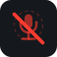
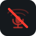
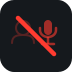
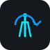
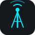
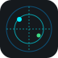
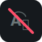

# 🎛️ XuruVOIP Stream Deck Plugin User Guide

Welcome to the **XuruVOIP Stream Deck Plugin Guide**! This guide is written to help you set up physical buttons on your Elgato Stream Deck device to control your voice settings and telemetry feeds while playing Star Citizen.

---

## 🌟 What is the Stream Deck Plugin?

The **XuruVOIP Stream Deck Plugin** links your physical Elgato Stream Deck hardware to the XuruVOIP Client running on your PC. Once set up, you can touch a physical button on your desk to:
1. Mute or unmute your microphone.
2. Mute or unmute other players' voices.
3. Open or close your space suit helmet visor.
4. Broadcast to the ship's Public Address (PA) system.
5. Toggle Radio Repeater / Beacon relay modes.
6. Trigger customized voice command macros (e.g., "open hangar", "request landing").
7. Monitor ship intercom degradation status and cycle simulation states.
8. Read real-time system zone names and X, Y, Z space coordinates on a physical key display.

---

## 🚀 Step 1: Installing the Plugin

Getting the plugin installed into your Stream Deck software is very simple.

1. **Download the Plugin:**
   * Download the file named `com.xurudragon.xuruvoip.streamDeckPlugin` from the releases page.
2. **Install:**
   * Double-click the downloaded file.
   * Your Elgato Stream Deck software will open and show a message asking if you want to install it. Click **Install**.
3. **Verify:**
   * In your Elgato Stream Deck desktop app, look at the list of actions on the right side.
   * Scroll down until you see a category named **XuruVOIP** containing 22 actions.

---

## 🔌 Step 2: Connecting to your XuruVOIP Client

The Stream Deck app talks to your voice client using a local network link. You must enable this link in your client application:

1. Open your **XuruVOIP Client** (the WPF app).
2. Click the **Settings** gear icon.
3. In the **General** tab, check the box **Enable Companion HTTP Server**.
4. Check the port number (default is `8891`).
5. Click **Save & Close** to apply.

---

## ⚙️ Step 3: Dragging Actions & Configuration

Now, let's configure the physical buttons on your device.

1. **Drag and Drop:**
   * Select any action from the **XuruVOIP** list on the right.
   * Drag it onto one of the empty squares representing your Stream Deck buttons.
2. **Configure (Property Inspector):**
   * Click on the button you just placed to highlight it.
   * Look at the **Property Inspector** panel at the bottom of the Stream Deck window.
   * Configure the parameters:
     * **Companion Port:** Enter the port matching your client settings (default is **`8891`**).
     * **Voice Command** *(Voice Command Macro action only)*: Enter the specific text command you want to trigger (e.g., `open visor`, `engage quantum drive`).

---

## 🎮 Available Actions & Visual Feedback

The plugin features dynamic icons and text that change in real-time based on your settings. Below is the list of all 22 implemented actions and their associated icon states:

### 🎤 Microphone Mute Keys
Controls microphone mute status for various communication ranges.

| Action | UUID | Icon (Unmuted) | Icon (Muted) | Visual Feedback & Use |
| :--- | :--- | :---: | :---: | :--- |
| **Proximity Mute** | `com.xurudragon.xuruvoip.action.proximity-mute` |  |  | Toggle local proximity mic. |
| **Radio Mute** | `com.xurudragon.xuruvoip.action.radio-mute` |  |  | Toggle ship radio mic. |
| **Profile Mute** | `com.xurudragon.xuruvoip.action.profile-mute` |  |  | Toggle user profile mic. |

### 🔊 Audio Playback Mute Keys
Controls whether you hear audio from specific communication channels.

| Action | UUID | Icon (Active) | Icon (Muted) | Visual Feedback & Use |
| :--- | :--- | :---: | :---: | :--- |
| **Audio Proximity Mute** | `com.xurudragon.xuruvoip.action.audio-proximity-mute` |  |  | Toggle hearing proximity voices. |
| **Audio Radio Mute** | `com.xurudragon.xuruvoip.action.audio-radio-mute` |  |  | Toggle hearing radio voices. |
| **Audio Profile Mute** | `com.xurudragon.xuruvoip.action.audio-profile-mute` |  |  | Toggle hearing profile voices. |

### 🪖 Helmet Visor Toggle
Controls space suit helmet visor state.

| Action | UUID | Icon (Open) | Icon (Closed) | Visual Feedback & Use |
| :--- | :--- | :---: | :---: | :--- |
| **Toggle Helmet** | `com.xurudragon.xuruvoip.action.toggle-helmet` |  |  | Toggle visor open (red icon) or closed (green icon). |

### 🔄 Active Radio Channel
Manages channel frequencies with real-time feedback.

| Action | UUID | Icon (Ready) | Visual Feedback & Use |
| :--- | :--- | :---: | :--- |
| **Cycle Radio** | `com.xurudragon.xuruvoip.action.cycle-radio` |  | Cycles active channels. Displays channel name (e.g., `General`, `120.5`) in clean text on the LCD. |

### 📢 PA Broadcast & Beacon Relay
Ship-wide communications and beacons.

| Action | UUID | Icon (Idle) | Icon (Active) | Visual Feedback & Use |
| :--- | :--- | :---: | :---: | :--- |
| **PA Broadcast** | `com.xurudragon.xuruvoip.action.pa-broadcast` |  |  | Hold to broadcast on Ship Public Address (cyan equalizer). |
| **Beacon Mode** | `com.xurudragon.xuruvoip.action.beacon-repeater` |  |  | Toggles Radio Repeater / Beacon mode (active waves). |

### 🎙️ Voice Command Macro
Custom voice macro executor.

| Action | UUID | Icon (Ready) | Icon (Listening) | Visual Feedback & Use |
| :--- | :--- | :---: | :---: | :--- |
| **Voice Command Macro** | `com.xurudragon.xuruvoip.action.voice-command` |  |  | Triggers custom voice macros (green listening badge). |

### 💬 Intercom Status (Multi-State)
Monitors intercom telemetry simulation states.

| Action | UUID | Icons (State 0 - 3) | Visual Feedback & Use |
| :--- | :--- | :---: | :--- |
| **Intercom Status** | `com.xurudragon.xuruvoip.action.intercom-status` | **NORMAL**:  **SHIELD HIT**:  **CRIT PWR**:  **QUANTUM**:  | Pressing cycles the simulator state. Renders corresponding status icons on the key screen. |

### 🗺️ Location Telemetry
Live coordinate HUD telemetry.

| Action | UUID | Icon | Visual Feedback & Use |
| :--- | :--- | :---: | :--- |
| **Location Telemetry** | `com.xurudragon.xuruvoip.action.location-telemetry` |  | Read-only telemetry displaying active zone and coordinate vectors $(X, Y, Z)$ or `NO GPS`. |

### 📞 Ship-to-Ship Hailing Actions
Manage cockpits direct-calling linkages.

| Action | UUID | Icon | Visual Feedback & Use |
| :--- | :--- | :---: | :--- |
| **Initiate Hail** | `com.xurudragon.xuruvoip.action.hail-initiate` |  | Triggers private hailing call request to nearest cockpit target. |
| **Accept Hail** | `com.xurudragon.xuruvoip.action.hail-accept` |  | Accepts incoming ship-to-ship hailing. |
| **Decline/End Hail** | `com.xurudragon.xuruvoip.action.hail-decline` |  | Rejects incoming call or hangs up active call. |

### 🔤 HUD Translation Subtitles
Real-time subtitle rendering settings.

| Action | UUID | Icon (Disabled) | Icon (Enabled) | Visual Feedback & Use |
| :--- | :--- | :---: | :---: | :--- |
| **Toggle Translation** | `com.xurudragon.xuruvoip.action.toggle-translation` |  |  | Toggles foreign audio real-time translation subtitles. |

### 🎧 Spatial Audio & Visor Spectrogram
HUD immersive rendering controls.

| Action | UUID | Icon (Disabled) | Icon (Enabled) | Visual Feedback & Use |
| :--- | :--- | :---: | :---: | :--- |
| **Toggle HRTF** | `com.xurudragon.xuruvoip.action.toggle-hrtf` |  |  | Toggle Binaural HRTF Spatial Audio. |
| **Toggle Spectrogram** | `com.xurudragon.xuruvoip.action.toggle-spectrogram` |  |  | Toggle 3D spectrogram visualizer. |

---

## 🗺️ Stream Deck Layout Profiles

We have pre-designed 15 layout profiles (5 devices × 3 layouts: Pilot, Infantry, Captain) organized by device directory under `streamdeck/profiles/`. In the GitHub release, these are packaged as individual `.streamDeckProfile` files for easy deployment:

---

### 1. Stream Deck Mini (3x2 Grid)
Designed for compact setups, prioritizing the most critical buttons.

*   **Pilot:**
    *   **Row 1:** Proximity Mute, Radio Mute, Toggle Helmet
    *   **Row 2:** PA Broadcast, Intercom Status, Location Telemetry
*   **Infantry:**
    *   **Row 1:** Proximity Mute, Radio Mute, Toggle Helmet
    *   **Row 2:** Cycle Radio, *Macro: Status Report*, Location Telemetry
*   **Captain:**
    *   **Row 1:** Proximity Mute, Radio Mute, PA Broadcast
    *   **Row 2:** Intercom Status, Cycle Radio, Location Telemetry

*Profile templates folder: [streamdeck/profiles/mini](../streamdeck/profiles/mini)*

---

### 2. Stream Deck Classic (5x3 Grid)
The standard layout for a 15-key Stream Deck device.

*   **Pilot:**
    | | Column 1 | Column 2 | Column 3 | Column 4 | Column 5 |
    | :---: | :---: | :---: | :---: | :---: | :---: |
    | **Row 1** | Proximity Mute | Radio Mute | Profile Mute | Cycle Radio | Toggle Helmet |
    | **Row 2** | PA Broadcast | Beacon Mode | Intercom Status | *Macro: Open Hangar* | *Macro: Req Landing* |
    | **Row 3** | Location Telemetry | Audio Prox Mute | Audio Radio Mute | Audio Profile Mute | *Macro: Status Report* |

*   **Infantry:**
    | | Column 1 | Column 2 | Column 3 | Column 4 | Column 5 |
    | :---: | :---: | :---: | :---: | :---: | :---: |
    | **Row 1** | Proximity Mute | Radio Mute | Toggle Helmet | Cycle Radio | *Macro: Status Report* |
    | **Row 2** | Audio Prox Mute | Audio Radio Mute | Beacon Mode | *Macro: Mute Prox* | *Macro: Unmute Prox* |
    | **Row 3** | Location Telemetry | *Macro: Ch Alpha* | *Macro: Ch Beta* | *Macro: Toggle Changer* | *Macro: Voice Cyborg* |

*   **Captain:**
    | | Column 1 | Column 2 | Column 3 | Column 4 | Column 5 |
    | :---: | :---: | :---: | :---: | :---: | :---: |
    | **Row 1** | Proximity Mute | Radio Mute | PA Broadcast | Intercom Status | Toggle Helmet |
    | **Row 2** | Audio Prox Mute | Audio Radio Mute | Beacon Mode | *Macro: Power Shields* | *Macro: Status Check* |
    | **Row 3** | Location Telemetry | Cycle Radio | *Simulate Shield Hit* | *Simulate Power Loss* | *Simulate Quantum* |

*Profile templates folder: [streamdeck/profiles/classic](../streamdeck/profiles/classic)*

---

### 3. Stream Deck XL (9x4 Grid)
Provides a high-density 36-key layout for maximum physical control.

*   **Common Keypad Base (Rows 1 & 2):**
    | | Col 1 | Col 2 | Col 3 | Col 4 | Col 5 | Col 6 | Col 7 | Col 8 | Col 9 |
    | :---: | :---: | :---: | :---: | :---: | :---: | :---: | :---: | :---: | :---: |
    | **Row 1** | Prox Mute | Radio Mute | Profile Mute | Toggle Helmet | Cycle Radio | PA Broadcast | Beacon Mode | Intercom Status | Location Telemetry |
    | **Row 2** | Audio Prox Mute | Audio Radio Mute | Audio Profile Mute | Initiate Hail | Accept/Answer Hail | Decline/End Hail | Toggle Translation | Toggle HRTF | Toggle Spectrogram |

*   **Pilot Specializations (Rows 3 & 4):**
    *   **Row 3:** *Macro: Open Hangar* (Col 1), *Macro: Req Landing* (Col 2), *Macro: Status Report* (Col 3), *Macro: Close Visor* (Col 4)
    *   **Row 4:** *Macro: Power Up Shields* (Col 1)
*   **Infantry Specializations (Rows 3 & 4):**
    *   **Row 3:** *Macro: Status Report* (Col 1), *Macro: Mute Prox* (Col 2), *Macro: Unmute Prox* (Col 3)
    *   **Row 4:** *Macro: Ch Alpha* (Col 1), *Macro: Ch Beta* (Col 2), *Macro: Toggle Changer* (Col 3), *Macro: Voice Cyborg* (Col 4)
*   **Captain Specializations (Rows 3 & 4):**
    *   **Row 3:** *Macro: Power Up Shields* (Col 1), *Macro: Status Check* (Col 2)
    *   **Row 4:** *Simulate Shield Hit* (Col 1), *Simulate Power Loss* (Col 2), *Simulate Quantum* (Col 3)

*Profile templates folder: [streamdeck/profiles/xl](../streamdeck/profiles/xl)*

---

### 4. Stream Deck + (4x2 Keypad + 4 Dials)
Combines physical keys with rotary encoders and a touch strip display.

*   **Keypad Grid:**
    | | Column 1 | Column 2 | Column 3 | Column 4 |
    | :---: | :---: | :---: | :---: | :---: |
    | **Row 1 (Pilot)** | Proximity Mute | Radio Mute | Profile Mute | Toggle Helmet |
    | **Row 2 (Pilot)** | PA Broadcast | Beacon Mode | Intercom Status | Location Telemetry |
    | **Row 1 (Infantry)** | Proximity Mute | Radio Mute | Toggle Helmet | Location Telemetry |
    | **Row 2 (Infantry)** | Audio Prox Mute | Audio Radio Mute | PA Broadcast | *Macro: Status Report* |
    | **Row 1 (Captain)** | Proximity Mute | Radio Mute | PA Broadcast | Intercom Status |
    | **Row 2 (Captain)** | Toggle Helmet | Location Telemetry | Audio Prox Mute | Audio Radio Mute |

*   **Rotary Encoders (Dials) & Touch Strip:**
    1.  **Dial 1: Radio Channel Dial** (`com.xurudragon.xuruvoip.action.cycle-radio-dial`)
        *   **Icon:** 
        *   *Rotate:* Select active radio frequency/channel.
        *   *Push / Touch Screen Tap:* Toggle radio microphone mute.
        *   *Display:* Active radio channel name (red `[MUTED]` tag appended if muted).
    2.  **Dial 2: Adjust Exertion/G-Force** (`com.xurudragon.xuruvoip.action.adjust-exertion`)
        *   **Icon:** 
        *   *Rotate:* Adjust Mock G-Force.
        *   *Rotate while pressed:* Adjust Mock Exertion value.
        *   *Push / Touch Screen Tap:* Toggle immersive exertion distortion simulation.
        *   *Display:* G-force amount (G) and Exertion percentage (%) with state status.
    3.  **Dial 3: Voice Changer Dial** (`com.xurudragon.xuruvoip.action.voice-changer-dial`)
        *   **Icon:** 
        *   *Rotate:* Cycle through active voice changer profiles (None, Alien, Cyborg, Robotic, PitchShift).
        *   *Push / Touch Screen Tap:* Toggle voice changer on/off.
        *   *Display:* Active voice profile name or `Disabled`.
    4.  **Dial 4:** Unassigned / Reserved.

*Profile templates folder: [streamdeck/profiles/plus](../streamdeck/profiles/plus)*

---

### 5. Stream Deck + XL (9x4 Keypad + 6 Dials)
The ultimate layout, offering the full 36-key keypad grid of the XL along with 6 dials.

*   **Keypad Layout:** Identical layout mapping to the standard **Stream Deck XL** keypad.
*   **Rotary Dials:** Dial 1, 2, and 3 are mapped identically to the **Stream Deck +** (Radio Channel, G-Force/Exertion, Voice Changer). Dials 4, 5, and 6 are unassigned / reserved.

*Profile templates folder: [streamdeck/profiles/plus_xl](../streamdeck/profiles/plus_xl)*

---

---

## ❓ Troubleshooting (FAQ)

### My buttons show a yellow warning triangle!
* This means the Stream Deck software cannot communicate with the XuruVOIP client.
  1. Ensure the XuruVOIP client application is running.
  2. Verify that **Enable Companion HTTP Server** is checked in the client's settings.
  3. Double-check that the **Companion Port** in your Stream Deck Property Inspector (for that button) matches the port listed in the client settings (usually `8891`).

### The active radio frequency name or location coordinate is not appearing.
* Make sure you are connected to a XuruVOIP server. If you are disconnected or game telemetry is not running, the active channel will display as "Proximity" or "General", and coordinates will display as "NO GPS".
* Check the port configuration in the button's properties.
